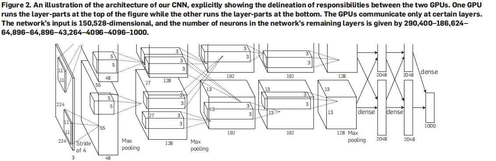
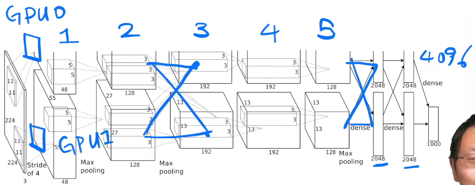
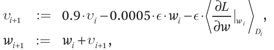
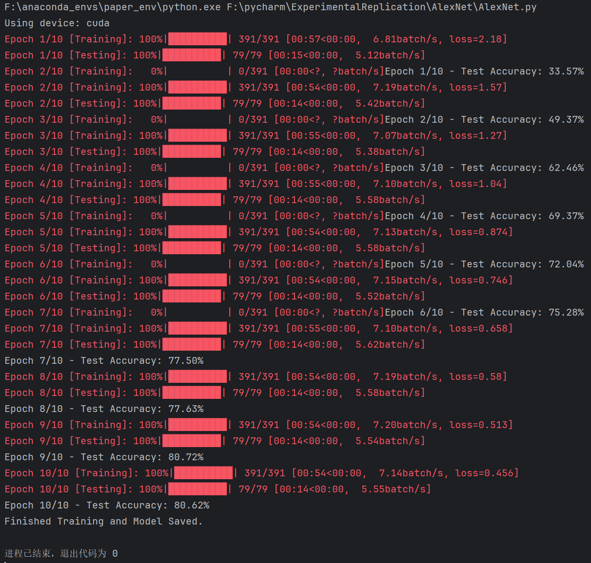
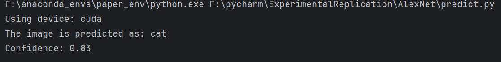
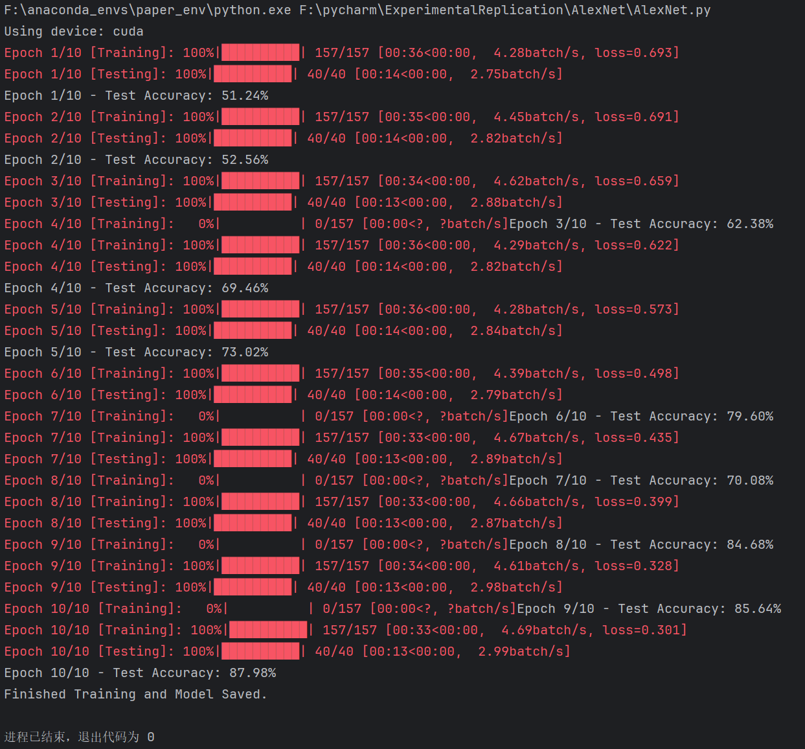
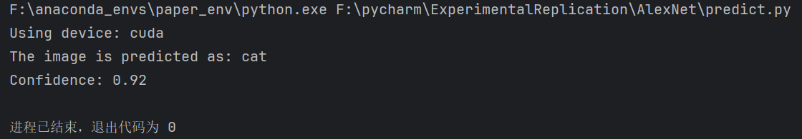

# AlexNet

ImageNet Classification with Deep Convolutional Neural Networks

## 第一遍

看摘要--->看结论--->看图、表

## 第二遍

### 数据处理

**不做预处理**仅剪裁而不用sift特征抽取

end to end 原始数据处理

### 架构



ReLU收敛比tanh、sigmoid快且简单

#### 正则化

正则化避免饱和

ReLU不需要输入正则化

#### Overlapping Pooling


#### Overall Architecture



**长度4096向量** 抓取能力强

### 过拟合处理

数据处理

颜色通道变换PCA

#### dropout

按概率丢弃，现在其实就相当于正则的一种方式

### 训练

#### 优化算法

**SGD随机梯度下降**

- batch size of 128
- momentum of 0.9
- weight decay of 0.0005



在 **随机梯度下降（SGD）** 中，`momentum`（动量）和 `weight decay`（权重衰减）是两个非常重要的技术，它们分别用于**加速收敛**和**防止过拟合**。

**Momentum（动量）**

- **目的：加速收敛，减小振荡**
- 直观理解：
  - 类似“**惯性**”原理，如果你在一个方向上连续下降，就会加速；
  - 遇到陡峭但方向不变的山谷时，它可以**减少左右来回震荡**。
- 数学公式：
  - 在基本 SGD 中，权重更新是：
  - $\theta_{t+1} = \theta_t - \eta \cdot \nabla L(\theta_t)$
  - 加了 momentum 后：
  - $v_{t+1} = \mu v_t - \eta \cdot \nabla L(\theta_t) \\ \theta_{t+1} = \theta_t + v_{t+1}$
  - 其中：
    - $\theta$：模型参数
    - $\eta$：学习率
    - $\mu$：动量系数（一般取 0.9）
    - $v$：“速度”，记录了前一步的方向
- 效果：
  - **更快跳出鞍点和局部最小值**；
  - **避免高频震荡**（尤其在梯度变化剧烈时）；
  - 对深层网络尤为有效。

**Weight Decay（权重衰减）**

- 目的：**正则化，防止过拟合**
- 直观理解：
  - 在每一步更新中“压缩”参数；
  - 趋势是让参数更小，防止模型过于复杂。
- 数学公式：
  - SGD 中引入 weight decay：
  - $\theta_{t+1} = \theta_t - \eta \cdot (\nabla L(\theta_t) + \lambda \theta_t)$
- **等价于优化以下目标**：
  - $\min_\theta \; L(\theta) + \frac{\lambda}{2} \|\theta\|^2$
  - 也就是加了一个 **L2 正则项**，λ\lambda 是衰减系数。
- 效果：
  - **控制模型参数大小**；
  - **减少对训练数据的过度拟合**；
  - 在训练大模型（如 ResNet、Transformer）时尤其重要。

#### 学习率

随epoch变换（动态调整学习率）

## 问题

- 神经网络的可解释性
- 决策是否公平
- 两个GPU所学习的特征重点不同，有一个GPU关注了颜色，而另一个没有

AlexNet 是 2012 年 ImageNet 图像识别竞赛冠军，由 Alex Krizhevsky 等人提出，对深度学习尤其是**卷积神经网络（CNN）在计算机视觉中的应用产生了巨大影响**。以下是 AlexNet 的主要**创新点与贡献**：

## AlexNet 创新点

#### 使用更深更大的卷积神经网络

- **创新点**：在当时其他模型只有 2~3 层，AlexNet 架构有 **8 层（5 层卷积 + 3 层全连接）**，参数达到 **6000 万**。
- **贡献**：**首次证明“更深的网络 + 更大规模训练数据”可以大幅提升识别精度。**

#### 引入 ReLU 激活函数

- **创新点**：首次在 CNN 中系统性使用 **ReLU（Rectified Linear Unit）** 替代传统的 sigmoid / tanh 激活函数。
- **贡献**：
  - 计算更高效（不涉及指数运算）；
  - 有效缓解梯度消失问题，加快收敛速度。

#### 使用 Dropout 防止过拟合

- **创新点**：在全连接层中引入了 **Dropout 技术**（以一定概率“随机丢弃”神经元）。
- **贡献**：有效防止大模型在小样本上的过拟合，提高泛化能力。

#### 数据增强（Data Augmentation）

- **创新点**：采用了一系列数据增强技术（如图片随机裁剪、镜像翻转、颜色扰动）。
- **贡献**：人工扩展训练数据集，提升模型的鲁棒性。

#### 使用 GPU 加速训练

- **创新点**：将模型训练分布在 **两块 GPU 上**（每块 GPU 处理一半网络）。
- **贡献**：
  - 将训练时间从几周缩短到几天；
  - 推动 GPU 成为深度学习的标准计算平台

#### 总结一句话

> **AlexNet 是第一个将深度卷积神经网络成功应用于大规模图像识别任务的里程碑模型，开启了深度学习视觉时代。**

## 实验复现

[参考文章：CSDN AlexNet理论及代码复现笔记（PyTorch）](https://blog.csdn.net/m0_51457734/article/details/131625135?fromshare=blogdetail&sharetype=blogdetail&sharerId=131625135&sharerefer=PC&sharesource=Davereminisce&sharefrom=from_link)

### dataset

采用 CIFAR-10 数据集

```python
# AlexNet原始输入是227x227，CIFAR-10是32x32，这里进行相应调整
transform = transforms.Compose([
    transforms.Resize((224, 224)),  # 将图像大小调整为224x224
    transforms.ToTensor(),  # 将PIL图像或numpy.ndarray转换为tensor
    transforms.Normalize((0.5, 0.5, 0.5), (0.5, 0.5, 0.5))  # 标准化
])

# 下载并加载CIFAR-10数据集
trainset = torchvision.datasets.CIFAR10(root='./data', train=True,
                                        download=True, transform=transform)
trainloader = torch.utils.data.DataLoader(trainset, batch_size=128,
                                          shuffle=True, num_workers=2)

testset = torchvision.datasets.CIFAR10(root='./data', train=False,
                                       download=True, transform=transform)
testloader = torch.utils.data.DataLoader(testset, batch_size=128,
                                         shuffle=False, num_workers=2)
```


### model

```python
# 定义AlexNet模型架构
class AlexNet(nn.Module):
    def __init__(self, num_classes=10):
        super(AlexNet, self).__init__()
        self.features = nn.Sequential(
            # 第一层：卷积层
            nn.Conv2d(3, 64, kernel_size=11, stride=4, padding=2),
            nn.ReLU(inplace=True),
            nn.MaxPool2d(kernel_size=3, stride=2),

            # 第二层：卷积层
            nn.Conv2d(64, 192, kernel_size=5, padding=2),
            nn.ReLU(inplace=True),
            nn.MaxPool2d(kernel_size=3, stride=2),

            # 第三层：卷积层
            nn.Conv2d(192, 384, kernel_size=3, padding=1),
            nn.ReLU(inplace=True),

            # 第四层：卷积层
            nn.Conv2d(384, 256, kernel_size=3, padding=1),
            nn.ReLU(inplace=True),

            # 第五层：卷积层
            nn.Conv2d(256, 256, kernel_size=3, padding=1),
            nn.ReLU(inplace=True),
            nn.MaxPool2d(kernel_size=3, stride=2),
        )

        # 自适应平均池化，将特征图大小调整为6x6
        self.avgpool = nn.AdaptiveAvgPool2d((6, 6))

        self.classifier = nn.Sequential(
            # 展平特征
            nn.Dropout(),
            # 第六层：全连接层
            nn.Linear(256 * 6 * 6, 4096),
            nn.ReLU(inplace=True),

            nn.Dropout(),
            # 第七层：全连接层
            nn.Linear(4096, 4096),
            nn.ReLU(inplace=True),

            # 第八层：全连接层，输出类别数量
            nn.Linear(4096, num_classes),
        )

    def forward(self, x):
        x = self.features(x)
        x = self.avgpool(x)
        x = torch.flatten(x, 1)
        x = self.classifier(x)
        return x
```


### train&optimizer

```python
# 定义训练和评估函数
def train_model():
    # 检查是否有可用的CUDA设备，并设置设备
    device = torch.device("cuda" if torch.cuda.is_available() else "cpu")
    print(f"Using device: {device}")

    # CIFAR-10
    model = AlexNet(num_classes=10).to(device)
    # # catdog
    # model = AlexNet(num_classes=2).to(device)

    criterion = nn.CrossEntropyLoss()
    optimizer = optim.SGD(model.parameters(), lr=0.01, momentum=0.9, weight_decay=5e-4)
    epochs = 10

    for epoch in range(epochs):
        # 训练阶段
        model.train()
        running_loss = 0.0
        pbar = tqdm(trainloader, desc=f"Epoch {epoch + 1}/{epochs} [Training]", unit="batch")
        for i, data in enumerate(pbar):
            inputs, labels = data[0].to(device), data[1].to(device)

            optimizer.zero_grad()

            outputs = model(inputs)
            loss = criterion(outputs, labels)
            loss.backward()
            optimizer.step()

            running_loss += loss.item()
            pbar.set_postfix({'loss': running_loss / (i + 1)})

        # 验证阶段
        model.eval()
        correct = 0
        total = 0
        with torch.no_grad():
            pbar_test = tqdm(testloader, desc=f"Epoch {epoch + 1}/{epochs} [Testing]", unit="batch")
            for data in pbar_test:
                images, labels = data[0].to(device), data[1].to(device)
                outputs = model(images)
                _, predicted = torch.max(outputs.data, 1)
                total += labels.size(0)
                correct += (predicted == labels).sum().item()

        accuracy = 100 * correct / total
        print(f'Epoch {epoch + 1}/{epochs} - Test Accuracy: {accuracy:.2f}%')

    # 保存 CIFAR-10 数据集 模型
    torch.save(model.state_dict(), 'alexnet_cifar10.pth')
    print('Finished Training and Model Saved.')
```


### main

```python
if __name__ == '__main__':
    train_model()
```


### catVSdog数据集

#### 数据目录

```bash
data
 |--catVSdog
	 |--test_data
		 |--cat
		 	 |--cat.10000.jpg
		 	 |--cat.10001.jpg
		 	 |--......
		 |--dog
		 	 |--dog.10000.jpg
		 	 |--dog.10001.jpg
		 	 |--......
	 |--train_data
		 |--cat
		 	 |--cat.0.jpg
		 	 |--cat.1.jpg
		 	 |--......
		 |--dog
		 	 |--dog.0.jpg
		 	 |--dog.1.jpg
		 	 |--......
	 
	 目标生成 txt
	 |--test.txt
     |--train.txt
```

#### 索引文件生成

`generate_txt_file.py` 文件用于生成一个**清单**或**索引**文件，这个文件包含了训练集和测试集中所有图片的路径和对应的标签。

```python
import os

# --- Path Initialization ---
# 训练集和测试集的基础路径
BASE_DIR = os.path.join("data", "catVSdog")
# 训练集路径
TRAIN_DIR = os.path.join(BASE_DIR, "train_data")
# 测试集路径
VALID_DIR = os.path.join(BASE_DIR, "test_data")
# 训练集 txt 文件路径
TRAIN_TXT_PATH = os.path.join(BASE_DIR, "train.txt")
# 测试集 txt 文件路径
VALID_TXT_PATH = os.path.join(BASE_DIR, "test.txt")

# Define the classes and their corresponding labels
# 定义类别和它们的标签
# This can make the code more flexible if you add more classes
# 这样在新增类别时，代码会更灵活
CLASSES = {
    'cat': '0',
    'dog': '1'
}


def generate_txt_file(txt_path, img_dir):
    """
    Generates a text file containing image paths and their labels.
    生成包含图像路径和标签的文本文件。

    Args:
        txt_path (str): The path to the output text file.
        img_dir (str): The root directory of the images.
    """
    # Use 'with' statement for safe file handling
    # 使用 'with' 语句，确保文件在处理完毕后自动关闭
    with open(txt_path, 'w') as f:
        # Traverse the subdirectories for 'cat' and 'dog'
        # 遍历 'cat' 和 'dog' 的子目录
        for class_name, label in CLASSES.items():
            class_dir = os.path.join(img_dir, class_name)

            # Check if the directory exists
            # 检查目录是否存在，增加代码的健壮性
            if not os.path.isdir(class_dir):
                print(f"Directory not found: {class_dir}")
                continue

            # Iterate through all files in the class directory
            # 遍历类别目录下的所有文件
            for img_file in os.listdir(class_dir):
                # Ensure the file is a jpg image
                # 确保文件是 .jpg 格式
                if img_file.endswith('.jpg'):
                    img_path = os.path.join(class_dir, img_file)
                    line = f"{img_path} {label}\n"
                    f.write(line)

    print(f"Successfully generated {txt_path} with image paths and labels.")


if __name__ == '__main__':
    generate_txt_file(TRAIN_TXT_PATH, TRAIN_DIR)
    generate_txt_file(VALID_TXT_PATH, VALID_DIR)
```

eg：生成test.txt

- ```txt
  data\catVSdog\test_data\cat\cat.10000.jpg 0
  data\catVSdog\test_data\cat\cat.10001.jpg 0
  data\catVSdog\test_data\cat\cat.10002.jpg 0
  ...
  ...
  ...
  data\catVSdog\test_data\dog\dog.12497.jpg 1
  data\catVSdog\test_data\dog\dog.12498.jpg 1
  data\catVSdog\test_data\dog\dog.12499.jpg 1
  ```

#### dataset

```python
# 定义自定义的CatDog数据集类
class CatDogDataset(Dataset):
    def __init__(self, txt_path, transform=None):
        """
        Args:
            txt_path (string): 包含图片路径和标签的文本文件路径。
            transform (callable, optional): 应用于样本的可选转换。
        """
        self.img_labels = []
        # 读取文本文件，并解析图片路径和标签
        with open(txt_path, 'r') as f:
            for line in f:
                img_path, label = line.strip().split()
                self.img_labels.append((img_path, int(label)))  # 将标签转换为整数
        self.transform = transform

    def __len__(self):
        # 返回数据集中样本的总数
        return len(self.img_labels)

    def __getitem__(self, idx):
        # 根据索引加载图片和标签
        img_path, label = self.img_labels[idx]
        image = Image.open(img_path).convert('RGB')  # 确保图片为RGB三通道

        if self.transform:
            image = self.transform(image)

        return image, torch.tensor(label)

# 图像预处理和加载
transform = transforms.Compose([
    transforms.Resize((224, 224)),
    transforms.ToTensor(),
    transforms.Normalize((0.5, 0.5, 0.5), (0.5, 0.5, 0.5))
])

# 使用自定义数据集加载训练和测试数据
train_txt_path = os.path.join("data", "catVSdog", "train.txt")
test_txt_path = os.path.join("data", "catVSdog", "test.txt")

trainset = CatDogDataset(txt_path=train_txt_path, transform=transform)
trainloader = DataLoader(trainset, batch_size=128, shuffle=True, num_workers=2)

testset = CatDogDataset(txt_path=test_txt_path, transform=transform)
testloader = DataLoader(testset, batch_size=128, shuffle=False, num_workers=2)

# 类别标签 (必须和的txt文件中的标签对应)
classes = ('cat', 'dog')
```

#### train

模型导入时，调整分类参数为2

保存模型参数

```python
# 定义训练和评估函数
def train_model():
    # 检查是否有可用的CUDA设备，并设置设备
    device = torch.device("cuda" if torch.cuda.is_available() else "cpu")
    print(f"Using device: {device}")

    # # CIFAR-10
    # model = AlexNet(num_classes=10).to(device)
    
    # catdog
    model = AlexNet(num_classes=2).to(device)
    ...
    ...
    ...
    # # 保存 CIFAR-10 数据集 模型
    # torch.save(model.state_dict(), 'alexnet_cifar10.pth')
    # print('Finished Training and Model Saved.')

    # 保存 catdog 数据集 模型
    torch.save(model.state_dict(), 'alexnet_catdog.pth')
    print('Finished Training and Model Saved.')
```

### 预测

predict.py

```python
import torch
import torch.nn as nn
from PIL import Image
import torchvision.transforms as transforms

# 检查是否有可用的CUDA设备，并设置设备
device = torch.device("cuda" if torch.cuda.is_available() else "cpu")
print(f"Using device: {device}")


# 定义AlexNet模型架构 (必须与训练时保持一致)
class AlexNet(nn.Module):
    def __init__(self, num_classes=10):
        super(AlexNet, self).__init__()
        self.features = nn.Sequential(
            nn.Conv2d(3, 64, kernel_size=11, stride=4, padding=2),
            nn.ReLU(inplace=True),
            nn.MaxPool2d(kernel_size=3, stride=2),

            nn.Conv2d(64, 192, kernel_size=5, padding=2),
            nn.ReLU(inplace=True),
            nn.MaxPool2d(kernel_size=3, stride=2),

            nn.Conv2d(192, 384, kernel_size=3, padding=1),
            nn.ReLU(inplace=True),

            nn.Conv2d(384, 256, kernel_size=3, padding=1),
            nn.ReLU(inplace=True),

            nn.Conv2d(256, 256, kernel_size=3, padding=1),
            nn.ReLU(inplace=True),
            nn.MaxPool2d(kernel_size=3, stride=2),
        )
        self.avgpool = nn.AdaptiveAvgPool2d((6, 6))
        self.classifier = nn.Sequential(
            nn.Dropout(),
            nn.Linear(256 * 6 * 6, 4096),
            nn.ReLU(inplace=True),

            nn.Dropout(),
            nn.Linear(4096, 4096),
            nn.ReLU(inplace=True),

            nn.Linear(4096, num_classes),
        )

    def forward(self, x):
        x = self.features(x)
        x = self.avgpool(x)
        x = torch.flatten(x, 1)
        x = self.classifier(x)
        return x


# 定义图像预处理
transform = transforms.Compose([
    transforms.Resize((224, 224)),
    transforms.ToTensor(),
    transforms.Normalize((0.5, 0.5, 0.5), (0.5, 0.5, 0.5))
])

# 类别标签
# 注意：这些标签必须与训练时使用的标签顺序一致
# # CIFAR-10
# classes = ('plane', 'car', 'bird', 'cat', 'deer', 'dog', 'frog', 'horse', 'ship', 'truck')
# catdog
classes = ('cat', 'dog')


def predict_image(image_path, model_path):
    """
    加载模型并对单张图片进行预测。

    Args:
        image_path (str): 要预测的图片文件路径。
        model_path (str): 保存的模型文件路径。

    Returns:
        tuple: (预测类别, 预测概率)。
    """
    # 加载模型
    # # CIDAR-10
    # model = AlexNet(num_classes=10).to(device)
    # catdog
    model = AlexNet(num_classes=2).to(device)

    try:
        model.load_state_dict(torch.load(model_path))
        model.eval()
    except FileNotFoundError:
        print(f"Error: Model file '{model_path}' not found. Please train the model first.")
        return None, None

    # 加载和预处理图片
    try:
        image = Image.open(image_path)
        image = transform(image).unsqueeze(0).to(device)
    except FileNotFoundError:
        print(f"Error: Image file '{image_path}' not found.")
        return None, None

    # 运行推理
    with torch.no_grad():
        outputs = model(image)
        _, predicted_idx = torch.max(outputs.data, 1)
        predicted_class = classes[predicted_idx.item()]

        # 计算预测概率
        probabilities = torch.nn.functional.softmax(outputs, dim=1)
        confidence = probabilities[0][predicted_idx.item()].item()

    return predicted_class, confidence


if __name__ == '__main__':
    # 测试图片路径
    image_to_predict = 'data/catVSdog/test_data/cat/cat.10000.jpg'

    # # CIFAR-10
    # model_file = 'alexnet_cifar10.pth'

    # catdog
    model_file = 'alexnet_catdog.pth'


    predicted_class, confidence = predict_image(image_to_predict, model_file)

    if predicted_class and confidence:
        print(f"The image is predicted as: {predicted_class}")
        print(f"Confidence: {confidence:.2f}")

```


### 实验结果

#### CIFAR-10

Training



predict

- data/catVSdog/test_data/cat/cat.10000.jpg




#### catVSdog

Training



predict

- data/catVSdog/test_data/cat/cat.10000.jpg



