# ResNet

[论文链接][https://arxiv.org/abs/1512.03385]

Deep Residual Learning for Image Recognition

### idea提出

#### 问题发现

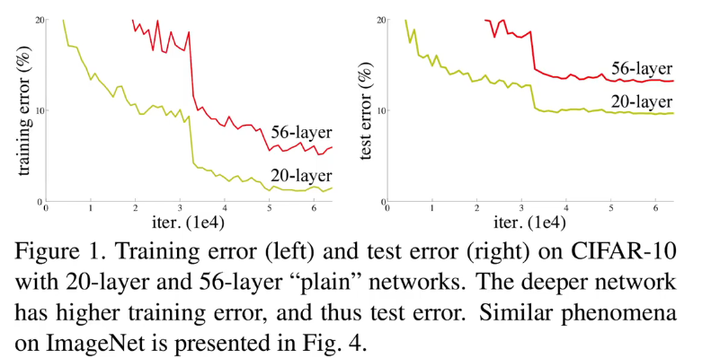

论文观察到的问题：层数越多还可能导致训练和测试误差都增大，**层数过多训练不动**，训练误差也随之变大了

由于**dientity mapping**，即**恒等映射**，深的网络应该至少好于浅的网络，因为我可以将深的部分层就不变（类似），这样看，深层应当由于浅层。但是，结果表示没有如此，即没有实现identity mapping

所以该文章显式构造一个identity mapping来解决该问题，即实现深的网络不会比浅的网络更差

#### 问题解决

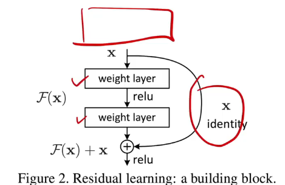

**下一层去学习上一层预测的值与真实值的差（残差）**

参数、模型复杂度都没变高

### 模型

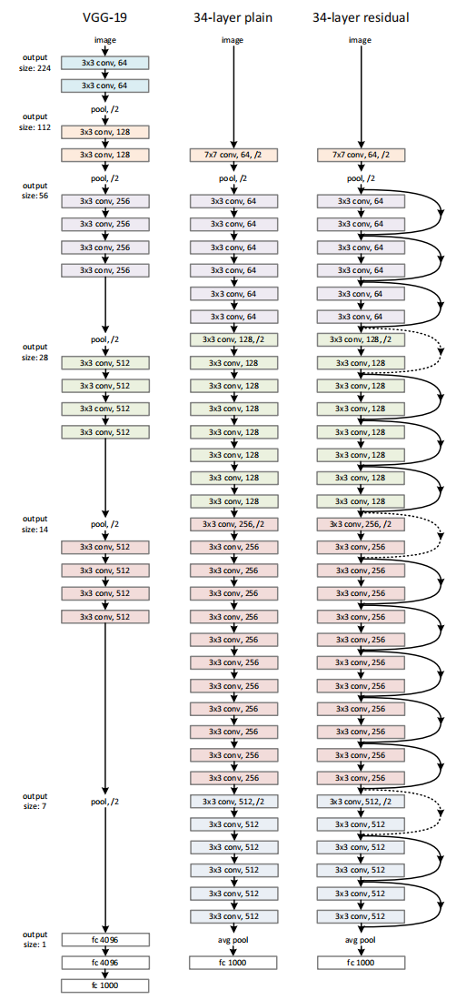

残差连接如何处理输入输出形状不同的情况

- A：在输入输出上添加额外的0，使得形状对应
- B：采用1*1的卷积层（使其在空间维度不做改变，而在通道维度上改变）这里的通道维度可以手动设置来调整参数复杂度，同时调整步长，使得其在高宽和通道上都能匹配

#### 架构版本

不同版本模型架构

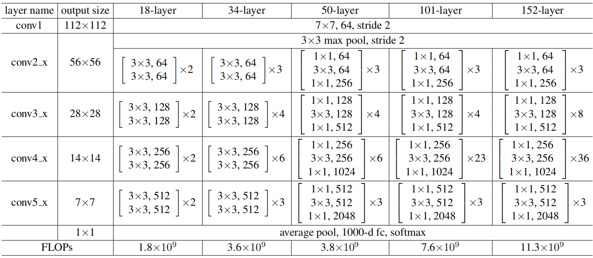

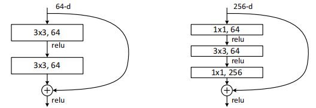

层数计算时，不包括 池化层 & softmax层 ，没参数

eg：34层

- 开始一个(7*7,64,stride 2)
- 之后池化(不算层)
- 再两层(3*3,64)作为一个残差块
- ......
- 参照表依次连接
- ......
- 接一个average pool层(不算参数)
- 再接一个全连接层1000-d FC(算一层，有参数（权重 + 偏置），用于线性变换)
  - 1000-d FC：一个具有 1000 维输出的全连接层（Fully Connected Layer）
- 最后一个softmax层(不算层，无参数，用于将输出变为概率分布)

#### 结果分析

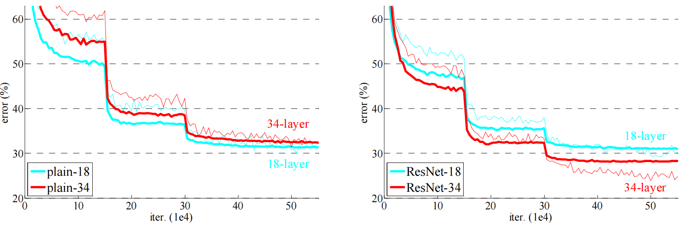

这里断层是因为设计时，**学习率变化**（这里好像是10次学习率*0.1），所以会有断层跳跃现象

- **这里有不好的地方就是可能导致跳太早，而使收敛效果下降，晚一点跳跃可以使开始方向更准确**

结果

- 有残差的模型收敛更快
- 后期效果更好

#### 三种残差连接方案

**投影操作**（projection shortcut）并**不是发生在残差块内部**主分支的卷积操作中，**而是作用在残差连接的“捷径路径”（shortcut path）上**，**用来对输入做变换**，以便**与主分支的输出维度对齐**。

> **投影（projection）是用于将输入残差（shortcut）映射成与主分支输出具有**相同维度**（包括通道数和空间尺寸），从而可以进行有效的“残差相加”操作。**

举例说明：

- 假设一个残差块中：

  - 主分支的输出是：`[batch_size, 128, 28, 28]`

  - 输入 `x` 是：`[batch_size, 64, 56, 56]`（通道数和尺寸都不同）

  - 此时你不能直接做：

  - ```python
    out = F(x) + x  # ❌ 维度不匹配，不能相加
    ```

- 解决方法就是 **投影 shortcut**：

  - 使用一个 `1×1` 卷积来把 `x` 变成 `[batch_size, 128, 28, 28]`：

  - ```python
    shortcut = nn.Sequential(
        nn.Conv2d(64, 128, kernel_size=1, stride=2, bias=False),
        nn.BatchNorm2d(128)
    )
    ```

  - 这样你就可以合法地做：

  - ```python
    out = F(x) + shortcut(x)  # ✅ 维度一致，可以相加
    ```

(A)

> **对于维度提升，使用零填充的快捷连接（shortcut），且所有快捷连接都不包含参数（与表2和图4右侧相同）。**

- 📘 **解释**：
  - 这是 ResNet（残差网络）中 shortcut（捷径连接）的三种策略之一。
  - 如果前一层的输出维度较小，而后一层需要更大的维度（比如通道数变多），就需要“提升维度”。
  - **零填充**（zero-padding）就是在输入特征图中添加全零通道来对齐尺寸，这种方式不引入新的参数，所以称为“parameter-free”（无参数）。

(B)

> **对于维度提升，使用投影（projection）shortcut，其他情况下的 shortcut 则使用恒等映射（identity）。**

- 📘 **解释**：
  - **维度不一致时**，用一个带参数的 projection（比如 1×1 卷积）将输入映射到新维度；
  - 如果维度一致，直接使用 identity shortcut（恒等映射），即输入直接跳过，不进行任何变换。

(C)

> **所有的 shortcut 都使用投影（projection）方式。**

- 📘 **解释**：
  - 不管维度是否变化，shortcut 全部用 projection（如 1×1 卷积）做线性变换；
  - 这种方式虽然引入更多参数，但理论上对学习能力更强，因为它不依赖输入和输出通道必须一致。

**三种残差连接策略对比**：

| 策略编号 | 维度不一致时的处理方式     | 维度一致时的处理方式 | 是否引入参数 |
| -------- | -------------------------- | -------------------- | ------------ |
| (A)      | **零填充**（zero-padding） | 直接跳过（identity） | ❌ 否         |
| (B)      | **1×1 卷积 projection**    | 直接跳过（identity） | ✅ 是（部分） |
| (C)      | **1×1 卷积 projection**    | 也用 projection      | ✅ 是（全部） |

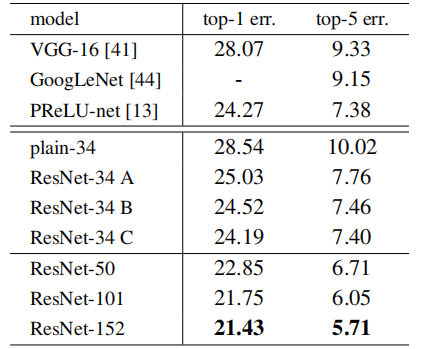

#### 维度不匹配的位置

stage3.4.5第一个块

- 因为其进行了下采样（即卷积层stride != 1，缩小了特征图大小），长宽维度不同

不同stage间

- 不同stage间输入与输出channel不同

瓶颈残差块

- 瓶颈残差块的输入输出维度不同

#### 深层化ResNet方法（瓶颈残差块）

在50以上层时，引入bottleneck design（**瓶颈设计**）


处理方法：深层时

- 使维度增大，学习到更多的模式（上图中 65-d---->256-d ，但是这样会增加4*4的计算复杂度）
- 加入（1*1，64）卷积投影回64-d（降低复杂度）
- 再（1*1，256）卷积投回256-d

**使其算法复杂度差不多**

#### 深层限制

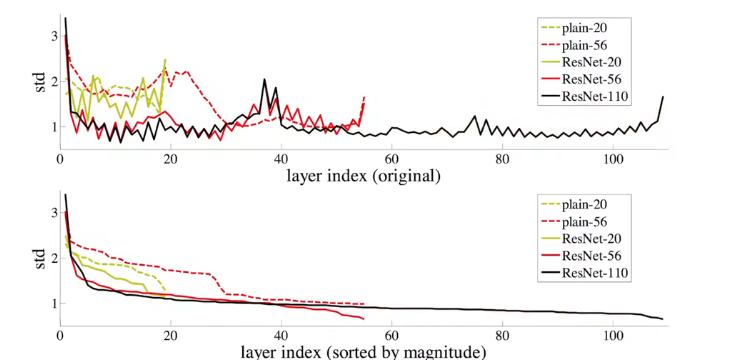

加入残差后，在层数达到一定深度后，可能更深的层没有作用了。

#### ResNet训练快的原因探讨

**原因：梯度上保持比较好**

- **不使用残差**

  - 两层
    - 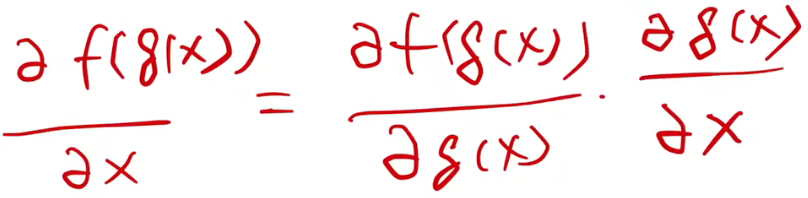

  - 而梯度都比较小（0的附近），层数多时就过小导致梯度消失

- **使用残差**

  - 两层
    - 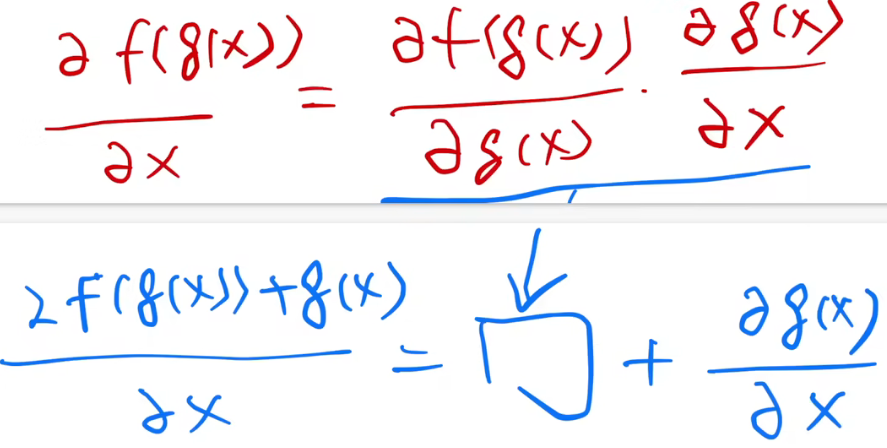

  - 保持了浅层梯度存在

**梯度不消失 → 梯度能够有效传播 → 网络能更快收敛 → 训练更快、更稳定**

**训练快** ： **收敛得快，而非一轮时间少**

## 实验复现

采用CIFAR-10数据集

****

### Model

这里我采用对ResNet进行模块化构建

#### model整体代码

```python
# model
"""
ResNet 模块化实现 
"""
# ------------------------------
# 基础残差块 BasicBlock (用于 ResNet-18/34)
# ------------------------------
class BasicBlock(nn.Module):
    expansion = 1  # 输出通道不变
    def __init__(self, in_planes, out_planes, stride=1):
        super().__init__()
        self.conv1 = nn.Conv2d(in_planes, out_planes, kernel_size=3, stride=stride,
                               padding=1, bias=False)
        self.bn1 = nn.BatchNorm2d(out_planes)
        self.relu = nn.ReLU(inplace=True)
        self.conv2 = nn.Conv2d(out_planes, out_planes, kernel_size=3, stride=1,
                               padding=1, bias=False)
        self.bn2 = nn.BatchNorm2d(out_planes)

        # shortcut（捷径/残差连接）
        self.downsample = None
        if stride != 1 or in_planes != out_planes:
            self.downsample = nn.Sequential(
                nn.Conv2d(in_planes, out_planes, kernel_size=1, stride=stride, bias=False),
                nn.BatchNorm2d(out_planes)
            )

    def forward(self, x):
        identity = x
        out = self.relu(self.bn1(self.conv1(x)))
        out = self.bn2(self.conv2(out))
        if self.downsample is not None:
            # 将输入数据维度调整为输出维度
            identity = self.downsample(x)
        out += identity
        out = self.relu(out)
        return out


# ------------------------------
# 瓶颈残差块 Bottleneck (用于 ResNet-50/101/152)
# ------------------------------
class BottleneckBlock(nn.Module):
    expansion = 4  # 输出通道扩大 4 倍
    def __init__(self, in_planes, out_planes, stride=1):
        super().__init__()
        width = out_planes
        self.conv1 = nn.Conv2d(in_planes, width, kernel_size=1, bias=False)
        self.bn1 = nn.BatchNorm2d(width)
        self.conv2 = nn.Conv2d(width, width, kernel_size=3, stride=stride,
                               padding=1, bias=False)
        self.bn2 = nn.BatchNorm2d(width)
        self.conv3 = nn.Conv2d(width, out_planes * self.expansion, kernel_size=1, bias=False)
        self.bn3 = nn.BatchNorm2d(out_planes * self.expansion)
        self.relu = nn.ReLU(inplace=True)

        self.downsample = None
        if stride != 1 or in_planes != out_planes * self.expansion:
            self.downsample = nn.Sequential(
                nn.Conv2d(in_planes, out_planes * self.expansion, kernel_size=1,
                          stride=stride, bias=False),
                nn.BatchNorm2d(out_planes * self.expansion)
            )

    def forward(self, x):
        identity = x
        out = self.relu(self.bn1(self.conv1(x)))
        out = self.relu(self.bn2(self.conv2(out)))
        out = self.bn3(self.conv3(out))
        if self.downsample is not None:
            identity = self.downsample(x)
        out += identity
        out = self.relu(out)
        return out


# ------------------------------
# Stage 构造函数
# ------------------------------
def make_stage(block, in_planes, out_planes, num_blocks, stride=1):
    """
    构造一个 stage (conv2_x / conv3_x / conv4_x / conv5_x)
    - block: BasicBlock 或 BottleneckBlock
    - in_planes: 输入通道
    - out_planes: stage 输出通道（Bottleneck 会再乘 expansion）
    - num_blocks: block 个数
    - stride: 第一个 block 的 stride (用于下采样)
    返回：nn.Sequential
    """
    layers = []
    layers.append(block(in_planes, out_planes, stride))
    in_planes = out_planes * block.expansion
    for _ in range(1, num_blocks):
        layers.append(block(in_planes, out_planes, stride=1))
    return nn.Sequential(*layers), in_planes


# ------------------------------
# 通用 ResNet
# ------------------------------
class ResNet(nn.Module):
    def __init__(self, block, layers, num_classes=10, input_channels=3):
        super().__init__()
        self.in_planes = 64

        # 第一层卷积：7x7, stride=2, padding=3
        self.conv1 = nn.Conv2d(input_channels, 64, kernel_size=7, stride=2, padding=3, bias=False)
        self.bn1 = nn.BatchNorm2d(64)
        self.relu = nn.ReLU(inplace=True)
        self.maxpool = nn.MaxPool2d(kernel_size=3, stride=2, padding=1)

        # stage2..stage5
        self.stage2, self.in_planes = make_stage(block, self.in_planes, 64, layers[0], stride=1)
        self.stage3, self.in_planes = make_stage(block, self.in_planes, 128, layers[1], stride=2)
        self.stage4, self.in_planes = make_stage(block, self.in_planes, 256, layers[2], stride=2)
        self.stage5, self.in_planes = make_stage(block, self.in_planes, 512, layers[3], stride=2)

        self.avgpool = nn.AdaptiveAvgPool2d((1, 1))
        self.fc = nn.Linear(self.in_planes, num_classes)

    def forward(self, x):
        x = self.relu(self.bn1(self.conv1(x)))  # 224 -> 112
        x = self.maxpool(x)                      # 112 -> 56
        x = self.stage2(x)                       # conv2_x
        x = self.stage3(x)                       # conv3_x
        x = self.stage4(x)                       # conv4_x
        x = self.stage5(x)                       # conv5_x
        x = self.avgpool(x)
        x = torch.flatten(x, 1)
        x = self.fc(x)
        return x


# ------------------------------
# 工厂函数 (便于快速生成不同架构)
# ------------------------------
def ResNet18(num_classes=10):
    return ResNet(BasicBlock, [2, 2, 2, 2], num_classes)

def ResNet34(num_classes=10):
    return ResNet(BasicBlock, [3, 4, 6, 3], num_classes)

def ResNet50(num_classes=10):
    return ResNet(BottleneckBlock, [3, 4, 6, 3], num_classes)

def ResNet101(num_classes=10):
    return ResNet(BottleneckBlock, [3, 4, 23, 3], num_classes)

def ResNet152(num_classes=10):
    return ResNet(BottleneckBlock, [3, 8, 36, 3], num_classes)
```

#### BasicBlock

基础残差块 BasicBlock (用于 ResNet-18/34)

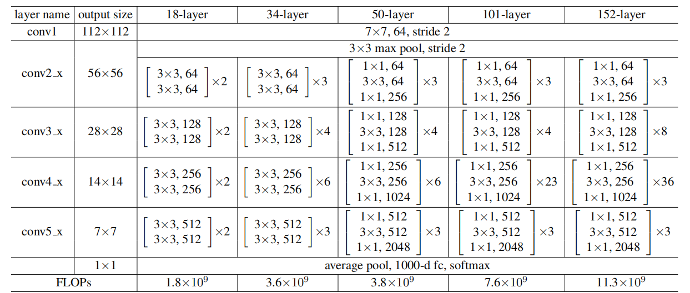

```python
class BasicBlock(nn.Module):
    expansion = 1  # 输出通道不变
    # stride默认为1，即不对特征图进行缩放
    def __init__(self, in_planes, out_planes, stride=1):
        super().__init__()
        # conv1 采用stride = stride，因为在stage3.4.5中，第一个块会进行下采用，缩小特征图长宽
        self.conv1 = nn.Conv2d(in_planes, out_planes, kernel_size=3, stride=stride, padding=1, bias=False)
        self.bn1 = nn.BatchNorm2d(out_planes)
        self.relu = nn.ReLU(inplace=True)
        self.conv2 = nn.Conv2d(out_planes, out_planes, kernel_size=3, stride=1, padding=1, bias=False)
        self.bn2 = nn.BatchNorm2d(out_planes)

        # shortcut（捷径/残差连接）
        #用在残差连接维度不匹配时，对输入进行维度变化，使其能与输出进行相加
        self.downsample = None
        #注意！这里有两种情况：1.特征图长宽改变时，长宽不匹配；2.通道数改变时，通道不匹配
        if stride != 1 or in_planes != out_planes:
            #nn.Sequential 是 PyTorch 提供的一个顺序容器，用来把多个层（layer）或者模块（module）按顺序组合在一起。
            self.downsample = nn.Sequential(
                nn.Conv2d(in_planes, out_planes, kernel_size=1, stride=stride, bias=False),
                nn.BatchNorm2d(out_planes)
            )

    def forward(self, x):
        identity = x
        out = self.relu(self.bn1(self.conv1(x)))
        out = self.bn2(self.conv2(out))
        if self.downsample is not None:
            # 将输入数据维度调整为输出维度
            identity = self.downsample(x)
        out += identity
        out = self.relu(out)
        return out
```

#### Bottleneck

瓶颈残差块 Bottleneck (用于 ResNet-50/101/152)


```python
class BottleneckBlock(nn.Module):
    expansion = 4  # 输出通道扩大 4 倍
    def __init__(self, in_planes, out_planes, stride=1):
        super().__init__()
        # 这里大部分块中，in_planes = out_planes 方便使用同一叠加函数对块进行叠加
        # out_planes常指的是“块的基准通道数”
        # 真实的输出维度：out_planes * self.expansion
        width = out_planes
        # 先将维度减小，减小计算量
        self.conv1 = nn.Conv2d(in_planes, width, kernel_size=1, bias=False)
        self.bn1 = nn.BatchNorm2d(width)
        # 如基础残差块，采用stride = stride，因为在stage3.4.5中，第一个块会进行下采用，缩小特征图长宽
        self.conv2 = nn.Conv2d(width, width, kernel_size=3, stride=stride, padding=1, bias=False)
        self.bn2 = nn.BatchNorm2d(width)
        self.conv3 = nn.Conv2d(width, out_planes * self.expansion, kernel_size=1, bias=False)
        self.bn3 = nn.BatchNorm2d(out_planes * self.expansion)
        self.relu = nn.ReLU(inplace=True)

        self.downsample = None
        if stride != 1 or in_planes != out_planes * self.expansion:
            self.downsample = nn.Sequential(
                nn.Conv2d(in_planes, out_planes * self.expansion, kernel_size=1, stride=stride, bias=False),
                nn.BatchNorm2d(out_planes * self.expansion)
            )

    def forward(self, x):
        identity = x
        out = self.relu(self.bn1(self.conv1(x)))
        out = self.relu(self.bn2(self.conv2(out)))
        out = self.bn3(self.conv3(out))
        if self.downsample is not None:
            identity = self.downsample(x)
        out += identity
        out = self.relu(out)
        return out
```

#### Stage

Stage 构造函数

```python
def make_stage(block, in_planes, out_planes, num_blocks, stride=1):
    """
    构造一个 stage (conv2_x / conv3_x / conv4_x / conv5_x)
    - block: BasicBlock 或 BottleneckBlock
    - in_planes: 输入通道
    - out_planes: stage 输出通道（Bottleneck 会再乘 expansion）
    - num_blocks: block 个数
    - stride: 第一个 block 的 stride (用于下采样)
    返回：nn.Sequential
    """
    layers = []
    # 特殊：第一个块，因为会有下采样
    layers.append(block(in_planes, out_planes, stride))
    
    # 第二个块的in_plaines更新
    in_planes = out_planes * block.expansion
    
    for _ in range(1, num_blocks):
        layers.append(block(in_planes, out_planes, stride=1))
    
    return nn.Sequential(*layers), in_planes
```

#### ResNet


```python
class ResNet(nn.Module):
    def __init__(self, block, layers, num_classes=10, input_channels=3):
        super().__init__()
        # 这里是标准ResNet，标准输入为 224*224*3
        # 第一层卷积：7x7, stride=2, padding=3
        self.conv1 = nn.Conv2d(input_channels, 64, kernel_size=7, stride=2, padding=3, bias=False)
        self.bn1 = nn.BatchNorm2d(64)
        self.relu = nn.ReLU(inplace=True)
        self.maxpool = nn.MaxPool2d(kernel_size=3, stride=2, padding=1)

        self.in_planes = 64
        # stage2，stride = 1，在 maxpool层 已经降低特征图
        self.stage2, self.in_planes = make_stage(block, self.in_planes, 64, layers[0], stride=1)
        # stage3..stage5，输入 stride = 2，需要降低特征图
        self.stage3, self.in_planes = make_stage(block, self.in_planes, 128, layers[1], stride=2)
        self.stage4, self.in_planes = make_stage(block, self.in_planes, 256, layers[2], stride=2)
        self.stage5, self.in_planes = make_stage(block, self.in_planes, 512, layers[3], stride=2)
		
        # 拉直，进行分类
        self.avgpool = nn.AdaptiveAvgPool2d((1, 1))
        self.fc = nn.Linear(self.in_planes, num_classes)

    def forward(self, x):
        x = self.relu(self.bn1(self.conv1(x)))  # 224 -> 112
        x = self.maxpool(x)                      # 112 -> 56
        x = self.stage2(x)                       # conv2_x
        x = self.stage3(x)                       # conv3_x
        x = self.stage4(x)                       # conv4_x
        x = self.stage5(x)                       # conv5_x
        x = self.avgpool(x)
        x = torch.flatten(x, 1)
        x = self.fc(x)
        return x
```

#### 工厂函数

工厂函数 (便于快速生成不同架构)

```python
def ResNet18(num_classes=10):
    return ResNet(BasicBlock, [2, 2, 2, 2], num_classes)

def ResNet34(num_classes=10):
    return ResNet(BasicBlock, [3, 4, 6, 3], num_classes)

def ResNet50(num_classes=10):
    return ResNet(BottleneckBlock, [3, 4, 6, 3], num_classes)

def ResNet101(num_classes=10):
    return ResNet(BottleneckBlock, [3, 4, 23, 3], num_classes)

def ResNet152(num_classes=10):
    return ResNet(BottleneckBlock, [3, 8, 36, 3], num_classes)
```

#### 模型结构测试

```python
if __name__ == "__main__":
    device = torch.device("cuda" if torch.cuda.is_available() else "cpu")

    # 测试 ResNet34
    model = ResNet34(num_classes=10).to(device)
    print(model)

    x = torch.randn(4, 3, 224, 224).to(device)
    # 4 → batch size（一次输入 4 张图片）
    # 3 → 通道数（RGB 三通道）
    # 224, 224 → 高和宽（ImageNet 的经典输入大小）
    y = model(x)
    print("ResNet34 输出:", y.shape)

    # 测试 ResNet50
    model50 = ResNet50(num_classes=10).to(device)
    y50 = model50(x)
    print("ResNet50 输出:", y50.shape)
```

### Dataset

```python
# 数据预处理和加载

batch_size = 32

# CIFAR-10 数据集（32x32）
transform_train = transforms.Compose([
    transforms.Resize(224),
    transforms.RandomHorizontalFlip(),
    transforms.ToTensor(),
    transforms.Normalize(mean=[0.4914, 0.4822, 0.4465],
                         std=[0.2023, 0.1994, 0.2010]),
])

transform_test = transforms.Compose([
    transforms.Resize(224),
    transforms.ToTensor(),
    transforms.Normalize(mean=[0.4914, 0.4822, 0.4465],
                         std=[0.2023, 0.1994, 0.2010]),
])

# 数据集
train_dataset = datasets.CIFAR10(root='./data', train=True, download=True, transform=transform_train)
test_dataset = datasets.CIFAR10(root='./data', train=False, download=True, transform=transform_test)

train_loader = DataLoader(train_dataset, batch_size=batch_size, shuffle=True, num_workers=4)
'''
batch_size=batch_size
	每次返回多少张图片和对应标签。
shuffle=True/False
	True：每个 epoch 打乱训练集顺序，增加训练随机性。测试集一般不打乱顺序。
num_workers=4
	并行加载数据的进程数，加快训练速度。
'''
test_loader = DataLoader(test_dataset, batch_size=batch_size, shuffle=False, num_workers=4)
```

### Train

单次循环训练函数

```python
def train(model, device, train_loader, criterion, optimizer, epoch):
    '''
    model：你要训练的神经网络（如 ResNet34）。
	device：设备（cpu 或 cuda），确保数据和模型在同一个设备上。
	train_loader：训练数据的 DataLoader。
	criterion：损失函数（如 nn.CrossEntropyLoss()）。
	optimizer：优化器（如 Adam 或 SGD）。
	epoch：当前训练轮数，用于显示进度。
    '''
    
    model.train()
    
    running_loss = 0.0 	# 累计训练损失，用于计算平均损失。
    correct = 0 		# 累计预测正确的样本数。
    total = 0 			# 累计总样本数。

    loop = tqdm(train_loader, desc=f"Epoch {epoch}")
    # tqdm 用于显示训练进度条。
    
    for inputs, targets in loop:
        inputs, targets = inputs.to(device), targets.to(device)
		# 梯度清零
        optimizer.zero_grad()
		# 前向传播
        outputs = model(inputs)
        # 计算损失
        loss = criterion(outputs, targets)
        # 反向传播
        loss.backward()
		# 更新参数
        optimizer.step()

        running_loss += loss.item() * inputs.size(0)
        
        # outputs.max(1)：取每个样本预测概率最大的类别。
        _, predicted = outputs.max(1)
        
        total += targets.size(0)
        correct += predicted.eq(targets).sum().item()

        # 更新 tqdm 显示:实时显示 平均损失 和 当前准确率。
        loop.set_postfix(loss=running_loss/total, acc=100.*correct/total)

    return running_loss / total, 100. * correct / total
```

**标准的 PyTorch 单 epoch 训练流程**：

1. 数据迭代
2. forward → loss
3. backward → 更新参数
4. 累计损失与准确率
5. 返回平均值

### Test

单次循环验证函数

```python
def test(model, device, test_loader, criterion):
    '''
    model：要测试的神经网络模型（如 ResNet34）。
	device：设备（CPU 或 GPU）。
	test_loader：测试集的 DataLoader。
	criterion：损失函数（如 nn.CrossEntropyLoss()）。
    '''
    
    model.eval()
    test_loss = 0.0
    correct = 0
    total = 0
    
	# 禁用梯度计算：在测试/验证时不需要梯度，节省显存和计算量。
    with torch.no_grad():	
        for inputs, targets in test_loader:
            inputs, targets = inputs.to(device), targets.to(device)
            
            # 前向传播
            outputs = model(inputs)
            loss = criterion(outputs, targets)
			
            # 累计损失和正确预测
        	'''
        	loss.item() * inputs.size(0)：乘以 batch 大小，得到 batch 的总损失。
			outputs.max(1)：取每个样本预测概率最大的类别。
			predicted.eq(targets).sum().item()：统计该 batch 预测正确的样本数。
        	'''
            test_loss += loss.item() * inputs.size(0)
            _, predicted = outputs.max(1)
            total += targets.size(0)
            correct += predicted.eq(targets).sum().item()

    # 计算平均损失和准确率
    avg_loss = test_loss / total
    acc = 100. * correct / total
    
    print(f"Test Loss: {avg_loss:.4f}, Test Acc: {acc:.2f}%")
    return avg_loss, acc
```

### Main

```python
if __name__ == "__main__":
    device = torch.device("cuda" if torch.cuda.is_available() else "cpu")
    print(f"Using device: {device}")

    epochs = 10
    learning_rate = 0.001

    # 创建保存模型的文件夹
    save_path = "./checkpoints"
    os.makedirs(save_path, exist_ok=True)
    best_acc = 0.0  # 记录最佳测试准确率
    
    # 模型
    model = ResNet34(num_classes=10).to(device)

    # 损失函数和优化器
    '''
    nn.CrossEntropyLoss()：多分类交叉熵损失。
	optim.Adam：Adam 优化器，用于更新模型参数。
	model.parameters()：把模型所有可训练参数传给优化器。
    '''
    criterion = nn.CrossEntropyLoss()
    optimizer = optim.Adam(model.parameters(), lr=learning_rate)

    # 学习率调度器
    '''
    每 step_size 个 epoch 后，把学习率乘以 gamma。
	这里每 5 个 epoch，学习率缩小为原来的 0.1 倍。
	可以帮助模型在训练后期收敛得更稳定。
    '''
    scheduler = optim.lr_scheduler.StepLR(optimizer, step_size=5, gamma=0.1)

    # 训练和测试
    for epoch in range(1, epochs + 1):
        train_loss, train_acc = train(model, device, train_loader, criterion, optimizer, epoch)
        test_loss, test_acc = test(model, device, test_loader, criterion)
        
        # 更新学习率
        scheduler.step()
        
        # 保存最优模型
        if test_acc > best_acc:
            best_acc = test_acc
            torch.save(model.state_dict(), os.path.join(save_path, f"resnet34_best_{epochs}.pth"))
            print(f"Saved best model with acc: {best_acc:.2f}%; epoch:{epoch}")
    
    
    # 保存最终训练完成后的模型
    torch.save(model.state_dict(), os.path.join(save_path, f"resnet34_final_{epochs}.pth"))
    print("Saved final model after all epochs.")
```

## 实验

### Train

数据集：CIFAR-10

架构：ResNet-34

- ResNet(BasicBlock, [3, 4, 6, 3],10)

参数：

- batch_size = 32

- epochs = 20
- learning_rate = 0.001

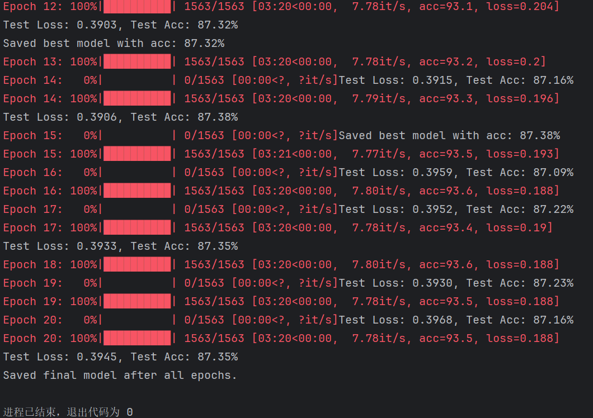

### predict

```python
import torch
from torchvision import transforms
from PIL import Image

# 导入我的模型架构
from ResNet import ResNet34  # 我的模型 ResNet34 定义在 ResNet.py 文件中


# CIFAR-10 类别标签
classes = ['airplane', 'automobile', 'bird', 'cat', 'deer',
           'dog', 'frog', 'horse', 'ship', 'truck']

# ======== 配置模型路径和测试图片路径 ========
model_path = "model/resnet34_best_20.pth"  # 训练好的模型路径
image_path = "cat.10002.jpg"  # 预测图片路径
device = torch.device("cuda" if torch.cuda.is_available() else "cpu")
# ============================================

def load_image(image_path):
    """
    加载图片并进行预处理
    """
    transform = transforms.Compose([
        transforms.Resize(224),  # 调整为模型输入尺寸
        transforms.ToTensor(),  # 转为 Tensor
        transforms.Normalize(mean=[0.4914, 0.4822, 0.4465],
                             std=[0.2023, 0.1994, 0.2010])
    ])

    image = Image.open(image_path).convert('RGB')  # 确保是 RGB 图
    image = transform(image).unsqueeze(0)  # 增加 batch 维度
    return image


def predict(image_path, model_path, device):
    """
    对单张图片进行预测
    """
    print(f"Using device: {device}")

    # 加载模型
    model = ResNet34(num_classes=10)

    model.load_state_dict(torch.load(model_path, map_location=device))
    model.to(device)
    model.eval()

    # 加载图片
    image = load_image(image_path).to(device)

    # 前向传播
    with torch.no_grad():
        outputs = model(image)
        _, predicted = outputs.max(1)
        class_idx = predicted.item()
        class_name = classes[class_idx]

    return class_name


if __name__ == "__main__":
    class_name = predict(image_path, model_path, device)
    print(f"Predicted class for '{image_path}': {class_name}")
```

model/resnet34_best_20.pth

```python
model_path = "model/resnet34_best_20.pth"
image_path = "cat.10002.jpg"
```

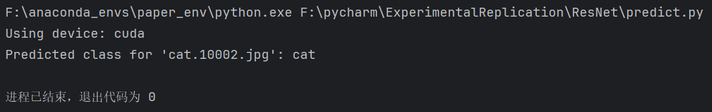

model/resnet34_final_20.pth

```python
model_path = "model/resnet34_final_20.pth"
image_path = "cat.10002.jpg"
```

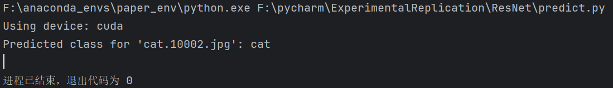