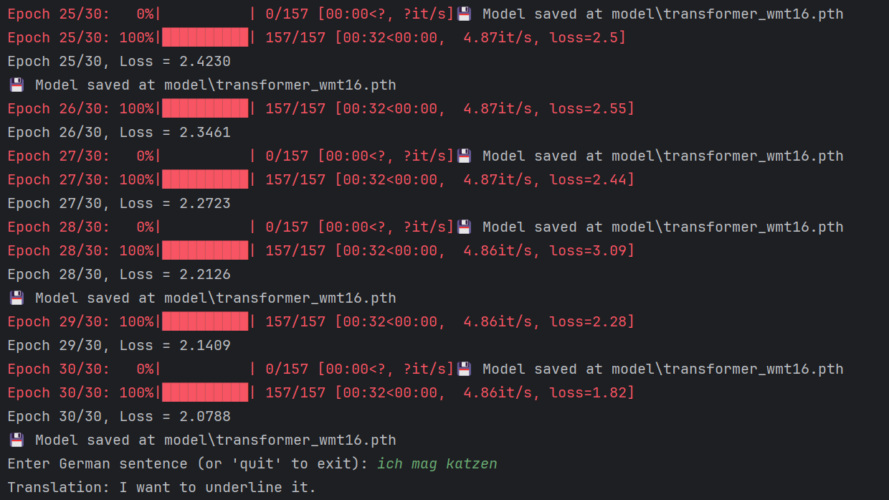
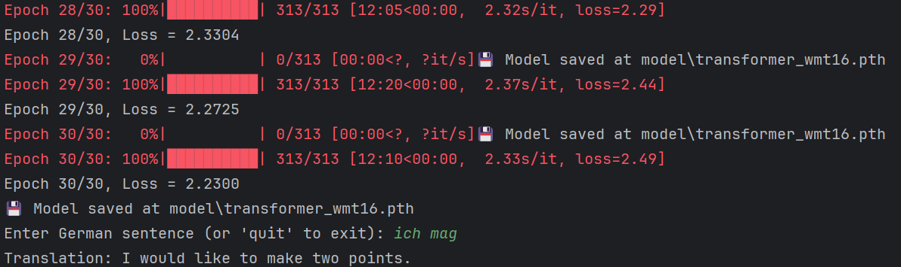

# Transformer

最开始用于机器翻译

对于**时序模型**

**仅使用注意力机制**，不使用卷积和循环

### 发现

**RNN**（循环神经网络）由于有**时序**（隐藏状态 $h_t=h_{t-1}+t$）

- 在**时间上无法并行**
- 时序较长时，在后面**其前面的信息可能有丢失**

**CNN**（卷积神经网络）

- 需要**用多层来连接**隔得远的像素
- 优点：可以做**多个输出通道**，每个通道识别不一样的模式

**Transformer**

- 使用**纯attention**完全做并行
- **一层**就可以看到**整个序列**
- 使用**多头attention**模拟CNN多输出通道的效果

Transformer：第一个使用自注意力机制做encode到decode的架构的模型

## 模型架构

**编码器（Encoder）**

- 输入：
  - **源语言句子的嵌入表示**（如英文句子 token embedding）
- 模块堆叠（通常为6层）：
  - 多头自注意力（**Self-Attention**）
  - 前馈全连接网络（Feed-Forward Layer）
  - 层归一化与残差连接
- 目标：提取出整句中每个单词在上下文中的**语义表示**

**解码器（Decoder）**

- 输入：
  - **前一步已经生成的词**（目标语言的前缀）
  - **编码器的输出**（源语言的语义表示）
- 模块堆叠（通常为6层）：
  - **Masked 多头自注意力层**：防止看到未来词
  - 多头注意力（对编码器输出的 cross-attention）
  - 前馈网络
  - 层归一化与残差连接
- 目标：逐步生成目标语言的单词序列


- **左边为编码器，右边为解码器**
- Nx：重复N次的意思

- 编码器的输出会作为解码器的一个输入放入


### encoder

- 6个块组成，每个块有两个子层（sub-layer）。
- 第一个子层：multi-head self-attention mechanism
- 第二个子层：simple, position wise fully connected feed-forward network就是一个MLP
- 每个子层用一个残差连接和一个 layer normalization
  - layer normalization：
- 子层公式：$LayerNorm(x + Sublayer(x))$
- 为了简单，每一层的输出维度$d_{model} = 512$

****

`LayerNorm`（层归一化）和 `BatchNorm`（批归一化）都是**神经网络中的归一化技术**，用于提高训练稳定性，加速收敛，缓解梯度消失/爆炸问题。它们的本质目标相同，但**归一化的维度和应用场景**有所不同。

#### Batch Normalization（批归一化）

> 在一个 mini-batch 中，对每个特征维度（channel）进行归一化

适用场景：

* **CNN、MLP 等前馈网络**
* 通常在卷积层或全连接层后使用（+ ReLU）

计算公式：

对于每一层输入 $x \in \mathbb{R}^{(N, C, H, W)}$（如卷积层输出）：

* **均值（按 batch 维度）**：

  $$
  \mu_c = \frac{1}{N \cdot H \cdot W} \sum_{n,h,w} x_{n,c,h,w}
  $$
* **方差**：

  $$
  \sigma_c^2 = \frac{1}{N \cdot H \cdot W} \sum_{n,h,w} (x_{n,c,h,w} - \mu_c)^2
  $$
* **归一化**：

  $$
  \hat{x}_{n,c,h,w} = \frac{x_{n,c,h,w} - \mu_c}{\sqrt{\sigma_c^2 + \epsilon}}
  $$
* **缩放与偏移**（可学习参数）：

  $$
  y = \gamma_c \cdot \hat{x}_{n,c,h,w} + \beta_c
  $$

特点：

* 利用了整个 batch 的统计量
* 对 batch 大小敏感，小 batch 效果差
* 训练和推理行为不同（推理中用滑动平均）

#### Layer Normalization（层归一化）

> 对单个样本的所有特征进行归一化，不依赖 batch

适用场景：

* **RNN、Transformer 等序列模型**
* 不受 batch 大小影响

输入形状（如 Transformer 中的 token 表示）：

$x \in \mathbb{R}^{(B, T, D)}$，其中 D 是特征维度

计算公式：

对每一个样本、每一个 token 的 D 维特征：

* **均值**：

  $$
  \mu = \frac{1}{D} \sum_{i=1}^{D} x_i
  $$
* **方差**：

  $$
  \sigma^2 = \frac{1}{D} \sum_{i=1}^{D} (x_i - \mu)^2
  $$
* **归一化与变换**：

  $$
  \hat{x}_i = \frac{x_i - \mu}{\sqrt{\sigma^2 + \epsilon}}, \quad y_i = \gamma_i \cdot \hat{x}_i + \beta_i
  $$

特点：

* 归一化仅对单个样本，适用于 RNN 和 Transformer
* 不依赖 batch 大小，训练推理一致
* 计算效率高，适用于自注意力结构

#### 对比总结表格

| 对比项              | **BatchNorm**                 | **LayerNorm**         |
| ------------------- | ----------------------------- | --------------------- |
| 归一化维度          | Batch + 特征维                | 单个样本的特征维      |
| 是否依赖 Batch 大小 | ✅ 是                          | ❌ 否                  |
| 应用场景            | CNN、MLP 等                   | RNN、Transformer      |
| 是否可并行          | ❌ 否（要等整个 batch）        | ✅ 是                  |
| 推理行为            | 与训练不同（需保存均值/方差） | 与训练一致            |
| 缺点                | 小 batch 效果差               | 对图像可能效果不如 BN |
| PyTorch 接口        | `nn.BatchNorm1d/2d/3d`        | `nn.LayerNorm`        |

---

#### Transformer 中为什么用 LayerNorm 而不是 BatchNorm？

* Transformer 的每个 token 是独立处理的 → 不依赖 batch 归一化
* 自注意力机制天然支持并行 → LayerNorm 更适合
* BatchNorm 在小 batch（如推理时）会退化
* LayerNorm稳点一些

Transformer 使用 LayerNorm 一般在两个位置：

* 在子层的前或后（Post-LN / Pre-LN）
* 如：`x = LayerNorm(x + SubLayer(x))`（残差连接后归一化）

#### 小结口诀（记忆）

> **BatchNorm 用在 CNN，LayerNorm 用在 Transformer。**
>
> Batch 看通道，Layer 看自己。


- **Batch**：一次处理几句话
- **Seq**：每句话有几个词（token）这个词数量可能不同，一般用0补全
- **Feature**：每个词用多少维向量来表示（512）

- **BatchNorm**
  - 蓝色切，然后做norm（均值为0，方差为1）
- **LayerNorm**
  - 黄色切，然后做norm（均值为0，方差为1）

### decoder

- 6层块堆叠
- 3个子层
  - 第一个：带掩码的注意力机制
    - 使其在训练时（输入时）仅看到 t 之前的输入，而看不到 t 之后的输入
    - 保证在训练和预测是行为一致
  - 第二个：多头注意力机制
  - 第三个：simple, position wise fully connected feed-forward network就是一个MLP
  - 使用残差和LayerNorm连接

### Attention

注意力机制（**Attention Mechanism**）是深度学习中一种**模拟“人类注意力”的机制**，它可以在处理序列或结构化数据时，**动态地关注输入中的关键信息**。

---

#### 注意力机制

> 在处理一个输入序列时，并不是所有信息都同等重要。
> 注意力机制让模型可以 **根据任务需要，自主决定“关注谁、忽略谁”。**

---

##### 基本数学形式（以最常见的 **Scaled Dot-Product Attention** 为例）

给定三个矩阵：

| 矩阵          | 含义                     |
| ------------- | ------------------------ |
| **Q (Query)** | 查询向量（我想找的信息） |
| **K (Key)**   | 键向量（你有什么信息）   |
| **V (Value)** | 值向量（具体要返回什么） |

##### 🎯 Attention(Q, K, V) 的公式：

$$
\text{Attention}(Q, K, V) = \text{softmax}\left(\frac{QK^T}{\sqrt{d_k}}\right) V
$$

各部分解释：

* $QK^T$：计算查询和键之间的相似度（点积）
* $\sqrt{d_k}$：防止数值过大导致softmax后向两边靠拢而导致梯度消失（做缩放）
* `softmax`：将相似度转换为权重（总和为1）
* 与 $V$ 相乘：加权求和，得到输出结果
* 矩阵运算
  * 


---

##### 直观理解（举例）

假设你正在翻译句子：

> “**The cat sat on the mat.**”

在翻译 “sat” 时：

* Query 是“sat”这个词的表示；
* 模型可能重点关注 “cat”（主语），也关注“mat”（地点）；
* **注意力机制会给这些词分配较大的权重**，从而帮助更准确地翻译“sat”。

---

##### Self-Attention（自注意力）

> 每个 token 同时是 Query、Key、Value，对整个序列内部“自我关注”。

* 允许模型在每一层中理解：
  某个词应该注意句子中哪些其它词。
* 是 Transformer 的核心机制！

---

##### Multi-Head Attention（多头注意力）

> 不是只计算一次注意力，而是**多个“头”并行学习不同的关注模式**

* 多头允许模型在不同的“子空间”上关注不同特征：

  * 一个头可能关注主语-谓语
  * 一个头可能关注代词指代
  * 一个头关注句法关系

📐 公式结构：

```text
MultiHead(Q,K,V) = Concat(head₁, ..., headₕ) · W_o
where headᵢ = Attention(QWᵢ^Q, KWᵢ^K, VWᵢ^V)
```

---

##### 注意力机制在不同模型中的应用

| 模型                   | 使用方式                      | 举例                      |
| ---------------------- | ----------------------------- | ------------------------- |
| Transformer            | 自注意力 + 多头注意力         | 每层都用                  |
| BERT                   | 编码器堆叠 + 多头注意力       | 理解任务，如问答、分类    |
| GPT                    | 解码器堆叠 + Masked Attention | 文本生成                  |
| 图像Transformer（ViT） | 用注意力代替卷积              | 图像分类                  |
| Seq2Seq（翻译模型）    | 编码器-解码器 Attention       | Decoder 关注 Encoder 输出 |

---

##### 总结口诀

> **注意力机制就是：计算相关性 + 加权组合信息**
>
> “Query 想知道什么，Key 提供线索，Value 给出答案”

---

#### Scaled Dot-Product Attention

$$
\text{Attention}(Q, K, V) = \text{softmax}\left(\frac{QK^T}{\sqrt{d_k}}\right) V
$$

这里除以$\sqrt{d_k}$作用

- dk过大时，点乘中值相对的差距就会变大，导致值大的softmax更靠近1，剩下的靠近0，导致更加向两边靠拢，这样梯度会变小，导致跑不动了
- 所以除以$\sqrt{d_k}$，防止数值过大导致softmax后向两边靠拢而导致梯度消失


Mask：对于Qt和Kt之后的值换成一个非常大的负数，在softmax后就会变为0，使得在做预测时训练测试的步骤一样

#### Multi-Head Attention


1. 在Linear层做h次投影，使其再经过h次注意力机制块
2. 使其有h次机会，去学习不一样的投影方法的度量空间中匹配不同模式及其需要的相似函数
3. 最后总结再做一次投影


**这里设置 h = 8 ，使得投影为 $d_k = d_v = d_{model}/h = 64$，最后合并投影回来**

#### Transformer中如何使用Attention


- **编码器自注意力层**
- **解码器Masked自注意力层**
- **解码器编码器连接的注意力层**
  - **key 和 value 来自于编码器的输出**
  - **query 来自于上一个 attention 的输出**
  - 作用：将编码器中我想要的有效输出拿过来

### Position-wise Feed-Forward Networks

编码器和解码器中的每一层**还包含一个前馈全连接神经网络**，该网络**对每个位置分别且一致地应用**。 这个前馈网络由**两个线性变换**组成，中间使用了**ReLU 激活函数**。

虽然这两个线性变换在**不同的位置上**使用的是**相同的参数**（即参数在 **token 之间共享**），但在**不同的网络层之间**，这些参数是**不同的**（每一层都有自己的一套 FFN 权重）。

**另一种描述方式是**：这个前馈网络可以看作是**两个卷积核大小为1的一维卷积操作**。

**输入和输出的维度**都是 $d_{\text{model}} = 512$，而**前馈网络内部的隐藏层维度**是 $d_{\text{ff}} = 2048$。

最后投影回512，因为需有残差连接

#### 结构形式

$$
\text{FFN}(x) = \text{max}(0,xW_1 + b_1)W_2 + b_2
$$

#### 结构图理解

```text
输入 x ∈ ℝ^{batch_size × seq_len × 512}
     │
     └──► Linear(512 → 2048)
               │
               ▼
           ReLU 激活
               │
               ▼
     └──► Linear(2048 → 512)
               │
               ▼
         输出 x' ∈ ℝ^{batch_size × seq_len × 512}
```

#### 总结

> Transformer 中每一层（不论是编码器还是解码器）除了注意力子层，还包括一个**前馈神经网络子层（FFN）**。
> FFN 对每个位置的表示单独处理，由两层全连接 + ReLU 构成（512 → 2048 → 512）。**参数在 token 之间共享，但在不同层之间不共享**。

#### 一个Attention和一个Feed Forward举例


- 这里下面的红色块是Attention
  - 使得**含有序列信息**
- 上面的红色块是MLP，且在一个层中token之间共享即一样
  - 对每个位置的表示进行**非线性变换和特征增强**

### Embeddings and Softmax

embedding

- **将词元映射成向量**长度为$d_{model}$，在模型中不同地方的embedding是一样的权重
- **这里embedding乘以**$\sqrt{d_{model}}$，因为embedding不管 d 多大时，值仍然为1，维度一大后，其权重值会过小，而**后面需要加上Positional Encoding所以扩大使得其在相加时在一个数量级上差不多**

### Positional Encoding

因为attention本身不会去关注其句子中位置存放的信息，这里使用Positonal Encoding在attention机制中加入时序信息，即将位置信息也当作输入


将**时序信息与嵌入层相加**，就完成了将时序信息加入数据的步骤

## Why Self-Attention


- n：序列长度，单词数n
- d：维度，用多少维向量表示一个单词
- k：卷积的核大小
- r：限制性自注意力（restricted self-attention）中的邻域大小。

| 符号 | 含义                                                         | 举例                                                         |
| ---- | ------------------------------------------------------------ | ------------------------------------------------------------ |
| n    | **sequence length**：序列长度                                | NLP 中一句话的 token 数，比如 "I love NLP." 是 3             |
| d    | **representation dimension**：表示维度                       | 每个词的 embedding 维度，如 512、768（BERT）等               |
| k    | **kernel size**：卷积核大小                                  | CNN 中常用大小如 3、5，表示局部窗口大小                      |
| r    | **neighborhood size** in **restricted self-attention**：限制性注意力的范围 | 仅让一个位置关注前后 r 个位置（如左1右1），不是全局 attention |

****

- Complexity per Layer复杂度
- Sequential Operations顺序计算下一步计算需要等前面多少步计算，越下并行度越高
- Maximum Path Length信息经过路程：信息从一个数据点走到另外一个数据点要走多远，越短越好

## Training

### Training Data and Batching

**训练数据和批次**

我们基于包含约450万句子对的标准WMT 2014英德语数据集进行训练。采用字节对编码[3]对句子进行编码，该编码使用共享的源语言目标语言词汇表，包含约37000个标记。对于英法语数据集，我们使用规模更大的WMT2014英法语数据集（包含3600万句子），将标记拆分为32000个词片词汇表[38]。根据近似序列长度对句子对进行批量处理，每个训练批次包含约25000个源语言标记和25000目标语言标记的句子对集合。 

****

### Hardware and Schedule

**硬件和时间表**

我们在配备8块NVIDIA P100 GPU的单机上训练模型。对于基础模型（使用文中所述的超参数配置），每个训练步骤耗时约0.4秒，总训练时长为10万步（即12小时）。针对大型模型（详见表3底部说明），每步耗时1.0秒，总训练时长达30万步（相当于3.5天）。

****

### Optimizer

**优化器**

我们使用**Adam优化器**[20]，参数设置为$β_1= 0.9、β_2= 0.98和ε=10^{−9}$。

在训练过程中，我们**根据以下公式调整学习率**


这对应于在前个预热训练步骤中线性增加学习率，之后则按步骤编号的平方根比例递减。使用了warmup_steps = 4000。 

****

### Regularization

**正则化**

使用**三个**正则化

- **Residual Dropout**：**残差丢弃机制**，我们在每个子层的输出**在进入残差连接和LayerNorm之前**，会丢弃，丢弃率为$P_{drop} = 0.1$。
- 此外，编码器和解码器堆栈中的**嵌入向量总和**及**位置编码总和**均会**进行丢弃处理**。基础模型采用的丢弃率为$P_{drop} = 0.1$。
- **Label Smoothing**：**标签平滑处理**，在训练过程中，我们使用了**标签平滑值为$ε_{ls}=0.1$**[36]（softmax后置信度为$1-0.1=0.9$）。这种处理虽然会**增加困惑度**-（因为模型会变得不那么确定），但能**有效提升准确率和BLEU分数**。 
  - **标签平滑的意义**
    - **不要**对训练标签**太自信**，**减少过拟合**，**提升泛化能力**，特别对抗模型“过分确定”的倾向有用。
    - 当**标签平滑值为 0.1** 时，模型对真实标签的置信度是 **90%**，其余 10% 的概率被**均匀分配给其他类别**。

## 缺点

- **对关键信息的“抓取能力”差**
- **需要大量数据进行训练**
- **训练资源消耗大（时间 + 显存 + 计算）**
- **解释性差**


## QKV&multi

Vision Transformer (ViT) 是 Transformer 模型针对计算机视觉任务的改编。所以我选择先进行Transformer 模型的学习

这里参照[csdn博客:一文读懂Transformer](https://blog.csdn.net/weixin_42475060/article/details/121101749?ops_request_misc=%257B%2522request%255Fid%2522%253A%2522159E0F39-AD8E-416D-AA92-7DD8F7B0E841%2522%252C%2522scm%2522%253A%252220140713.130102334.pc%255Fblog.%2522%257D&amp;request_id=159E0F39-AD8E-416D-AA92-7DD8F7B0E841&amp;biz_id=0&amp;utm_medium=distribute.pc_search_result.none-task-blog-2~blog~first_rank_ecpm_v1~hot_rank-3-121101749-null-null.nonecase&amp;utm_term=Transformer%20%E6%A8%A1%E5%9E%8B%E5%9C%A8%E6%9C%BA%E5%99%A8%E5%AD%A6%E4%B9%A0%E4%B8%AD&amp;spm=1018.2226.3001.4450 )

Transformer是一种用于自然语言处理（NLP）和其他序列到序列（sequence-to-sequence）任务的深度学习模型架构

最重要的就是引入了自注意力机制，就是将输入的序列不同部分进行赋权重，从而达到构建输入的样本内部形成了关系

### 整体结构


Encoder block对应编码器

Decoder block对应解码器


这里有六个编码器叠加，6个解码器叠加（互相间没有共享参数）

编码器与解码器之间的简略结构


输入的句子先进入自注意层，将每个单词编码时也与其他单词相关联

解码器的注意力层也是关注整个输入的相关部分

### Encoder Block

#### 单头自注意力层

我认为注意力头就是为每一个样本都创建三个权重矩阵，注意力机制会将这些权重矩阵应用于输入特征，生成查询、键和值，进而计算注意力权重并整合信息，以此来建立样本内部的关系连接，捕捉样本内部的复杂关系。


##### 计算步骤

step1：先将输入向量进行词嵌入与三个权重矩阵进行相乘创建出查询向量Q，键向量K，值向量V


step2：计算自注意力层的输出。


整体的计算图


1.先将x与Wq、Wk、Wv进行矩阵相乘得出查询向量、键向量、值向量

2.查询向量*键向量得出分数

3.分数除以dk的平方根

4.对第三步的得分进行softmax归一化

4.softmax后的值*值向量求和后就是该单词在该句子中的注意力了

#### 多头自注意力层Multi——Head Attention

Multi是将这个关系建立得更加清晰，每个头都有自己的一组权重矩阵。

关键是分头


分头的实现：用多组Wq，Wk，Wv得到多组查询、键、值矩阵，然后每组分别计算得到一个Z矩阵。最后形成多个注意力头，然后再用一个矩阵将多头拼接，最后再与一个建立的附加权重矩阵相乘最后得到一个注意力头矩阵（相当于合成数据）


通览


#### 位置编码使用

位置编码的存在是使同一个单词在不同位置的注意力分数不一样

这里选择词嵌入与位置编码进行相加，不是拼接（这里是防止维度增加）


#### Add&Normalize

在经过多头注意力机制得到矩阵Z后，Z并没有直接传入全连接神经网络，而是需要经过一步Add&Normalize。


Add：在z的基础上加了一个残差块X，防止在深度神经网络的训练过程中发生退化的问题，退化的意思就是深度神经网络通过增加网络的层数，Loss逐渐减小，然后趋于稳定达到饱和，然后再继续增加网络层数，Loss反而增大。

Normalize：归一化，加快训练速度、提高训练的稳定性

这里选用的是LN可以每一维上进行归一化

#### Feed Forward（全连接层）


在这里全连接层是一个**两层的神经网络**，先线性变换，然后ReLU非线性，再线性变换。

### Decoder Block


Decoder也是由6个decoder堆叠而成的。一个Decoder包含两个 Multi-Head Attention 层。第一个 Multi-Head Attention 层采用了 Masked 操作。第二个 Multi-Head Attention 层的K, V矩阵使用 Encoder 的编码信息矩阵C进行计算，而Q使用上一个 Decoder block 的输出计算。

#### Masked Multi-Head Attention

与Encoder的Multi-Head Attention计算原理一样，只是多加了一个mask码。mask 表示掩码，它对某些值进行掩盖，使其在参数更新时不产生效果。

### 输出

首先经过一次线性变换，然后Softmax得到输出的概率分布，然后通过词典，输出概率最大的对应的单词作为我们的预测输出。

## 图像理解

[【官方双语】直观解释注意力机制，Transformer的核心 | 【深度学习第6章】](https://www.bilibili.com/video/BV1TZ421j7Ke?vd_source=64fa735df4e10c3811ddac775f3035f1)


Transformer使其不单单编码单个词，还能融入更丰富的上下文含义


模型相互传递嵌入向量蕴含的信息进行更新


预测下一个token的计算过程完全基于序列中最后一个向量


原始向量（嵌入向量）包含词本身以及它在文中位置信息


最终目标计算出其实际表示的意义对应向量

- 比如经过形容词修饰后对应的向量


### Single head of attention

#### Q 查询矩阵


查询向量目的提供权重去注意有关token的向量

查询向量维度比嵌入向量小得多


注意：这里假设查询矩阵关注的是形容词

#### K 键矩阵

**将 [键] 视为想要回答 [查询]**


键与查询重合度越高就视为匹配度越高


进行矩阵乘法以得出匹配度


点积越大---》原点越大---》键与查询越对齐---》token嵌入注意到了某个token得嵌入

采用softmax进行归一化


#### 掩码机制

为了使一个训练样本能提供多次训练机会，需要使得后面的token不被看到，即只能看到前面的词语，不能让后面的token影响前面的token


#### V 值矩阵


表示**这个词**需要**调整目标词的含义**时需要添加的向量

累加得到想要引入的变化量


最终得到一个编码了上下文信息的一个更精准的嵌入向量


通过注意力模块，得到了一系列更精准的嵌入向量

#### 参数量


**更高效的做法**

- **让值矩阵所需参数量等于键矩阵和查询矩阵的参数量之和**，这对于并行多注意力头而言非常重要

**做法：将值矩阵分为两个小矩阵（对大矩阵进行 低秩分解 ），将整体视为一个线性映射**


### Multi-headed attention

大量 并行


总和是这个模块的输出，即通过这个模块得到的更精确的嵌入


训练时可能会将Value up矩阵合并为一个大矩阵（称：**输出矩阵**）

- 与整个多头注意力模块相关联

单个注意力头的值矩阵单指第一步的矩阵，即Value down矩阵


#### 多层感知器 MLP


**注意力层** 负责跨序列位置的信息交互（谁和谁相关）。

**MLP 层** 则负责 **位置内特征的非线性变换**，即逐 token 的特征提取和表达能力增强。

- 可以理解为：注意力决定“信息怎么流动”，而 MLP 决定“信息如何变换”。

这种交替堆叠的结构使 Transformer 既能捕捉全局依赖关系，又能逐点进行深度特征提炼。

# 复现

## Transformer架构

[哈佛NLP团队实现的Pytorch版Transformer的源码解析](https://nlp.seas.harvard.edu/annotated-transformer/)

[知乎：Transformer源码详解（Pytorch版本）](https://zhuanlan.zhihu.com/p/398039366)

### attention

```python
def attention(query, key, value, mask=None, dropout=None):
    d_k = query.size(-1)  
    scores = torch.matmul(query, key.transpose(-2, -1)) / math.sqrt(d_k)  
    if mask is not None:  
        scores = scores.masked_fill(mask == 0, -1e9)  
    p_attn = F.softmax(scores, dim=-1)  
    if dropout is not None:  
        p_attn = dropout(p_attn)  
    return torch.matmul(p_attn, value), p_attn
```

参数维度（常见约定）

在 **多头注意力**的实现里，通常传入的 `query, key, value` 不是原始的 3D `(batch, seq_len, d_model)`，而是已经**拆分成多头后的 4D**：

- `query`: `(batch, num_heads, seq_q, d_k)`
- `key`: `(batch, num_heads, seq_k, d_k)`
- `value`: `(batch, num_heads, seq_k, d_k)`
- 其中：
  - `batch` = 批次大小
  - `num_heads` = 注意力头数
  - `seq_q` = query 序列长度
  - `seq_k` = key/value 序列长度（可能和 `seq_q` 相同或不同，比如 encoder-decoder attention）
  - `d_k` = 每个注意力头的特征维度（通常 `d_model / num_heads`）

```python
d_k = query.size(-1)
```

取出每个头的维度大小（即 head_dim = d_model / num_heads）。

```python
scores = torch.matmul(query, key.transpose(-2, -1)) / math.sqrt(d_k)
```

这里是 **Scaled Dot-Product Attention** 的核心步骤：

- `key.transpose(-2, -1)` 把 `key` 的最后两个维度交换，
   原形状：`(batch, num_heads, seq_k, d_k)`
   转置后：`(batch, num_heads, d_k, seq_k)`
- `torch.matmul(query, key^T)`：
  - query: `(batch, num_heads, seq_q, d_k)`
  - key^T: `(batch, num_heads, d_k, seq_k)`
  - **结果：`(batch, num_heads, seq_q, seq_k)`**
     → 每个 query 位置和每个 key 位置计算相似度。
- 除以 `sqrt(d_k)`：防止数值过大，稳定梯度。

```python
if mask is not None:
    scores = scores.masked_fill(mask == 0, -1e9)
```

- `mask` 的形状要能广播到 `(batch, num_heads, seq_q, seq_k)`
- `mask==0` 的地方表示 **不可见**，用 `-1e9` 填充，softmax 后概率趋近于 0。
- 常见 mask 有：
  - **padding mask**: 屏蔽 `<pad>` token
  - **look-ahead mask**: 防止 decoder 看未来词

```python
p_attn = F.softmax(scores, dim=-1)
```

- 在最后一维 `seq_k` 上做 softmax。
- 结果 `p_attn` 的形状：`(batch, num_heads, seq_q, seq_k)`
- 表示每个 query 位置在所有 key 上的注意力分布。

```python
if dropout is not None:
    p_attn = dropout(p_attn)
```

- 在训练中对注意力权重做 dropout，增加正则化。

```python
return torch.matmul(p_attn, value), p_attn
```

- `p_attn`: `(batch, num_heads, seq_q, seq_k)`
- `value`: `(batch, num_heads, seq_k, d_k)`
- 矩阵乘法结果：`(batch, num_heads, seq_q, d_k)`

即每个 query 位置的表示是所有 value 的加权和。

最终返回：

1. **注意力输出** `(batch, num_heads, seq_q, d_k)`
2. **注意力权重** `(batch, num_heads, seq_q, seq_k)`（可用于可视化或解释模型）

总结：

- **输入 Q/K/V：4D `(batch, num_heads, seq_len, d_k)`**
- **scores：4D `(batch, num_heads, seq_q, seq_k)`**
- **softmax 后 p_attn：同上**
- **输出：4D `(batch, num_heads, seq_q, d_k)`**

### clones

```python
def clones(module, N):
    return nn.ModuleList([copy.deepcopy(module) for _ in range(N)])
```

**复制同一个模块 N 份，参数独立，并用 ModuleList 管理**，常用于 Transformer 里 **堆叠 N 层 Encoder/Decoder**。

- **输入**：
  - `module`：一个 `nn.Module`（比如 `EncoderLayer` 或 `SublayerConnection`）
  - `N`：想要复制的数量
- **输出**：
  - `nn.ModuleList`，里面有 `N` 个完全独立的 `module` 拷贝

### MultiHeadedAttention

```python
class MultiHeadedAttention(nn.Module):
    def __init__(self, h, d_model, dropout=0.1):
        super(MultiHeadedAttention, self).__init__()
        assert d_model % h == 0                             
        self.d_k = d_model // h
        self.h = h
        self.linears = clones(nn.Linear(d_model, d_model), 4)
        self.attn = None
        self.dropout = nn.Dropout(p=dropout)

    def forward(self, query, key, value, mask=None):
        if mask is not None:
            # Same mask applied to all h heads.
            mask = mask.unsqueeze(1)
        nbatches = query.size(0)

        # 1) Do all the linear projections in batch from d_model => h x d_k
        query, key, value = [l(x).view(nbatches, -1, self.h, self.d_k).transpose(1, 2) for l, x in zip(self.linears, (query, key, value))]
        # 2) Apply attention on all the projected vectors in batch.
        x, self.attn = attention(query, key, value, mask=mask, dropout=self.dropout)

        # 3) "Concat" using a view and apply a final linear.
        x = x.transpose(1, 2).contiguous().view(nbatches, -1, self.h * self.d_k)
        return self.linears[-1](x)
```

**多头注意力（Multi-Head Attention）** 的代码。

#### 1. 类的定义

```python
class MultiHeadedAttention(nn.Module):
```

模块：用来实现 **多头注意力机制**。

#### 2. 构造函数

```python
def __init__(self, h, d_model, dropout=0.1):
    super(MultiHeadedAttention, self).__init__()
    assert d_model % h == 0
```

* `h`: 头数（多少个注意力头）。
* `d_model`: 输入的总维度。
* `assert d_model % h == 0`: 保证可以均匀分成 h 个头。

```python
    self.d_k = d_model // h
    self.h = h
```

* `self.d_k`: 每个注意力头的维度大小。
* `self.h`: 头数。

```python
    self.linears = clones(nn.Linear(d_model, d_model), 4)
```

这里生成了 **4 个线性层**：

1. 给 **query** 做投影
2. 给 **key** 做投影
3. 给 **value** 做投影
4. 最后拼接后再做一次线性变换

 `self.linears` 是一个列表（长度为 4），里面有 4 个独立的 `nn.Linear(d_model, d_model)` 层。

```python
    self.attn = None
    self.dropout = nn.Dropout(p=dropout)
```

* `self.attn`: 保存注意力权重（可视化或调试用）。
* `self.dropout`: 在注意力分数上加 dropout，避免过拟合。

---

#### 3. 前向传播

```python
def forward(self, query, key, value, mask=None):
```

输入参数：

* `query, key, value`: 输入张量（通常 shape = `[batch_size, seq_len, d_model]`）。
* `mask`: 掩码，用于屏蔽某些位置（比如 Transformer 的解码器用来防止看未来的信息）。

```python
    if mask is not None:
        mask = mask.unsqueeze(1)
```

扩展 `mask` 维度，使其可以应用到所有头。

```python
    nbatches = query.size(0)
```

获取 batch size。

---

#### 4. 投影到多头空间

```python
    query, key, value = [
        l(x).view(nbatches, -1, self.h, self.d_k).transpose(1, 2)
        for l, x in zip(self.linears, (query, key, value))
    ]
```

这一行是核心：

这里采用了 **列表推导式** 写法，本质上就是一个 **for 循环** 的简写，只是写在一行里。

**流程：原始输入 (d_model 维) → 线性层投影 (还是 d_model 维) → reshape 分成 h 个头 (d_k 维) → 转置方便计算。**

1. `l(x)`：先通过对应的线性层投影，维度还是 `(batch, seq_len, d_model)`。
2. `.view(nbatches, -1, self.h, self.d_k)`：拆分成多头 `(batch, seq_len, h, d_k)`。
3. `.transpose(1, 2)`：调整维度顺序 → `(batch, h, seq_len, d_k)`，方便后面计算每个头的注意力。
4. `zip(self.linears, (query, key, value))`：`zip` 会把两个可迭代对象按顺序配对。
    这里只取前 3 个线性层去对应 3 个输入
5. `for l, x in zip(...)`：
6. 就是把这三对分别展开：

   - 第一次循环：`l = Linear1, x = query`

   - 第二次循环：`l = Linear2, x = key`

   - 第三次循环：`l = Linear3, x = value`

---

#### 5. 计算注意力

```python
    x, self.attn = attention(query, key, value, mask=mask, dropout=self.dropout)
```

调用 `attention` 函数（通常是 **缩放点积注意力**）：

$$
\text{Attention}(Q,K,V) = \text{softmax}\Big(\frac{QK^T}{\sqrt{d_k}} + \text{mask}\Big)V
$$

输出：

* `x`: 多头注意力的结果 `(batch, h, seq_len, d_k)`。
* `self.attn`: 注意力权重 `(batch, h, seq_len, seq_len)`。

---

#### 6. 拼接 + 最终线性变换

```python
    x = x.transpose(1, 2).contiguous().view(nbatches, -1, self.h * self.d_k)
```

* `.transpose(1, 2)`：先把维度转回来 `(batch, seq_len, h, d_k)`。
* `.contiguous()`：在内存里复制一份数据，使张量的存储变成连续的。这样才能安全地调用 `.view()`。
* `.view` 展平最后两个维度，得到 `(batch, seq_len, d_model)`。

```python
    return self.linears[-1](x)
```

最后用第 4 个线性层做一次映射，得到最终的输出。

---

#### 总结

这个模块做的事就是标准的 **Multi-Head Attention**：

1. 用 3 个线性层分别投影 Q、K、V
2. 拆分成多个头 `(h)`
3. 在每个头里做缩放点积注意力
4. 把所有头拼接起来
5. 再用一个线性层融合

### PositionwiseFeedForward

```python
class PositionwiseFeedForward(nn.Module):
    def __init__(self, d_model, d_ff, dropout=0.1):
        super(PositionwiseFeedForward, self).__init__()
        self.w_1 = nn.Linear(d_model, d_ff)
        self.w_2 = nn.Linear(d_ff, d_model)
        self.dropout = nn.Dropout(dropout)

    def forward(self, x):
        return self.w_2(self.dropout(F.relu(self.w_1(x))))
```

**Positionwise Feedforward** 层，通常在 **Transformer** 模型中的每个编码器和解码器层中作为后续处理层。它对输入的每个位置都应用相同的前馈网络操作。

#### 1. 类的定义

```python
class PositionwiseFeedForward(nn.Module):
```

`PositionwiseFeedForward` 类继承了 `nn.Module`，表示一个神经网络模块，用于实现前馈神经网络层。

#### 2. 构造函数

```python
def __init__(self, d_model, d_ff, dropout=0.1):
    super(PositionwiseFeedForward, self).__init__()
```

- `d_model`: 输入的维度大小。通常是 **Transformer** 中的 `d_model`，例如 512 或 1024。
- `d_ff`: 前馈网络的隐层维度，通常比 `d_model` 大，表示网络的扩展维度。
- `dropout`: 在前馈网络的激活值上应用 dropout，用于防止过拟合，默认值是 0.1。

```python
    self.w_1 = nn.Linear(d_model, d_ff)
    self.w_2 = nn.Linear(d_ff, d_model)
    self.dropout = nn.Dropout(dropout)
```

- `self.w_1`: 一个线性层，将输入维度 `d_model` 映射到隐层维度 `d_ff`。
- `self.w_2`: 另一个线性层，将隐层的 `d_ff` 映射回原始的 `d_model` 维度。
- `self.dropout`: dropout 层，用于在前馈网络的激活值上进行正则化。

#### 3. 前向传播

```python
def forward(self, x):
    return self.w_2(self.dropout(F.relu(self.w_1(x))))
```

- `x` 是输入张量，通常形状为 `[batch_size, seq_len, d_model]`，即每个位置的特征是 `d_model` 维度的。

**前向传播的操作：**

1. `self.w_1(x)`：先通过第一个线性层 `w_1`，将输入的 `d_model` 维度映射到 `d_ff` 维度。
2. `F.relu(...)`：对输出应用 ReLU 激活函数。
3. `self.dropout(...)`：对 ReLU 激活后的结果应用 dropout。
4. `self.w_2(...)`：最后通过第二个线性层 `w_2`，将 `d_ff` 维度的特征映射回原始的 `d_model` 维度。

#### 总结

这个层的作用是：

1. 对输入进行两次线性映射（一个扩展维度，另一个恢复维度）。
2. 在两次映射之间应用 ReLU 激活函数和 dropout。
3. 它是位置无关的，即对每个位置的输入都应用相同的前馈网络。

### Embeddings

```python
class Embeddings(nn.Module):
    def __init__(self, d_model, vocab):
        super(Embeddings, self).__init__()
        self.lut = nn.Embedding(vocab, d_model)
        self.d_model = d_model

    def forward(self, x):
        return self.lut(x) * math.sqrt(self.d_model)
```

**Embedding** 层，用于将离散的词汇索引（如词表中的单词）映射到密集的 **词向量**（即一个固定维度的实数向量），并对嵌入向量做一个缩放操作，增强模型的训练效果。用来表示输入的词汇。

#### 1. 类的定义

```python
class Embeddings(nn.Module):
```

`Embeddings` 类继承自 `nn.Module`，表示一个神经网络模块，用于生成词嵌入。

#### 2. 构造函数

```python
def __init__(self, d_model, vocab):
    super(Embeddings, self).__init__()
    self.lut = nn.Embedding(vocab, d_model)
    self.d_model = d_model
```

* `d_model`: 每个词汇的嵌入维度，**Transformer** 模型的特征维度（如 512 或 1024）。
* `vocab`: 词汇表的大小，表示词表中不同的词汇数量。

**`self.lut = nn.Embedding(vocab, d_model)`**：

* 通过 `nn.Embedding` 创建了一个**词嵌入层**，它的作用是将输入的词汇索引（整数）映射到一个连续空间的向量（维度为 `d_model`）。
* 该层会学习一个大小为 `[vocab, d_model]` 的权重矩阵，`vocab` 表示词汇表中的词汇数，`d_model` 表示每个词的嵌入维度。

```python
    self.d_model = d_model
```

* 记录 `d_model` 的值。

#### 3. 前向传播

```python
def forward(self, x):
    return self.lut(x) * math.sqrt(self.d_model)
```

* `x` 是输入的索引张量，通常形状为 `[batch_size, seq_len]`，其中 `seq_len` 是序列的长度。每个元素都是词汇表中词汇的索引。

**前向传播的操作：**

1. **`self.lut(x)`**：通过 `nn.Embedding` 层将输入的索引 `x` **映射为嵌入向量**，得到一个形状为 `[batch_size, seq_len, d_model]` 的输出张量。
2. **`* math.sqrt(self.d_model)`**：**将嵌入向量缩放**。根据 **Transformer** 中的惯例，词嵌入的维度需要乘以一个常数因子（通常是 `sqrt(d_model)`），这**有助于防止嵌入向量的初始值过大或者过小，从而有利于梯度的稳定传播。**

#### 总结

该模块实现了 **词嵌入** 的功能：

1. 使用 `nn.Embedding` 将每个词汇索引映射为一个密集的向量表示。
2. 将嵌入向量乘以 `sqrt(d_model)`，避免初始化时向量过小，从而加速训练。

这种方式能够有效地将离散的词汇信息转化为连续的向量表示，使得模型能够通过学习这些词向量来理解语义信息。

### PositionalEncoding

```python
class PositionalEncoding(nn.Module):
    def __init__(self, d_model, dropout, max_len=5000):
        super(PositionalEncoding, self).__init__()
        self.dropout = nn.Dropout(p=dropout)
        pe = torch.zeros(max_len, d_model)
        position = torch.arange(0, max_len).unsqueeze(1)
        div_term = torch.exp(torch.arange(0, d_model, 2) *
                             -(math.log(10000.0) / d_model))
        pe[:, 0::2] = torch.sin(position * div_term)
        pe[:, 1::2] = torch.cos(position * div_term)
        pe = pe.unsqueeze(0)
        self.register_buffer('pe', pe)

    def forward(self, x):
        x = x + Variable(self.pe[:, :x.size(1)], requires_grad=False)
        return self.dropout(x)
```

这段代码实现了 **Transformer 里的位置编码（Positional Encoding）**，它的作用是为词向量加入位置信息

#### 1. 类定义

```python
class PositionalEncoding(nn.Module):
```

继承自 `nn.Module`，用于生成 **位置编码** 并加到输入的词向量上。

#### 2. 构造函数

```python
def __init__(self, d_model, dropout, max_len=5000):
    super(PositionalEncoding, self).__init__()
    self.dropout = nn.Dropout(p=dropout)
```

* `d_model`: 词向量的维度（例如 512）。
* `dropout`: **在位置编码加到输入后，再做 dropout**，避免过拟合。
* `max_len`: 允许的最大序列长度（例如 5000）。

```python
    pe = torch.zeros(max_len, d_model)   # (max_len, d_model)，保存所有位置的编码
    position = torch.arange(0, max_len).unsqueeze(1)  # shape = (max_len, 1)，表示每个位置的索引
```

* `pe` 用来存储位置编码矩阵。
* `position` 就是 `[0,1,2,...,max_len-1]` 的位置索引。

```python
    div_term = torch.exp(torch.arange(0, d_model, 2) *
                         -(math.log(10000.0) / d_model))
```

这里是缩放因子：

$$
\text{div\_term}[i] = 10000^{- \frac{2i}{d_{model}}}
$$

用于不同维度的频率缩放，让正弦/余弦函数能覆盖不同的周期范围。

#### 3. 生成位置编码

```python
    pe[:, 0::2] = torch.sin(position * div_term)
    pe[:, 1::2] = torch.cos(position * div_term)
```

* `0::2` → 偶数维度用 `sin`
* `1::2` → 奇数维度用 `cos`

这样就得到了：

$$
PE_{(pos, 2i)} = \sin\Big(\frac{pos}{10000^{2i/d_{model}}}\Big)
$$

$$
PE_{(pos, 2i+1)} = \cos\Big(\frac{pos}{10000^{2i/d_{model}}}\Big)
$$

这样设计的好处是：**任意位置之间的位置编码可以线性表示相对位置关系**。

#### 4. 调整维度并注册为缓冲区

```python
    pe = pe.unsqueeze(0)   # shape: (1, max_len, d_model)
    self.register_buffer('pe', pe)
```

* `.unsqueeze(0)` ：在第 0 维增加维度，增加 batch 维度，方便和输入相加。
* `register_buffer` 表示这是**模型的持久状态**，把 `pe` 保存到模型里，但**不作为可训练参数。**
  * **位置编码是固定的正弦/余弦函数，不需要学习**。


#### 5. 前向传播

```python
def forward(self, x):
    x = x + Variable(self.pe[:, :x.size(1)], requires_grad=False)
    return self.dropout(x)
```

* `x`: 输入张量，形状 `(batch_size, seq_len, d_model)`。
* `self.pe[:, :x.size(1)]`: 取前 `seq_len` 个位置的编码（因为输入序列可能比 `max_len` 短）。
* `x + position_encoding`: 将位置编码加到词嵌入上。
* 最后通过 `dropout` 返回。

#### 总结

这个模块的作用是：

1. **构造一个固定的正弦/余弦位置编码矩阵**，覆盖 `[0, max_len]` 的所有位置。
2. **在前向传播时**，根据输入序列的长度，取对应长度的位置编码，加到输入的词向量上。
3. 通过 **sin 和 cos 的不同周期**，模型可以感知序列中的绝对和相对位置。

### Layer Normalization

```python
class LayerNorm(nn.Module):
    def __init__(self, features, eps=1e-6):
        super(LayerNorm, self).__init__()
        self.a_2 = nn.Parameter(torch.ones(features))
        self.b_2 = nn.Parameter(torch.zeros(features))
        self.eps = eps

    def forward(self, x):
        mean = x.mean(-1, keepdim=True)
        std = x.std(-1, keepdim=True)
        return self.a_2 * (x - mean) / (std + self.eps) + self.b_2
```

**Layer Normalization（层归一化）**

和 BatchNorm 不同，LayerNorm 是在 **特征维度** 上做归一化的（即每个样本自己归一化，不依赖 batch 里的其他样本），**就是对一个 token 的嵌入向量（即最后一维 `d_model`）做归一化**。

#### 1. 类的定义

```python
class LayerNorm(nn.Module):
```

继承自 `nn.Module`，用于实现 Layer Normalization。

#### 2. 构造函数

```python
def __init__(self, features, eps=1e-6):
    super(LayerNorm, self).__init__()
    self.a_2 = nn.Parameter(torch.ones(features))
    self.b_2 = nn.Parameter(torch.zeros(features))
    self.eps = eps
```

* `features`: 特征的维度大小（例如输入 `x` 的最后一维长度）。
* `eps`: 一个很小的数，防止除零错误，默认 `1e-6`。

两个可学习参数：

* `self.a_2`（相当于 γ）：缩放参数，初始为 1。
* `self.b_2`（相当于 β）：平移参数，初始为 0。

**这两个参数会在训练过程中学习，保证归一化后还能恢复模型的表达能力。**

#### 3. 前向传播

```python
def forward(self, x):
    mean = x.mean(-1, keepdim=True)
    std = x.std(-1, keepdim=True)
    return self.a_2 * (x - mean) / (std + self.eps) + self.b_2
```

**关键步骤：**

1. **计算均值**

   ```python
   mean = x.mean(-1, keepdim=True)
   ```

   * 在最后一维（特征维度）上求均值。
   * `keepdim=True` 保持维度方便后续广播。

2. **计算标准差**

   ```python
   std = x.std(-1, keepdim=True)
   ```

   * 在最后一维上求标准差。

3. **归一化**

   ```python
   (x - mean) / (std + self.eps)
   ```

   * 减去均值，再除以标准差，实现标准化。
   * `eps` 防止除零错误。

4. **缩放和平移**

   ```python
   self.a_2 * (...) + self.b_2
   ```

   * γ（`a_2`）控制缩放，β（`b_2`）控制平移。
   * 这样模型在归一化的同时，依然能学习到合适的分布。

####  **γ（a\_2）** 和 **β（b\_2）** 在 LayerNorm 里的作用

- LayerNorm 先对输入做归一化：


$$
\hat{x} = \frac{x - \mu}{\sigma + \epsilon}
$$

- 这样做的结果是：

  * 归一化后的均值 = 0

  * 归一化后的方差 = 1


- 但是！如果只是这样，**模型会失去表达能力**：所有特征的分布都被固定在标准正态分布了。

  - 为了让模型保留表达能力，我们引入两个可学习参数：


$$
y = \gamma \cdot \hat{x} + \beta
$$

- `self.a_2` （γ）：缩放参数，初始化为 1
- `self.b_2` （β）：平移参数，初始化为 0

- γ（a\_2）和 β（b\_2）的作用

  * **γ（a\_2，缩放）→ 控制特征大小**
    * 控制每个特征归一化后的幅度。
    * 如果 γ 学得很大，就把该特征“放大”；学得很小，就“压缩”。
    * 让模型能自适应不同特征的重要性。
    
  * **β（b\_2，平移）→ 控制特征偏移**
    * 控制归一化后的偏移量。
    * 如果归一化结果都围绕 0，而模型更希望特征围绕 5，那 β 就会学到一个偏移值。


* 它们保证了 **归一化不会损害模型的表达能力**，而是给模型一个**“重新调整分布”的自由度**。

#### 总结

这段代码的作用就是：

* **对每个样本的特征维度做标准化**（即 LayerNorm）。
* 保证不同位置的特征在训练中不会因为数值过大/过小而影响训练稳定性。
* 提供可学习的缩放和平移参数，增强模型表达能力。

公式对应为：

$$
\text{LayerNorm}(x) = \gamma \cdot \frac{x - \mu}{\sigma + \epsilon} + \beta
$$

其中：

* $\mu$：最后一维的均值
* $\sigma$：最后一维的标准差
* $\gamma = \text{a\_2}, \ \beta = \text{b\_2}$

### SublayerConnection

```python
class SublayerConnection(nn.Module):

    def __init__(self, size, dropout):
        super(SublayerConnection, self).__init__()
        self.norm = LayerNorm(size)
        self.dropout = nn.Dropout(dropout)

    def forward(self, x, sublayer):
        return x + self.dropout(sublayer(self.norm(x)))
```

这段代码实现了 **Transformer 中的子层连接（Sublayer Connection）**

- **残差连接 + LayerNorm + Dropout** 的组合

#### 1. 类定义

```python
class SublayerConnection(nn.Module):
```

继承自 `nn.Module`，用于把 **残差连接 + 层归一化 + Dropout** 封装成一个模块。

#### 2. 构造函数

```python
def __init__(self, size, dropout):
    super(SublayerConnection, self).__init__()
    self.norm = LayerNorm(size)
    self.dropout = nn.Dropout(dropout)
```

* `size`：输入特征的维度大小（通常就是 `d_model`）。
* `dropout`：在子层输出上做 dropout 的概率。

**初始化了两个组件**：

1. `LayerNorm(size)`：对输入做层归一化，保证每个样本特征维度稳定。
2. `Dropout(dropout)`：防止过拟合。

#### 3. 前向传播

```python
def forward(self, x, sublayer):
    return x + self.dropout(sublayer(self.norm(x)))
```

**步骤拆解：**

1. **先归一化输入**

```python
self.norm(x)
```

* 对输入 `x` 做 LayerNorm，得到稳定的特征分布。

2. **调用子层函数**

```python
sublayer(self.norm(x))
```

* **`sublayer` 是一个具体操作的函数（比如 `Multi-Head Attention` 或 `PositionwiseFeedForward`）**，作用于归一化后的输入。
* 这里把子层操作 **封装成可传入的函数**，灵活性很高。

3. **加 Dropout**

```python
self.dropout(...)
```

* 对子层输出加 Dropout，防止过拟合。

4. **残差连接**

```python
x + ...
```

* 最后把子层的输出加回原始输入 `x`（residual connection）。

#### 4. 总结

`SublayerConnection` 就是 Transformer 中每个子层的标准套路：
$$
\text{Output} = x + \text{Dropout}(\text{Sublayer}(\text{LayerNorm}(x)))
$$

* `LayerNorm`：稳定训练
* `Sublayer`：具体操作（注意力或前馈网络）
* `Dropout`：防止过拟合
* `Residual`：保证梯度顺利回传

### EncoderLayer

```python
class EncoderLayer(nn.Module):
    def __init__(self, size, self_attn, feed_forward, dropout):
        super(EncoderLayer, self).__init__()
        self.self_attn = self_attn
        self.feed_forward = feed_forward
        self.sublayer = clones(SublayerConnection(size, dropout), 2)
        self.size = size

    def forward(self, x, mask):
        x = self.sublayer[0](x, lambda x: self.self_attn(x, x, x, mask))
        return self.sublayer[1](x, self.feed_forward)
```

这段代码实现了 **Transformer 编码器（Encoder）的一层**

结合了 **多头自注意力（Self-Attention）**、**前馈网络（FeedForward）**、**残差连接 + LayerNorm + Dropout**。

#### 1. 类定义

```python
class EncoderLayer(nn.Module):
```

继承自 `nn.Module`，表示 Transformer 编码器的一层。

#### 2. 构造函数

```python
def __init__(self, size, self_attn, feed_forward, dropout):
    super(EncoderLayer, self).__init__()
    self.self_attn = self_attn
    self.feed_forward = feed_forward
    self.sublayer = clones(SublayerConnection(size, dropout), 2)
    self.size = size
```

参数说明：

* `size`：输入特征维度 `d_model`。
* `self_attn`：多头自注意力模块（`MultiHeadedAttention`）。
* `feed_forward`：位置前馈网络模块（`PositionwiseFeedForward`）。
* `dropout`：子层的 Dropout 概率。

具体做了：

1. 保存 **自注意力模块** 和 **前馈网络模块**。
2. 用 `clones` 创建 **两个 SublayerConnection**：

   * 第一个对应 **自注意力子层**
   * 第二个对应 **前馈网络子层**
3. 保存输入维度 `size`。

#### 3. 前向传播

```python
def forward(self, x, mask):
    x = self.sublayer[0](x, lambda x: self.self_attn(x, x, x, mask))
    return self.sublayer[1](x, self.feed_forward)
```

**步骤拆解：**

1. **第一个子层：自注意力**

```python
x = self.sublayer[0](x, lambda x: self.self_attn(x, x, x, mask))
```

* `sublayer[0]` 是第一个 `SublayerConnection`。
  * 输入先 LayerNorm，然后传入 lambda 函数调用 **多头自注意力**

* `lambda x: self.self_attn(x, x, x, mask)`：定义了一个临时函数，输入是 `x`，输出是 `self.self_attn(x, x, x, mask)` 的结果。
  * 在 Python 里，如果你有一个函数或对象方法 **本身需要多个参数**，但你想把它传给一个 **只会传一个参数的接口**，就需要用 **匿名函数（lambda）或 functools.partial** 来封装，把额外的参数固定住。


```python
self.self_attn(x, x, x, mask)
```

* query、key、value 都是同一个 `x` → **自注意力**

  * 这里传入的三个 x 表示 **每个头的投影函数都会独立生成 Q/K/V**
  * 并不是说 Q=K=V=x
  * 内部实现（在 MultiHeadedAttention 里）是：

  ```
  query = self.linears[0](x)
  key   = self.linears[1](x)
  value = self.linears[2](x)
  ```

  - 所以 **传入相同的 x** 是为了让自注意力知道所有位置的信息，**线性层会生成不同的 Q/K/V 表示**
* 使用 `mask` 避免关注到填充或未来位置
* 最后做残差连接和 dropout

2. **第二个子层：前馈网络**

```python
return self.sublayer[1](x, self.feed_forward)
```

* `sublayer[1]` 是第二个 `SublayerConnection`。
* 输入 `x` 先 LayerNorm，然后传给 **前馈网络**，再做残差连接和 dropout

#### 4. 总结

一层 `EncoderLayer` 的流程：

```
输入 x
   │
LayerNorm → MultiHeadAttention → Dropout → 残差相加
   │
LayerNorm → FeedForward → Dropout → 残差相加
   │
输出 x
```

特点：

1. **两个子层**：自注意力 + 前馈网络
2. **每个子层都有**：LayerNorm + Dropout + Residual
3. 支持 mask，用于屏蔽 padding 或未来位置

### Encoder

```python
class Encoder(nn.Module):
    def __init__(self, layer, N):
        super(Encoder, self).__init__()
        self.layers = clones(layer, N)
        self.norm = LayerNorm(layer.size)

    def forward(self, x, mask):
        for layer in self.layers:
            x = layer(x, mask)
        return self.norm(x)
```

**Transformer 编码器（Encoder）**

由 **N 层相同的 EncoderLayer 堆叠而成**，并在最后加上 LayerNorm。

#### 1. 类定义

```python
class Encoder(nn.Module):
```

继承自 `nn.Module`，表示整个编码器模块，不是单层，而是由多层 EncoderLayer 堆叠构成。

#### 2. 构造函数

```python
def __init__(self, layer, N):
    super(Encoder, self).__init__()
    self.layers = clones(layer, N)
    self.norm = LayerNorm(layer.size)
```

参数：

- `layer`：一个 `EncoderLayer` 实例
- `N`：堆叠的层数（通常是 6 层）

功能：

1. **克隆 N 层相同的 EncoderLayer**

```python
self.layers = clones(layer, N)
```

- `clones` 返回一个包含 N 个 **独立参数副本** 的列表，每一层都是单独可训练的。
- 每一层都有自己的多头自注意力和前馈网络参数。

1. **最后 LayerNorm**

```python
self.norm = LayerNorm(layer.size)
```

- `layer.size`：用于最后的 LayerNorm
  - `size` 其实就是在 `EncoderLayer` 的构造函数里， **Transformer 的隐藏维度 `d_model`**（例如 512 或 1024）
- 在所有层堆叠完成后，对最终输出做 **层归一化**，保证数值稳定。

#### 3. 前向传播

```python
def forward(self, x, mask):
    for layer in self.layers:
        x = layer(x, mask)
    return self.norm(x)
```

步骤：

1. 循环遍历每一层 `EncoderLayer`：

```python
x = layer(x, mask)
```

- 每一层会执行：
  - 自注意力 + 残差连接 + LayerNorm
  - 前馈网络 + 残差连接 + LayerNorm
- 输出 `x` 作为下一层输入

2. **最后 LayerNorm**

```python
return self.norm(x)
```

- 对最后一层的输出做一次归一化
- Transformer 的论文里提到最后输出需要 LayerNorm（有些实现也可能把 LayerNorm 放在每层之前或之后）

#### 4. 总结

整个 `Encoder` 做的事情：

```
输入 x
   │
EncoderLayer 1
   │
EncoderLayer 2
   │
...
   │
EncoderLayer N
   │
LayerNorm
   │
输出 x
```

- 堆叠 N 层 EncoderLayer
- 每层包含：
  - 自注意力 + 残差 + LayerNorm
  - 前馈网络 + 残差 + LayerNorm
- 输出是经过 LayerNorm 的最终编码序列表示

### DecoderLayer

```python
class DecoderLayer(nn.Module):
    def __init__(self, size, self_attn, src_attn, feed_forward, dropout):
        super(DecoderLayer, self).__init__()
        self.size = size
        self.self_attn = self_attn
        self.src_attn = src_attn
        self.feed_forward = feed_forward
        self.sublayer = clones(SublayerConnection(size, dropout), 3)

    def forward(self, x, memory, src_mask, tgt_mask):
        m = memory
        x = self.sublayer[0](x, lambda x: self.self_attn(x, x, x, tgt_mask))
        x = self.sublayer[1](x, lambda x: self.src_attn(x, m, m, src_mask))
        return self.sublayer[2](x, self.feed_forward)
```

**Transformer 解码器（Decoder）的一层**

比编码器层多了一步 **对编码器输出的注意力（Encoder-Decoder Attention）**。

#### 1. 类定义

```python
class DecoderLayer(nn.Module):
```

继承自 `nn.Module`，表示 Transformer 解码器的一层。

#### 2. 构造函数

```python
def __init__(self, size, self_attn, src_attn, feed_forward, dropout):
    super(DecoderLayer, self).__init__()
    self.size = size
    self.self_attn = self_attn
    self.src_attn = src_attn
    self.feed_forward = feed_forward
    self.sublayer = clones(SublayerConnection(size, dropout), 3)
```

参数：

- `size`：隐藏维度 `d_model`
- `self_attn`：解码器自身的 **Masked Self-Attention**
- `src_attn`：解码器对编码器输出的 **Encoder-Decoder Attention**
- `feed_forward`：前馈网络
- `dropout`：Dropout 概率

初始化：

1. 保存三个子模块：`self_attn`、`src_attn`、`feed_forward`
2. 克隆三个 `SublayerConnection`，对应三个子层：
   1. Masked Self-Attention
   2. Encoder-Decoder Attention
   3. 前馈网络

#### 3. 前向传播

```python
def forward(self, x, memory, src_mask, tgt_mask):
    m = memory
    x = self.sublayer[0](x, lambda x: self.self_attn(x, x, x, tgt_mask))
    x = self.sublayer[1](x, lambda x: self.src_attn(x, m, m, src_mask))
    return self.sublayer[2](x, self.feed_forward)
```

**步骤拆解**

1. **Masked Self-Attention（防止看到未来）**

```python
x = self.sublayer[0](x, lambda x: self.self_attn(x, x, x, tgt_mask))
```

- 作用：解码器自己序列内做注意力
- **`tgt_mask`** 避免模型看到未来词（保证自回归生成）
- 经过 LayerNorm + Dropout + 残差

1. **Encoder-Decoder Attention**

```python
x = self.sublayer[1](x, lambda x: self.src_attn(x, m, m, src_mask))
```

- `x` 是解码器当前层输入
- **`m = memory` 是编码器的输出**
- Query = `x`（解码器当前状态）
- Key/Value = `m`（编码器输出）
- **`src_mask`** 用于屏蔽编码器输入中的 padding
- 作用：让解码器关注输入序列中相关信息
- 经过 LayerNorm + Dropout + 残差

1. **前馈网络**

```python
return self.sublayer[2](x, self.feed_forward)
```

- 标准前馈网络处理每个位置的向量
- 经过 LayerNorm + Dropout + 残差

#### 4. 总结

一层 DecoderLayer 流程如下：

```
输入 x
   │
Masked Self-Attention (x->x) + Residual + LayerNorm
   │
Encoder-Decoder Attention (x->memory) + Residual + LayerNorm
   │
FeedForward + Residual + LayerNorm
   │
输出 x
```

特点：

1. **三个子层**：Masked Self-Attention → Encoder-Decoder Attention → 前馈网络
2. **每个子层都带残差 + LayerNorm + Dropout**
3. 通过 `lambda` 封装子层函数，统一接口

### Decoder

```python
class Decoder(nn.Module):
    "Generic N layer decoder with masking."

    def __init__(self, layer, N):
        super(Decoder, self).__init__()
        self.layers = clones(layer, N)
        self.norm = LayerNorm(layer.size)

    def forward(self, x, memory, src_mask, tgt_mask):
        for layer in self.layers:
            x = layer(x, memory, src_mask, tgt_mask)
        return self.norm(x)
```

**Transformer 解码器（Decoder）整体结构**，

和 `Encoder` 很像，不过每一层是 `DecoderLayer`，而且 **forward 的参数多了 `memory`（编码器输出）和 `mask`。**

#### 1. 类定义

```python
class Decoder(nn.Module):
    "Generic N layer decoder with masking."
```

* 表示整个 Transformer 解码器，由 **N 层 `DecoderLayer` 堆叠而成**。
* 这里的 `masking` 指的是 **目标序列的掩码 (tgt\_mask)**，防止看到未来词。

#### 2. 构造函数

```python
def __init__(self, layer, N):
    super(Decoder, self).__init__()
    self.layers = clones(layer, N)
    self.norm = LayerNorm(layer.size)
```

参数：

* `layer`：一个 `DecoderLayer` 实例
* `N`：堆叠层数（通常是 6）

逻辑：

1. `self.layers = clones(layer, N)`

   * 克隆 N 个 `DecoderLayer`，每层都有独立的参数（自注意力、交叉注意力、前馈网络）。
2. `self.norm = LayerNorm(layer.size)`

   * 在最后输出前做一次 LayerNorm，保证数值稳定。

#### 3. 前向传播

```python
def forward(self, x, memory, src_mask, tgt_mask):
    for layer in self.layers:
        x = layer(x, memory, src_mask, tgt_mask)
    return self.norm(x)
```

输入参数：

* `x`：目标序列（decoder 输入，比如训练时是 `<sos> + y` 的嵌入表示）
* `memory`：编码器的输出（作为 cross-attention 的 Key/Value）
* `src_mask`：源序列 mask（屏蔽掉 padding 部分）
* `tgt_mask`：目标序列 mask（保证解码器不能偷看未来 token）

流程：

1. 依次通过 N 层 `DecoderLayer`

   * 每层都会做：

     1. Masked Self-Attention（对自己目标序列内部做注意力）
     2. Encoder-Decoder Attention（对编码器输出做注意力）
     3. 前馈网络
   * 每个子层都有残差 + LayerNorm
2. 最后做一次 LayerNorm

输出：

* 形状 `(batch_size, tgt_seq_len, d_model)`
* 即目标序列每个位置的上下文表示，包含了目标序列内部的依赖 + 源序列的信息

#### 4. 结构总结

`Decoder` 的整体结构：

```
输入 x (目标序列嵌入)
   │
  N 层 DecoderLayer 堆叠
   │
每层 = [Masked Self-Attn → Cross-Attn (with memory) → FeedForward]
   │
LayerNorm
   │
输出 (解码序列的表示)
```

### EncoderDecoder

```python
class EncoderDecoder(nn.Module):
    def __init__(self, encoder, decoder, src_embed, tgt_embed, generator):
        super(EncoderDecoder, self).__init__()
        self.encoder = encoder
        self.decoder = decoder
        self.src_embed = src_embed
        self.tgt_embed = tgt_embed
        self.generator = generator

    def forward(self, src, tgt, src_mask, tgt_mask):
        return self.decode(self.encode(src, src_mask), src_mask, tgt, tgt_mask)

    def encode(self, src, src_mask):
        return self.encoder(self.src_embed(src), src_mask)

    def decode(self, memory, src_mask, tgt, tgt_mask):
        return self.decoder(self.tgt_embed(tgt), memory, src_mask, tgt_mask)
```

**Transformer 的顶层模型**

#### 1. `__init__`

```python
def __init__(self, encoder, decoder, src_embed, tgt_embed, generator):
```

* **encoder**：编码器（由 `Encoder` 类构造，包含 N 层）
* **decoder**：解码器（由 `Decoder` 类构造，包含 N 层）
* **src\_embed**：源序列嵌入（通常是 `nn.Embedding + PositionalEncoding`）
* **tgt\_embed**：目标序列嵌入（同上）
* **generator**：最后的输出层（把 decoder 的隐状态映射到词表概率分布，常用 `nn.Linear(d_model, vocab_size) + Softmax`）

#### 2. `forward`

```python
def forward(self, src, tgt, src_mask, tgt_mask):
    return self.decode(self.encode(src, src_mask), src_mask, tgt, tgt_mask)
```

这里执行的步骤就是 Transformer 的 **整体流程**：

1. **encode**

   ```python
   memory = self.encode(src, src_mask)
   ```

   * 输入：`src`（源序列 token id），`src_mask`（对 pad 位置的掩码）
   * 操作：先嵌入（`src_embed`），再送入 encoder
   * 输出：`memory`，即编码器输出（所有源 token 的上下文表示）

2. **decode**

   ```python
   out = self.decode(memory, src_mask, tgt, tgt_mask)
   ```

   * 输入：

     * `memory`：来自 encoder 的上下文
     * `src_mask`：源序列掩码（保证对齐）
     * `tgt`：目标序列 token id（训练时输入已知的前缀，预测时输入已生成的 token）
     * `tgt_mask`：目标掩码（防止 decoder 看见未来 token）
   * 操作：先嵌入（`tgt_embed`），再送入 decoder
   * 输出：解码器的隐状态表示

#### 3. `encode`

```python
def encode(self, src, src_mask):
    return self.encoder(self.src_embed(src), src_mask)
```

* `src_embed(src)`：词嵌入 + 位置编码
* `self.encoder(...)`：N 层 encoder 堆叠
* 输出：memory (维度 `[batch_size, src_len, d_model]`)

#### 4. `decode`

```python
def decode(self, memory, src_mask, tgt, tgt_mask):
    return self.decoder(self.tgt_embed(tgt), memory, src_mask, tgt_mask)
```

* `tgt_embed(tgt)`：目标序列嵌入 + 位置编码
* `self.decoder(...)`：N 层 decoder 堆叠
* 输入：memory（encoder 输出）、src\_mask、tgt\_mask
* 输出：decoder 隐状态（还没过最后的 `generator`）

### Generator

```python
class Generator(nn.Module):
    def __init__(self, d_model, vocab):
        super(Generator, self).__init__()
        self.proj = nn.Linear(d_model, vocab)

    def forward(self, x):
        # x: [batch, seq_len, d_model]
        # 输出: [batch, seq_len, vocab]，再经过 softmax 才是概率分布
        return F.log_softmax(self.proj(x), dim=-1)
```

**`Generator` 类**就是 **输出层**

它把 decoder 的隐藏状态转成对词表的概率分布。

#### 1. 构造函数

```python
class Generator(nn.Module):
    def __init__(self, d_model, vocab):
        super(Generator, self).__init__()
        self.proj = nn.Linear(d_model, vocab)
```

- `d_model`：decoder 每个 token 的表示维度（比如 512）
- `vocab`：目标语言词表大小（比如 37000）
- `nn.Linear(d_model, vocab)`：把 `[batch, seq_len, d_model]` 的向量投影到 `[batch, seq_len, vocab]`，相当于为每个位置生成一个 **词表打分向量**。

#### 2. 前向传播

```python
def forward(self, x):
    # x: [batch, seq_len, d_model]
    return F.log_softmax(self.proj(x), dim=-1)
```

- 输入 `x`：decoder 输出的隐藏状态
   → shape `[batch, seq_len, d_model]`
- `self.proj(x)`：线性映射到词表维度
   → shape `[batch, seq_len, vocab]`
- `F.log_softmax(..., dim=-1)`：在 **最后一维（词表维度）** 上做 log-softmax，得到 **log 概率分布**。

#### 3. 为什么用 `log_softmax` 而不是 `softmax`？

- `softmax` 给的是概率分布 (0~1)
- `log_softmax` 给的是对数概率
- 在训练时通常用 **`nn.NLLLoss()`**（负对数似然损失），它和 `log_softmax` 正好搭配使用。
   （否则就要 `nn.CrossEntropyLoss()`，它内部会自己做 `log_softmax`）

#### 4. 总结

- `Generator` = **输出层**
- 作用：把 decoder 的隐藏状态 → 词表分布
- 流程：
   `decoder 输出 (d_model)` → `Linear` → `[vocab]` → `log_softmax`

### make_model

```python
def make_model(src_vocab, tgt_vocab, N=6, d_model=512, d_ff=2048, h=8, dropout=0.1):
    c = copy.deepcopy
    attn = MultiHeadedAttention(h, d_model)
    ff = PositionwiseFeedForward(d_model, d_ff, dropout)
    position = PositionalEncoding(d_model, dropout)
    model = EncoderDecoder(
        Encoder(EncoderLayer(d_model, c(attn), c(ff), dropout), N),
        Decoder(DecoderLayer(d_model, c(attn), c(attn),c(ff), dropout), N),
        nn.Sequential(Embeddings(d_model, src_vocab), c(position)),
        nn.Sequential(Embeddings(d_model, tgt_vocab), c(position)),
        Generator(d_model, tgt_vocab))
```

**模型构建函数 `make_model`** 

这是《Attention Is All You Need》论文里 Transformer 的经典实现方式。

#### 1. 参数

```python
def make_model(src_vocab, tgt_vocab, N=6, d_model=512, d_ff=2048, h=8, dropout=0.1):
```

- **src_vocab**：源语言词表大小（int，比如英语 37000）
- **tgt_vocab**：目标语言词表大小（int，比如德语 37000）
- **N**：encoder 和 decoder 的层数（默认 6 层）
- **d_model**：embedding 和隐藏向量的维度（默认 512）
- **d_ff**：前馈全连接层隐藏维度（默认 2048）
- **h**：多头注意力的头数（默认 8）
- **dropout**：dropout 概率

#### 2. 克隆函数

```python
c = copy.deepcopy
```

⚡ 作用：因为同一个 `attn` 或 `ff` 对象不能直接复用到多个层（否则共享权重），
 所以用 `deepcopy` 拷贝出 **参数独立**的多个副本。

#### 3. 定义子模块

```python
attn = MultiHeadedAttention(h, d_model)
ff = PositionwiseFeedForward(d_model, d_ff, dropout)
position = PositionalEncoding(d_model, dropout)
```

- **attn**：多头自注意力模块（输入 `x`，内部生成 Q, K, V）
- **ff**：逐位置前馈网络（两个 `Linear`，中间 `ReLU`）
- **position**：位置编码（sin/cos 形式 + dropout）

#### 4. 组装 Encoder

```python
Encoder(EncoderLayer(d_model, c(attn), c(ff), dropout), N)
```

- `EncoderLayer`：一层 = **自注意力 + 前馈网络**
- `Encoder`：堆叠 N 层
- 每层都需要独立的 `attn` 和 `ff` → 用 `c(...)` 拷贝

#### 5. 组装 Decoder

```python
Decoder(DecoderLayer(d_model, c(attn), c(attn), c(ff), dropout), N)
```

- `DecoderLayer`：一层 = **自注意力 + 编码器-解码器注意力 + 前馈网络**
  - 第一个 `attn`：目标序列的 **自注意力**（masked）
  - 第二个 `attn`：对编码器 `memory` 的 **交互注意力**
  - `ff`：逐位置前馈网络
- `Decoder`：堆叠 N 层

#### 6. 嵌入 + 位置编码

```python
nn.Sequential(Embeddings(d_model, src_vocab), c(position))
nn.Sequential(Embeddings(d_model, tgt_vocab), c(position))
```

- **Embeddings**：把 token id → d_model 维度向量
- **PositionalEncoding**：给 embedding 加位置信息
- `Sequential`：组合成一个整体模块

#### 7. 输出层

```python
Generator(d_model, tgt_vocab)
```

- 把 decoder 输出 `[batch, len, d_model]`
   映射到 `[batch, len, tgt_vocab]`，得到 softmax 概率分布。

#### 8. 返回模型

```python
model = EncoderDecoder(encoder, decoder, src_embed, tgt_embed, generator)
```

整体拼好，得到完整的 Transformer。

#### 总结

 `make_model` 就是把 **Transformer 架构**拼装起来，参数意义如下：

- `src_vocab` / `tgt_vocab`：输入/输出词表大小
- `d_model`：embedding 维度
- `h`：多头数
- `d_ff`：前馈层大小
- `N`：层数
- `dropout`：防过拟合

### 整体代码

Modular_Transformer.py

```python
import torch
import torch.nn as nn
import torch.nn.functional as F
import math
import copy
from torch.autograd import Variable


def clones(module, N):
    "Produce N identical layers."
    return nn.ModuleList([copy.deepcopy(module) for _ in range(N)])

def attention(query, key, value, mask=None, dropout=None):
    d_k = query.size(-1)
    scores = torch.matmul(query, key.transpose(-2, -1)) / math.sqrt(d_k)
    if mask is not None:
        scores = scores.masked_fill(mask == 0, -1e9)
    p_attn = F.softmax(scores, dim=-1)
    if dropout is not None:
        p_attn = dropout(p_attn)
    return torch.matmul(p_attn, value), p_attn

class MultiHeadedAttention(nn.Module):
    def __init__(self, h, d_model, dropout=0.1):
        super(MultiHeadedAttention, self).__init__()
        assert d_model % h == 0
        self.d_k = d_model // h
        self.h = h
        self.linears = clones(nn.Linear(d_model, d_model), 4)
        self.attn = None
        self.dropout = nn.Dropout(p=dropout)

    def forward(self, query, key, value, mask=None):
        if mask is not None:
            # Same mask applied to all h heads.
            mask = mask.unsqueeze(1)
        nbatches = query.size(0)

        # 1) Do all the linear projections in batch from d_model => h x d_k
        query, key, value = [l(x).view(nbatches, -1, self.h, self.d_k).transpose(1, 2) for l, x in zip(self.linears, (query, key, value))]
        # 2) Apply attention on all the projected vectors in batch.
        x, self.attn = attention(query, key, value, mask=mask, dropout=self.dropout)

        # 3) "Concat" using a view and apply a final linear.
        x = x.transpose(1, 2).contiguous().view(nbatches, -1, self.h * self.d_k)
        return self.linears[-1](x)

class PositionwiseFeedForward(nn.Module):
    def __init__(self, d_model, d_ff, dropout=0.1):
        super(PositionwiseFeedForward, self).__init__()
        self.w_1 = nn.Linear(d_model, d_ff)
        self.w_2 = nn.Linear(d_ff, d_model)
        self.dropout = nn.Dropout(dropout)

    def forward(self, x):
        return self.w_2(self.dropout(F.relu(self.w_1(x))))

class Embeddings(nn.Module):
    def __init__(self, d_model, vocab):
        super(Embeddings, self).__init__()
        self.lut = nn.Embedding(vocab, d_model)
        self.d_model = d_model

    def forward(self, x):
        return self.lut(x) * math.sqrt(self.d_model)

class PositionalEncoding(nn.Module):
    def __init__(self, d_model, dropout, max_len=5000):
        super(PositionalEncoding, self).__init__()
        self.dropout = nn.Dropout(p=dropout)
        pe = torch.zeros(max_len, d_model)
        position = torch.arange(0, max_len).unsqueeze(1)
        div_term = torch.exp(torch.arange(0, d_model, 2) *
                             -(math.log(10000.0) / d_model))
        pe[:, 0::2] = torch.sin(position * div_term)
        pe[:, 1::2] = torch.cos(position * div_term)
        pe = pe.unsqueeze(0)
        self.register_buffer('pe', pe)

    def forward(self, x):
        x = x + Variable(self.pe[:, :x.size(1)], requires_grad=False)
        return self.dropout(x)

class LayerNorm(nn.Module):
    def __init__(self, features, eps=1e-6):
        super(LayerNorm, self).__init__()
        self.a_2 = nn.Parameter(torch.ones(features))
        self.b_2 = nn.Parameter(torch.zeros(features))
        self.eps = eps

    def forward(self, x):
        mean = x.mean(-1, keepdim=True)
        std = x.std(-1, keepdim=True)
        return self.a_2 * (x - mean) / (std + self.eps) + self.b_2

class SublayerConnection(nn.Module):

    def __init__(self, size, dropout):
        super(SublayerConnection, self).__init__()
        self.norm = LayerNorm(size)
        self.dropout = nn.Dropout(dropout)

    def forward(self, x, sublayer):
        return x + self.dropout(sublayer(self.norm(x)))

class EncoderLayer(nn.Module):
    def __init__(self, size, self_attn, feed_forward, dropout):
        super(EncoderLayer, self).__init__()
        self.self_attn = self_attn
        self.feed_forward = feed_forward
        self.sublayer = clones(SublayerConnection(size, dropout), 2)
        self.size = size

    def forward(self, x, mask):
        x = self.sublayer[0](x, lambda x: self.self_attn(x, x, x, mask))
        return self.sublayer[1](x, self.feed_forward)

class Encoder(nn.Module):
    def __init__(self, layer, N):
        super(Encoder, self).__init__()
        self.layers = clones(layer, N)
        self.norm = LayerNorm(layer.size)

    def forward(self, x, mask):
        for layer in self.layers:
            x = layer(x, mask)
        return self.norm(x)

class DecoderLayer(nn.Module):
    def __init__(self, size, self_attn, src_attn, feed_forward, dropout):
        super(DecoderLayer, self).__init__()
        self.size = size
        self.self_attn = self_attn
        self.src_attn = src_attn
        self.feed_forward = feed_forward
        self.sublayer = clones(SublayerConnection(size, dropout), 3)

    def forward(self, x, memory, src_mask, tgt_mask):
        m = memory
        x = self.sublayer[0](x, lambda x: self.self_attn(x, x, x, tgt_mask))
        x = self.sublayer[1](x, lambda x: self.src_attn(x, m, m, src_mask))
        return self.sublayer[2](x, self.feed_forward)

class Decoder(nn.Module):
    "Generic N layer decoder with masking."

    def __init__(self, layer, N):
        super(Decoder, self).__init__()
        self.layers = clones(layer, N)
        self.norm = LayerNorm(layer.size)

    def forward(self, x, memory, src_mask, tgt_mask):
        for layer in self.layers:
            x = layer(x, memory, src_mask, tgt_mask)
        return self.norm(x)

class EncoderDecoder(nn.Module):
    def __init__(self, encoder, decoder, src_embed, tgt_embed, generator):
        super(EncoderDecoder, self).__init__()
        self.encoder = encoder
        self.decoder = decoder
        self.src_embed = src_embed
        self.tgt_embed = tgt_embed
        self.generator = generator

    def forward(self, src, tgt, src_mask, tgt_mask):
        return self.decode(self.encode(src, src_mask), src_mask, tgt, tgt_mask)

    def encode(self, src, src_mask):
        return self.encoder(self.src_embed(src), src_mask)

    def decode(self, memory, src_mask, tgt, tgt_mask):
        return self.decoder(self.tgt_embed(tgt), memory, src_mask, tgt_mask)

class Generator(nn.Module):
    def __init__(self, d_model, vocab):
        super(Generator, self).__init__()
        self.proj = nn.Linear(d_model, vocab)

    def forward(self, x):
        # x: [batch, seq_len, d_model]
        # 输出: [batch, seq_len, vocab]，再经过 softmax 才是概率分布
        return F.log_softmax(self.proj(x), dim=-1)

def make_model(src_vocab, tgt_vocab, N=6, d_model=512, d_ff=2048, h=8, dropout=0.1):
    c = copy.deepcopy
    attn = MultiHeadedAttention(h, d_model)
    ff = PositionwiseFeedForward(d_model, d_ff, dropout)
    position = PositionalEncoding(d_model, dropout)
    model = EncoderDecoder(
        Encoder(EncoderLayer(d_model, c(attn), c(ff), dropout), N),
        Decoder(DecoderLayer(d_model, c(attn), c(attn),c(ff), dropout), N),
        nn.Sequential(Embeddings(d_model, src_vocab), c(position)),
        nn.Sequential(Embeddings(d_model, tgt_vocab), c(position)),
        Generator(d_model, tgt_vocab)
    )
    return model
```


## 训练

```python
import os
import torch
import torch.nn as nn
import torch.optim as optim
from torch.utils.data import Dataset, DataLoader
from datasets import load_dataset
from Modular_Transformer import make_model
from tqdm import tqdm

# =======================
# 1. 数据集类（wmt16 版本）
# =======================
class WMT16Dataset(Dataset):
    def __init__(self, split="train", src_lang="de", tgt_lang="en", max_len=50, max_samples=500, data_dir="./data"):
        dataset = load_dataset("wmt16", "de-en", split=split, cache_dir=data_dir)
        if max_samples:
            dataset = dataset.select(range(max_samples))

        # ⚠️ 注意这里访问 translation 字段
        self.src_sentences = [ex['translation'][src_lang] for ex in dataset]
        self.tgt_sentences = [ex['translation'][tgt_lang] for ex in dataset]
        self.max_len = max_len

        # 构建词表
        # 词表大小 = 所有训练句子中不重复的 token 数 + 特殊 token。
        # 原本的每个token就是在词表中的一个数字，通过embedding后，变为d_model长度的向量了
        self.src_vocab = self.build_vocab(self.src_sentences)
        self.tgt_vocab = self.build_vocab(self.tgt_sentences)

    @staticmethod
    def build_vocab(sentences):
        vocab = {"<pad>":0, "<sos>":1, "<eos>":2}
        idx = 3
        for s in sentences:
            for w in s.strip().split():
                if w not in vocab:
                    vocab[w] = idx
                    idx += 1
        return vocab

    def encode_sentence(self, sentence, vocab):
        tokens = ["<sos>"] + sentence.strip().split() + ["<eos>"]
        ids = [vocab.get(t, 0) for t in tokens]
        if len(ids) < self.max_len:
            ids += [vocab["<pad>"]] * (self.max_len - len(ids))
        return ids[:self.max_len]

    def __len__(self):
        return len(self.src_sentences)

    def __getitem__(self, idx):
        src_ids = torch.tensor(self.encode_sentence(self.src_sentences[idx], self.src_vocab))
        tgt_ids = torch.tensor(self.encode_sentence(self.tgt_sentences[idx], self.tgt_vocab))
        return src_ids, tgt_ids

# =======================
# 2. Collate 函数
# =======================
def collate_fn(batch):
    src_batch, tgt_batch = zip(*batch)
    src_batch = torch.stack(src_batch)
    tgt_batch = torch.stack(tgt_batch)
    return src_batch, tgt_batch

# =======================
# 3. Mask 函数
# =======================
def create_masks(src, tgt, pad_idx):
    src_mask = (src != pad_idx).unsqueeze(1)
    tgt_len = tgt.size(1)
    tgt_mask = torch.tril(torch.ones(tgt_len, tgt_len, device=src.device)).bool()
    tgt_padding_mask = (tgt != pad_idx).unsqueeze(1)
    tgt_mask = tgt_mask & tgt_padding_mask
    return src_mask, tgt_mask

# =======================
# 4. 训练函数
# =======================
def train(model, dataset, epochs=5, lr=1e-3, batch_size=32, save_dir="model", device=None):
    if device is None:
        device = torch.device("cuda" if torch.cuda.is_available() else "cpu")
    os.makedirs(save_dir, exist_ok=True)

    dataloader = DataLoader(dataset, batch_size=batch_size, shuffle=True, collate_fn=collate_fn)
    model.to(device)
    optimizer = optim.Adam(model.parameters(), lr=lr)
    criterion = nn.CrossEntropyLoss(ignore_index=dataset.tgt_vocab["<pad>"])

    start_epoch = 0
    save_path = os.path.join(save_dir, "transformer_wmt16.pth")

    if os.path.exists(save_path):
        checkpoint = torch.load(save_path, map_location=device)
        model.load_state_dict(checkpoint["model_state_dict"])
        optimizer.load_state_dict(checkpoint["optimizer_state_dict"])
        start_epoch = checkpoint["epoch"] + 1
        print(f"🔄 Loaded model from epoch {checkpoint['epoch']+1}, loss={checkpoint['loss']:.4f}")

    for epoch in range(start_epoch, epochs):
        model.train()
        total_loss = 0
        # 使用 tqdm 包裹 DataLoader，显示进度
        loop = tqdm(dataloader, desc=f"Epoch {epoch + 1}/{epochs}")
        for src, tgt in loop:
            src, tgt = src.to(device), tgt.to(device)
            src_mask, tgt_mask = create_masks(src, tgt[:, :-1], dataset.src_vocab["<pad>"])

            optimizer.zero_grad()
            output = model(src, tgt[:, :-1], src_mask, tgt_mask)
            logits = model.generator(output)
            loss = criterion(logits.reshape(-1, logits.size(-1)), tgt[:, 1:].reshape(-1))
            loss.backward()
            optimizer.step()
            total_loss += loss.item()

            # 更新进度条描述显示当前 loss
            loop.set_postfix(loss=loss.item())

        avg_loss = total_loss / len(dataloader)
        print(f"Epoch {epoch+1}/{epochs}, Loss = {avg_loss:.4f}")

        torch.save({
            "epoch": epoch,
            "model_state_dict": model.state_dict(),
            "optimizer_state_dict": optimizer.state_dict(),
            "loss": avg_loss
        }, save_path)
        print(f"💾 Model saved at {save_path}")

# =======================
# 5. 推理函数
# =======================
def translate(model, sentence, dataset, max_len=50, device=None):
    if device is None:
        device = torch.device("cuda" if torch.cuda.is_available() else "cpu")

    model.eval()
    with torch.no_grad():
        src_ids = torch.tensor(dataset.encode_sentence(sentence, dataset.src_vocab)).unsqueeze(0).to(device)
        src_mask = (src_ids != dataset.src_vocab["<pad>"]).unsqueeze(1).to(device)
        tgt_ids = torch.tensor([[dataset.tgt_vocab["<sos>"]]], device=device)

        for _ in range(max_len):
            tgt_mask = torch.tril(torch.ones(tgt_ids.size(1), tgt_ids.size(1), device=device)).bool().unsqueeze(0)
            out = model(src_ids, tgt_ids, src_mask, tgt_mask)
            logits = model.generator(out)
            next_word = logits[:, -1, :].argmax(dim=-1).unsqueeze(0)
            tgt_ids = torch.cat([tgt_ids, next_word], dim=1)
            if next_word.item() == dataset.tgt_vocab["<eos>"]:
                break

        id_to_word = {i: w for w, i in dataset.tgt_vocab.items()}
        words = [id_to_word[i.item()] for i in tgt_ids[0][1:]]
        if "<eos>" in words:
            words = words[:words.index("<eos>")]
        return " ".join(words)

# =======================
# 6. 主程序
# =======================
if __name__ == "__main__":
    dataset = WMT16Dataset(split="train", src_lang="de", tgt_lang="en", max_len=500, max_samples=5000, data_dir="./data")
    '''
    参数说明：
    split="train"     -> 使用训练集（train），可选 "validation" 或 "test"    
        train       454885条
        validation  2169条
        test        2999条
    src_lang="de"     -> 源语言为德语，模型输入为德语句子
    tgt_lang="en"     -> 目标语言为英语，模型输出为英语句子
    max_len=50        -> 每个句子最大长度，超过截断，不足补 <pad>
    max_samples=5000  -> 最大取样数量为 5000 条，用于快速调试
    data_dir="./data" -> 数据下载/缓存到项目目录下的 ./data 文件夹
    '''

    model = make_model(len(dataset.src_vocab), len(dataset.tgt_vocab), N=2, d_model=128, d_ff=256, h=4)
    '''
    参数说明：
    len(dataset.src_vocab) -> 源语言词表大小（德语），用于嵌入层输入维度
    len(dataset.tgt_vocab) -> 目标语言词表大小（英语），用于输出层生成概率
    N=2   -> Encoder 和 Decoder 堆叠的层数，每个堆叠包含多头注意力和前馈网络
    d_model=128 -> Transformer 中隐藏状态向量维度，也是嵌入向量维度
    d_ff=256    -> 前馈全连接层的维度（Feed-Forward Network）
    h=4        -> 多头注意力机制中的头数（head 数），每个头独立计算注意力
    '''

    train(model, dataset, epochs=30, batch_size=32, save_dir="model")


    while True:
        sentence = input("Enter German sentence (or 'quit' to exit): ")
        if sentence.lower() == "quit":
            break
        translation = translate(model, sentence, dataset)
        print("Translation:", translation)
    '''
    data = [
        ("i like cats", "ich mag katzen"),
        ("you love dogs", "du liebst hunde"),
        ("he eats food", "er isst essen"),
        ("we play games", "wir spielen spiele"),
        ("they read books", "sie lesen bücher"),
    ]
    '''
```

### create_masks

```python
def create_masks(src, tgt, pad_idx):
    # 1. 对 source 序列创建 padding mask
    src_mask = (src != pad_idx).unsqueeze(1)

    # 2. 目标序列长度
    tgt_len = tgt.size(1)

    # 3. 生成一个下三角矩阵（防止预测时看到未来的信息）
    tgt_mask = torch.tril(torch.ones(tgt_len, tgt_len, device=src.device)).bool()

    # 4. 对 target 序列也加上 padding mask
    tgt_padding_mask = (tgt != pad_idx).unsqueeze(1)

    # 5. 将未来位置的 mask 和 padding mask 结合
    tgt_mask = tgt_mask & tgt_padding_mask

    return src_mask, tgt_mask
```

`create_masks` 函数。

这个函数的目的是为 **Transformer 模型** 生成 **Mask 掩码**，避免模型在训练时看到不该看到的信息（比如 padding、未来的 token）。

#### 详细解释：

1. `src_mask = (src != pad_idx).unsqueeze(1)`

* `src != pad_idx`：生成一个布尔张量，表示哪些位置不是 `<PAD>`。

  * 假设 `pad_idx = 0`，`src = [2, 5, 0, 0]`
  * 得到 `[True, True, False, False]`
* `unsqueeze(1)`：在第 1 个维度增加一个维度，便于后续和注意力计算时做广播。
* **作用**：告诉模型 `src` 里面哪些 token 是有效的。

2. `tgt_len = tgt.size(1)`

* 获取目标序列的长度。
* 假设 `tgt = [[4, 7, 9, 0, 0]]`，`tgt_len = 5`。

3. `tgt_mask = torch.tril(torch.ones(tgt_len, tgt_len, device=src.device)).bool()`

* `torch.ones(tgt_len, tgt_len)` 生成一个全 1 矩阵。
* `torch.tril(...)` 取下三角矩阵。

  * 举例：`tgt_len=5`

  ```
  [[1, 0, 0, 0, 0],
   [1, 1, 0, 0, 0],
   [1, 1, 1, 0, 0],
   [1, 1, 1, 1, 0],
   [1, 1, 1, 1, 1]]
  ```
* `bool()` 转为布尔类型。
* **作用**：让 decoder 在预测第 t 个 token 时，只能看到 `t` 及其之前的 token，避免信息泄露（causal mask）。

4. `tgt_padding_mask = (tgt != pad_idx).unsqueeze(1)`

* 和 `src_mask` 类似，但作用在 `tgt`。
* 标记出 `tgt` 中哪些位置是有效 token，哪些是 `<PAD>`。

5. `tgt_mask = tgt_mask & tgt_padding_mask`

* 将 **未来信息屏蔽 mask (causal mask)** 和 **padding mask** 结合。
* 最终的 `tgt_mask` 既能保证模型不会看到未来的 token，也不会处理 `<PAD>`。

#### 返回结果：

* `src_mask`：标记输入序列中哪些 token 有效。
* `tgt_mask`：标记目标序列中哪些 token 有效，同时避免看到未来的信息。

### 数据集

wmt16

### 实验

参数

```python
dataset = WMT16Dataset(split="train", src_lang="de", tgt_lang="en", max_len=500, max_samples=5000, data_dir="./data")

model = make_model(len(dataset.src_vocab), len(dataset.tgt_vocab), N=2, d_model=128, d_ff=256, h=4)

train(model, dataset, epochs=30, batch_size=32, save_dir="model")
```



效果：差

原因：Transformer需要足够深才能学习到足够特征，同时d_model也太小

参数

```python
dataset = WMT16Dataset(split="train", src_lang="de", tgt_lang="en", max_len=500, max_samples=10000, data_dir="./data")

model = make_model(len(dataset.src_vocab), len(dataset.tgt_vocab), N=2, d_model=512, d_ff=1024, h=4)

train(model, dataset, epochs=30, batch_size=32, save_dir="model")
```



效果：差，翻译语义差距大

原因：我认为是model中参数N过小，导致两个语言中语义交流缺失
