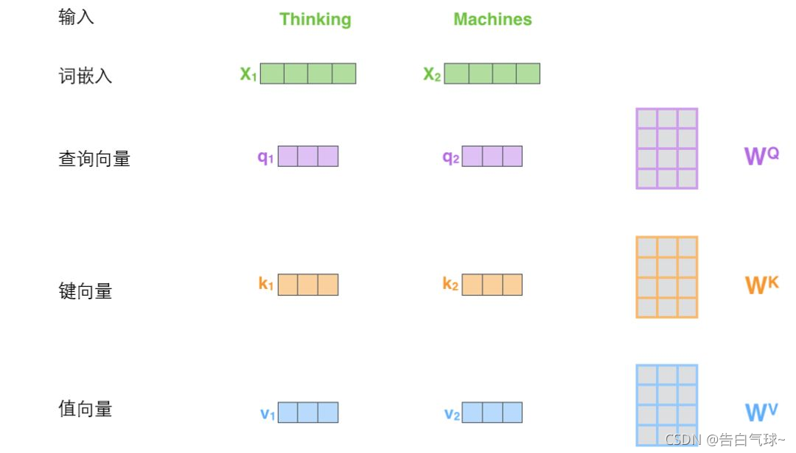
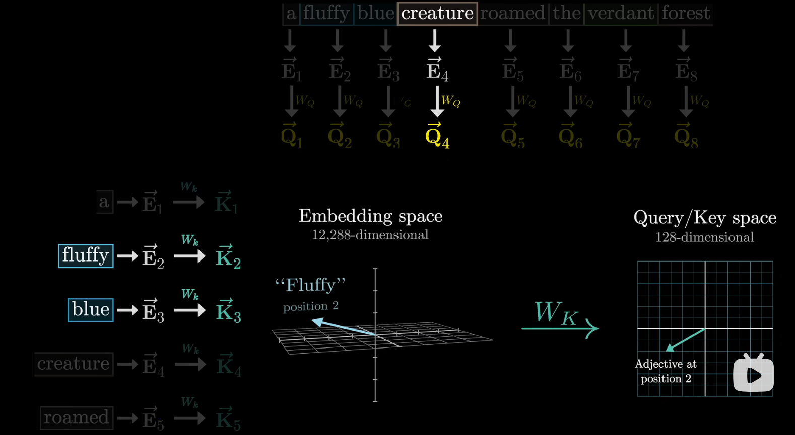
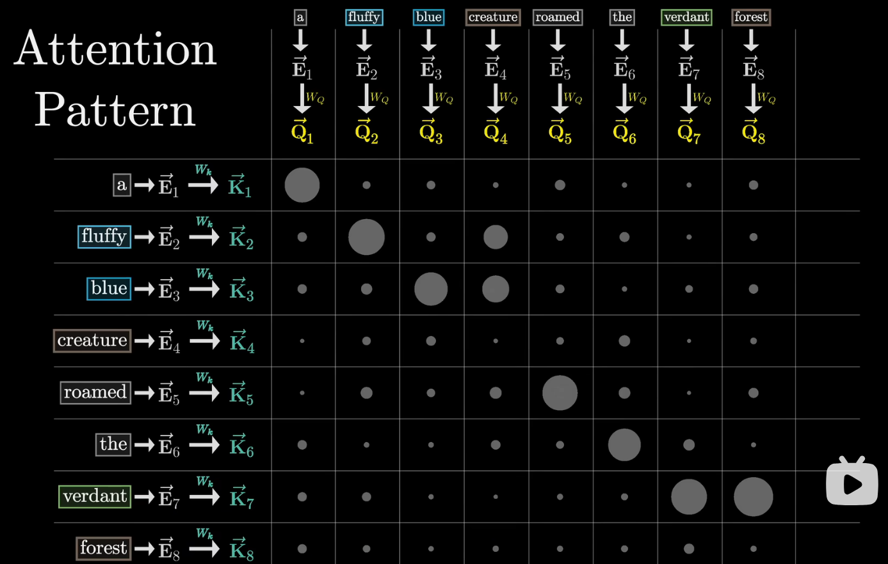
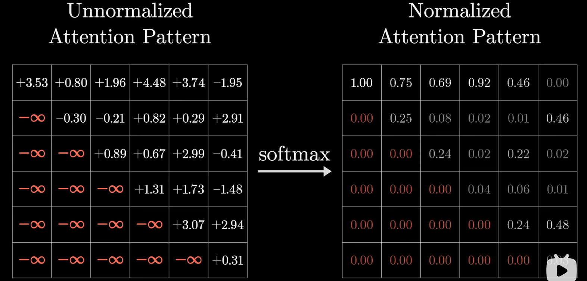

# Transformer

最开始用于机器翻译

对于**时序模型**

**仅使用注意力机制**，不使用卷积和循环

### 发现

**RNN**（循环神经网络）由于有**时序**（隐藏状态 $h_t=h_{t-1}+t$）

- 在**时间上无法并行**
- 时序较长时，在后面**其前面的信息可能有丢失**

**CNN**（卷积神经网络）

- 需要**用多层来连接**隔得远的像素
- 优点：可以做**多个输出通道**，每个通道识别不一样的模式

**Transformer**

- 使用**纯attention**完全做并行
- **一层**就可以看到**整个序列**
- 使用**多头attention**模拟CNN多输出通道的效果

Transformer：第一个使用自注意力机制做encode到decode的架构的模型

## 模型架构

**编码器（Encoder）**

- 输入：
  - **源语言句子的嵌入表示**（如英文句子 token embedding）
- 模块堆叠（通常为6层）：
  - 多头自注意力（**Self-Attention**）
  - 前馈全连接网络（Feed-Forward Layer）
  - 层归一化与残差连接
- 目标：提取出整句中每个单词在上下文中的**语义表示**

**解码器（Decoder）**

- 输入：
  - **前一步已经生成的词**（目标语言的前缀）
  - **编码器的输出**（源语言的语义表示）
- 模块堆叠（通常为6层）：
  - **Masked 多头自注意力层**：防止看到未来词
  - 多头注意力（对编码器输出的 cross-attention）
  - 前馈网络
  - 层归一化与残差连接
- 目标：逐步生成目标语言的单词序列


- **左边为编码器，右边为解码器**
- Nx：重复N次的意思

- 编码器的输出会作为解码器的一个输入放入


### encoder

- 6个块组成，每个块有两个子层（sub-layer）。
- 第一个子层：multi-head self-attention mechanism
- 第二个子层：simple, position wise fully connected feed-forward network就是一个MLP
- 每个子层用一个残差连接和一个 layer normalization
  - layer normalization：
- 子层公式：$LayerNorm(x + Sublayer(x))$
- 为了简单，每一层的输出维度$d_{model} = 512$

****

`LayerNorm`（层归一化）和 `BatchNorm`（批归一化）都是**神经网络中的归一化技术**，用于提高训练稳定性，加速收敛，缓解梯度消失/爆炸问题。它们的本质目标相同，但**归一化的维度和应用场景**有所不同。

#### Batch Normalization（批归一化）

> 在一个 mini-batch 中，对每个特征维度（channel）进行归一化

适用场景：

* **CNN、MLP 等前馈网络**
* 通常在卷积层或全连接层后使用（+ ReLU）

计算公式：

对于每一层输入 $x \in \mathbb{R}^{(N, C, H, W)}$（如卷积层输出）：

* **均值（按 batch 维度）**：

  $$
  \mu_c = \frac{1}{N \cdot H \cdot W} \sum_{n,h,w} x_{n,c,h,w}
  $$
* **方差**：

  $$
  \sigma_c^2 = \frac{1}{N \cdot H \cdot W} \sum_{n,h,w} (x_{n,c,h,w} - \mu_c)^2
  $$
* **归一化**：

  $$
  \hat{x}_{n,c,h,w} = \frac{x_{n,c,h,w} - \mu_c}{\sqrt{\sigma_c^2 + \epsilon}}
  $$
* **缩放与偏移**（可学习参数）：

  $$
  y = \gamma_c \cdot \hat{x}_{n,c,h,w} + \beta_c
  $$

特点：

* 利用了整个 batch 的统计量
* 对 batch 大小敏感，小 batch 效果差
* 训练和推理行为不同（推理中用滑动平均）

#### Layer Normalization（层归一化）

> 对单个样本的所有特征进行归一化，不依赖 batch

适用场景：

* **RNN、Transformer 等序列模型**
* 不受 batch 大小影响

输入形状（如 Transformer 中的 token 表示）：

$x \in \mathbb{R}^{(B, T, D)}$，其中 D 是特征维度

计算公式：

对每一个样本、每一个 token 的 D 维特征：

* **均值**：

  $$
  \mu = \frac{1}{D} \sum_{i=1}^{D} x_i
  $$
* **方差**：

  $$
  \sigma^2 = \frac{1}{D} \sum_{i=1}^{D} (x_i - \mu)^2
  $$
* **归一化与变换**：

  $$
  \hat{x}_i = \frac{x_i - \mu}{\sqrt{\sigma^2 + \epsilon}}, \quad y_i = \gamma_i \cdot \hat{x}_i + \beta_i
  $$

特点：

* 归一化仅对单个样本，适用于 RNN 和 Transformer
* 不依赖 batch 大小，训练推理一致
* 计算效率高，适用于自注意力结构

#### 对比总结表格

| 对比项              | **BatchNorm**                 | **LayerNorm**         |
| ------------------- | ----------------------------- | --------------------- |
| 归一化维度          | Batch + 特征维                | 单个样本的特征维      |
| 是否依赖 Batch 大小 | ✅ 是                          | ❌ 否                  |
| 应用场景            | CNN、MLP 等                   | RNN、Transformer      |
| 是否可并行          | ❌ 否（要等整个 batch）        | ✅ 是                  |
| 推理行为            | 与训练不同（需保存均值/方差） | 与训练一致            |
| 缺点                | 小 batch 效果差               | 对图像可能效果不如 BN |
| PyTorch 接口        | `nn.BatchNorm1d/2d/3d`        | `nn.LayerNorm`        |

---

#### Transformer 中为什么用 LayerNorm 而不是 BatchNorm？

* Transformer 的每个 token 是独立处理的 → 不依赖 batch 归一化
* 自注意力机制天然支持并行 → LayerNorm 更适合
* BatchNorm 在小 batch（如推理时）会退化
* LayerNorm稳点一些

Transformer 使用 LayerNorm 一般在两个位置：

* 在子层的前或后（Post-LN / Pre-LN）
* 如：`x = LayerNorm(x + SubLayer(x))`（残差连接后归一化）

#### 小结口诀（记忆）

> **BatchNorm 用在 CNN，LayerNorm 用在 Transformer。**
>
> Batch 看通道，Layer 看自己。


- **Batch**：一次处理几句话
- **Seq**：每句话有几个词（token）这个词数量可能不同，一般用0补全
- **Feature**：每个词用多少维向量来表示（512）

- **BatchNorm**
  - 蓝色切，然后做norm（均值为0，方差为1）
- **LayerNorm**
  - 黄色切，然后做norm（均值为0，方差为1）

### decoder

- 6层块堆叠
- 3个子层
  - 第一个：带掩码的注意力机制
    - 使其在训练时（输入时）仅看到 t 之前的输入，而看不到 t 之后的输入
    - 保证在训练和预测是行为一致
  - 第二个：多头注意力机制
  - 第三个：simple, position wise fully connected feed-forward network就是一个MLP
  - 使用残差和LayerNorm连接

### Attention

注意力机制（**Attention Mechanism**）是深度学习中一种**模拟“人类注意力”的机制**，它可以在处理序列或结构化数据时，**动态地关注输入中的关键信息**。

---

#### 注意力机制

> 在处理一个输入序列时，并不是所有信息都同等重要。
> 注意力机制让模型可以 **根据任务需要，自主决定“关注谁、忽略谁”。**

---

##### 基本数学形式（以最常见的 **Scaled Dot-Product Attention** 为例）

给定三个矩阵：

| 矩阵          | 含义                     |
| ------------- | ------------------------ |
| **Q (Query)** | 查询向量（我想找的信息） |
| **K (Key)**   | 键向量（你有什么信息）   |
| **V (Value)** | 值向量（具体要返回什么） |

##### 🎯 Attention(Q, K, V) 的公式：

$$
\text{Attention}(Q, K, V) = \text{softmax}\left(\frac{QK^T}{\sqrt{d_k}}\right) V
$$

各部分解释：

* $QK^T$：计算查询和键之间的相似度（点积）
* $\sqrt{d_k}$：防止数值过大导致softmax后向两边靠拢而导致梯度消失（做缩放）
* `softmax`：将相似度转换为权重（总和为1）
* 与 $V$ 相乘：加权求和，得到输出结果
* 矩阵运算
  * 


---

##### 直观理解（举例）

假设你正在翻译句子：

> “**The cat sat on the mat.**”

在翻译 “sat” 时：

* Query 是“sat”这个词的表示；
* 模型可能重点关注 “cat”（主语），也关注“mat”（地点）；
* **注意力机制会给这些词分配较大的权重**，从而帮助更准确地翻译“sat”。

---

##### Self-Attention（自注意力）

> 每个 token 同时是 Query、Key、Value，对整个序列内部“自我关注”。

* 允许模型在每一层中理解：
  某个词应该注意句子中哪些其它词。
* 是 Transformer 的核心机制！

---

##### Multi-Head Attention（多头注意力）

> 不是只计算一次注意力，而是**多个“头”并行学习不同的关注模式**

* 多头允许模型在不同的“子空间”上关注不同特征：

  * 一个头可能关注主语-谓语
  * 一个头可能关注代词指代
  * 一个头关注句法关系

📐 公式结构：

```text
MultiHead(Q,K,V) = Concat(head₁, ..., headₕ) · W_o
where headᵢ = Attention(QWᵢ^Q, KWᵢ^K, VWᵢ^V)
```

---

##### 注意力机制在不同模型中的应用

| 模型                   | 使用方式                      | 举例                      |
| ---------------------- | ----------------------------- | ------------------------- |
| Transformer            | 自注意力 + 多头注意力         | 每层都用                  |
| BERT                   | 编码器堆叠 + 多头注意力       | 理解任务，如问答、分类    |
| GPT                    | 解码器堆叠 + Masked Attention | 文本生成                  |
| 图像Transformer（ViT） | 用注意力代替卷积              | 图像分类                  |
| Seq2Seq（翻译模型）    | 编码器-解码器 Attention       | Decoder 关注 Encoder 输出 |

---

##### 总结口诀

> **注意力机制就是：计算相关性 + 加权组合信息**
>
> “Query 想知道什么，Key 提供线索，Value 给出答案”

---

#### Scaled Dot-Product Attention

$$
\text{Attention}(Q, K, V) = \text{softmax}\left(\frac{QK^T}{\sqrt{d_k}}\right) V
$$

这里除以$\sqrt{d_k}$作用

- dk过大时，点乘中值相对的差距就会变大，导致值大的softmax更靠近1，剩下的靠近0，导致更加向两边靠拢，这样梯度会变小，导致跑不动了
- 所以除以$\sqrt{d_k}$，防止数值过大导致softmax后向两边靠拢而导致梯度消失


Mask：对于Qt和Kt之后的值换成一个非常大的负数，在softmax后就会变为0，使得在做预测时训练测试的步骤一样

#### Multi-Head Attention


1. 在Linear层做h次投影，使其再经过h次注意力机制块
2. 使其有h次机会，去学习不一样的投影方法的度量空间中匹配不同模式及其需要的相似函数
3. 最后总结再做一次投影


这里设置 h = 8 ，使得投影为 $d_k = d_v = d_{model}/h = 64$，最后合并投影回来

#### Transformer中如何使用Attention


- **编码器自注意力层**
- **解码器Masked自注意力层**
- **解码器编码器连接的注意力层**
  - key和value来自于编码器的输出
  - query来自于上一个attention的输出
  - 作用：将编码器中我想要的有效输出拿过来

### Position-wise Feed-Forward Networks

编码器和解码器中的每一层**还包含一个前馈全连接神经网络**，该网络**对每个位置分别且一致地应用**。 这个前馈网络由**两个线性变换**组成，中间使用了**ReLU 激活函数**。

虽然这两个线性变换在**不同的位置上**使用的是**相同的参数**（即参数在 **token 之间共享**），但在**不同的网络层之间**，这些参数是**不同的**（每一层都有自己的一套 FFN 权重）。

**另一种描述方式是**：这个前馈网络可以看作是**两个卷积核大小为1的一维卷积操作**。

**输入和输出的维度**都是 $d_{\text{model}} = 512$，而**前馈网络内部的隐藏层维度**是 $d_{\text{ff}} = 2048$。

最后投影回512，因为需有残差连接

#### 结构形式

$$
\text{FFN}(x) = \text{max}(0,xW_1 + b_1)W_2 + b_2
$$

#### 结构图理解

```text
输入 x ∈ ℝ^{batch_size × seq_len × 512}
     │
     └──► Linear(512 → 2048)
               │
               ▼
           ReLU 激活
               │
               ▼
     └──► Linear(2048 → 512)
               │
               ▼
         输出 x' ∈ ℝ^{batch_size × seq_len × 512}
```

#### 总结

> Transformer 中每一层（不论是编码器还是解码器）除了注意力子层，还包括一个**前馈神经网络子层（FFN）**。
> FFN 对每个位置的表示单独处理，由两层全连接 + ReLU 构成（512 → 2048 → 512）。**参数在 token 之间共享，但在不同层之间不共享**。

#### 一个Attention和一个Feed Forward举例


- 这里下面的红色块是Attention
  - 使得**含有序列信息**
- 上面的红色块是MLP，且在一个层中token之间共享即一样
  - 对每个位置的表示进行**非线性变换和特征增强**

### Embeddings and Softmax

embedding

- **将词元映射成向量**长度为$d_{model}$，在模型中不同地方的embedding是一样的权重
- **这里embedding乘以**$\sqrt{d_{model}}$，因为embedding不管 d 多大时，值仍然为1，维度一大后，其权重值会过小，而**后面需要加上Positional Encoding所以扩大使得其在相加时在一个数量级上差不多**

### Positional Encoding

因为attention本身不会去关注其句子中位置存放的信息，这里使用Positonal Encoding在attention机制中加入时序信息，即将位置信息也当作输入


将**时序信息与嵌入层相加**，就完成了将时序信息加入数据的步骤

## Why Self-Attention


- n：序列长度，单词数n
- d：维度，用多少维向量表示一个单词
- k：卷积的核大小
- r：限制性自注意力（restricted self-attention）中的邻域大小。

| 符号 | 含义                                                         | 举例                                                         |
| ---- | ------------------------------------------------------------ | ------------------------------------------------------------ |
| n    | **sequence length**：序列长度                                | NLP 中一句话的 token 数，比如 "I love NLP." 是 3             |
| d    | **representation dimension**：表示维度                       | 每个词的 embedding 维度，如 512、768（BERT）等               |
| k    | **kernel size**：卷积核大小                                  | CNN 中常用大小如 3、5，表示局部窗口大小                      |
| r    | **neighborhood size** in **restricted self-attention**：限制性注意力的范围 | 仅让一个位置关注前后 r 个位置（如左1右1），不是全局 attention |

****

- Complexity per Layer复杂度
- Sequential Operations顺序计算下一步计算需要等前面多少步计算，越下并行度越高
- Maximum Path Length信息经过路程：信息从一个数据点走到另外一个数据点要走多远，越短越好

## Training

### Training Data and Batching

**训练数据和批次**

我们基于包含约450万句子对的标准WMT 2014英德语数据集进行训练。采用字节对编码[3]对句子进行编码，该编码使用共享的源语言目标语言词汇表，包含约37000个标记。对于英法语数据集，我们使用规模更大的WMT2014英法语数据集（包含3600万句子），将标记拆分为32000个词片词汇表[38]。根据近似序列长度对句子对进行批量处理，每个训练批次包含约25000个源语言标记和25000目标语言标记的句子对集合。 

****

### Hardware and Schedule

**硬件和时间表**

我们在配备8块NVIDIA P100 GPU的单机上训练模型。对于基础模型（使用文中所述的超参数配置），每个训练步骤耗时约0.4秒，总训练时长为10万步（即12小时）。针对大型模型（详见表3底部说明），每步耗时1.0秒，总训练时长达30万步（相当于3.5天）。

****

### Optimizer

**优化器**

我们使用**Adam优化器**[20]，参数设置为$β_1= 0.9、β_2= 0.98和ε=10^{−9}$。

在训练过程中，我们**根据以下公式调整学习率**


这对应于在前个预热训练步骤中线性增加学习率，之后则按步骤编号的平方根比例递减。使用了warmup_steps = 4000。 

****

### Regularization

**正则化**

使用**三个**正则化

- **Residual Dropout**：**残差丢弃机制**，我们在每个子层的输出**在进入残差连接和LayerNorm之前**，会丢弃，丢弃率为$P_{drop} = 0.1$。
- 此外，编码器和解码器堆栈中的**嵌入向量总和**及**位置编码总和**均会**进行丢弃处理**。基础模型采用的丢弃率为$P_{drop} = 0.1$。
- **Label Smoothing**：**标签平滑处理**，在训练过程中，我们使用了**标签平滑值为$ε_{ls}=0.1$**[36]（softmax后置信度为$1-0.1=0.9$）。这种处理虽然会**增加困惑度**-（因为模型会变得不那么确定），但能**有效提升准确率和BLEU分数**。 
  - **标签平滑的意义**
    - **不要**对训练标签**太自信**，**减少过拟合**，**提升泛化能力**，特别对抗模型“过分确定”的倾向有用。
    - 当**标签平滑值为 0.1** 时，模型对真实标签的置信度是 **90%**，其余 10% 的概率被**均匀分配给其他类别**。

## 缺点

- **对关键信息的“抓取能力”差**
- **需要大量数据进行训练**
- **训练资源消耗大（时间 + 显存 + 计算）**
- **解释性差**


## QKV&multi

Vision Transformer (ViT) 是 Transformer 模型针对计算机视觉任务的改编。所以我选择先进行Transformer 模型的学习

这里参照[csdn博客:一文读懂Transformer](https://blog.csdn.net/weixin_42475060/article/details/121101749?ops_request_misc=%257B%2522request%255Fid%2522%253A%2522159E0F39-AD8E-416D-AA92-7DD8F7B0E841%2522%252C%2522scm%2522%253A%252220140713.130102334.pc%255Fblog.%2522%257D&amp;request_id=159E0F39-AD8E-416D-AA92-7DD8F7B0E841&amp;biz_id=0&amp;utm_medium=distribute.pc_search_result.none-task-blog-2~blog~first_rank_ecpm_v1~hot_rank-3-121101749-null-null.nonecase&amp;utm_term=Transformer%20%E6%A8%A1%E5%9E%8B%E5%9C%A8%E6%9C%BA%E5%99%A8%E5%AD%A6%E4%B9%A0%E4%B8%AD&amp;spm=1018.2226.3001.4450 )

Transformer是一种用于自然语言处理（NLP）和其他序列到序列（sequence-to-sequence）任务的深度学习模型架构

最重要的就是引入了自注意力机制，就是将输入的序列不同部分进行赋权重，从而达到构建输入的样本内部形成了关系

### 整体结构


Encoder block对应编码器

Decoder block对应解码器


这里有六个编码器叠加，6个解码器叠加（互相间没有共享参数）

编码器与解码器之间的简略结构


输入的句子先进入自注意层，将每个单词编码时也与其他单词相关联

解码器的注意力层也是关注整个输入的相关部分

### Encoder Block

#### 单头自注意力层

我认为注意力头就是为每一个样本都创建三个权重矩阵，注意力机制会将这些权重矩阵应用于输入特征，生成查询、键和值，进而计算注意力权重并整合信息，以此来建立样本内部的关系连接，捕捉样本内部的复杂关系。


##### 计算步骤

step1：先将输入向量进行词嵌入与三个权重矩阵进行相乘创建出查询向量Q，键向量K，值向量V



step2：计算自注意力层的输出。


整体的计算图


1.先将x与Wq、Wk、Wv进行矩阵相乘得出查询向量、键向量、值向量

2.查询向量*键向量得出分数

3.分数除以dk的平方根

4.对第三步的得分进行softmax归一化

4.softmax后的值*值向量求和后就是该单词在该句子中的注意力了

#### 多头自注意力层Multi——Head Attention

Multi是将这个关系建立得更加清晰，每个头都有自己的一组权重矩阵。

关键是分头


分头的实现：用多组Wq，Wk，Wv得到多组查询、键、值矩阵，然后每组分别计算得到一个Z矩阵。最后形成多个注意力头，然后再用一个矩阵将多头拼接，最后再与一个建立的附加权重矩阵相乘最后得到一个注意力头矩阵（相当于合成数据）


通览


#### 位置编码使用

位置编码的存在是使同一个单词在不同位置的注意力分数不一样

这里选择词嵌入与位置编码进行相加，不是拼接（这里是防止维度增加）


#### Add&Normalize

在经过多头注意力机制得到矩阵Z后，Z并没有直接传入全连接神经网络，而是需要经过一步Add&Normalize。


Add：在z的基础上加了一个残差块X，防止在深度神经网络的训练过程中发生退化的问题，退化的意思就是深度神经网络通过增加网络的层数，Loss逐渐减小，然后趋于稳定达到饱和，然后再继续增加网络层数，Loss反而增大。

Normalize：归一化，加快训练速度、提高训练的稳定性

这里选用的是LN可以每一维上进行归一化

#### Feed Forward（全连接层）


在这里全连接层是一个**两层的神经网络**，先线性变换，然后ReLU非线性，再线性变换。

### Decoder Block


Decoder也是由6个decoder堆叠而成的。一个Decoder包含两个 Multi-Head Attention 层。第一个 Multi-Head Attention 层采用了 Masked 操作。第二个 Multi-Head Attention 层的K, V矩阵使用 Encoder 的编码信息矩阵C进行计算，而Q使用上一个 Decoder block 的输出计算。

#### Masked Multi-Head Attention

与Encoder的Multi-Head Attention计算原理一样，只是多加了一个mask码。mask 表示掩码，它对某些值进行掩盖，使其在参数更新时不产生效果。

### 输出

首先经过一次线性变换，然后Softmax得到输出的概率分布，然后通过词典，输出概率最大的对应的单词作为我们的预测输出。

## 图像理解

[【官方双语】直观解释注意力机制，Transformer的核心 | 【深度学习第6章】](https://www.bilibili.com/video/BV1TZ421j7Ke?vd_source=64fa735df4e10c3811ddac775f3035f1)


Transformer使其不单单编码单个词，还能融入更丰富的上下文含义


模型相互传递嵌入向量蕴含的信息进行更新


预测下一个token的计算过程完全基于序列中最后一个向量


原始向量（嵌入向量）包含词本身以及它在文中位置信息


最终目标计算出其实际表示的意义对应向量

- 比如经过形容词修饰后对应的向量


### Single head of attention

#### Q 查询矩阵


查询向量目的提供权重去注意有关token的向量

查询向量维度比嵌入向量小得多


注意：这里假设查询矩阵关注的是形容词

#### K 键矩阵

**将 [键] 视为想要回答 [查询]**



键与查询重合度越高就视为匹配度越高


进行矩阵乘法以得出匹配度


点积越大---》原点越大---》键与查询越对齐---》token嵌入注意到了某个token得嵌入

采用softmax进行归一化





#### 掩码机制

为了使一个训练样本能提供多次训练机会，需要使得后面的token不被看到，即只能看到前面的词语，不能让后面的token影响前面的token




#### V 值矩阵


表示**这个词**需要**调整目标词的含义**时需要添加的向量

累加得到想要引入的变化量


最终得到一个编码了上下文信息的一个更精准的嵌入向量


通过注意力模块，得到了一系列更精准的嵌入向量

#### 参数量


**更高效的做法**

- **让值矩阵所需参数量等于键矩阵和查询矩阵的参数量之和**，这对于并行多注意力头而言非常重要

**做法：将值矩阵分为两个小矩阵（对大矩阵进行 低秩分解 ），将整体视为一个线性映射**


### Multi-headed attention

大量 并行


总和是这个模块的输出，即通过这个模块得到的更精确的嵌入


训练时可能会将Value up矩阵合并为一个大矩阵（称：**输出矩阵**）

- 与整个多头注意力模块相关联

单个注意力头的值矩阵单指第一步的矩阵，即Value down矩阵


#### 多层感知器 MLP


**注意力层** 负责跨序列位置的信息交互（谁和谁相关）。

**MLP 层** 则负责 **位置内特征的非线性变换**，即逐 token 的特征提取和表达能力增强。

- 可以理解为：注意力决定“信息怎么流动”，而 MLP 决定“信息如何变换”。

这种交替堆叠的结构使 Transformer 既能捕捉全局依赖关系，又能逐点进行深度特征提炼。
