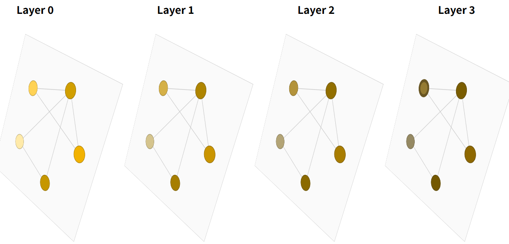

# GNN

****

[A Gentle Introduction to Gragh Neural Networks](https://distill.pub/2021/gnn-intro/)

****

处理图的 结构 和 性质

## 什么是图

 **使用向量表示** 顶点 边 全局 值（高矮表示值，柱数目表示向量长度）

**有向性 & 无向性**

## 如何得到图

### Images as graphs

我们通常将图像视为具有图像通道的矩形网格，并将其表示为数组（例如 244x244x3 的浮点数）。另一种理解图像的方式是将其视为具有规则结构的图：

- **每个像素代表一个节点**
- **通过一条边连接到相邻像素**
- **每个非边界像素恰好有 8 个邻居**
- **每个节点存储的信息是一个三维向量，表示该像素的 RGB 值**

可视化图连通性的一种方法是通过其邻接矩阵。我们对节点进行排序

- 在本例中，每个节点代表一张简单的 5x5 笑脸图像中的 25 个像素，如果两个节点共享一条边，则用一个条目填充 $n_{nodes} × n_{nodes}$ 的矩阵。请注意，**以下三种表示形式是同一数据的不同视图**。

### Text as graphs

这里为**有向边**

### Graph-valued data in the wild

化学分子

社交网络

- 社交关系

引用图

- **一般为有向边**

## 图结构化数据有哪些类型的问题？

There are three general types of prediction tasks on graphs:

- **graph-level**
- **node-level**
- **edge-level**

### Graph-level task

In a graph-level task, our goal is to predict **the property（属性） of an entire graph.**

- 例如，对于一个以图表示的分子，我们可能想预测它的气味，或者它是否会与与某种疾病相关的受体结合。

### Node-level task

Node-level tasks are concerned with predicting **the identity or role of each node within a graph**.

- 节点级预测问题的一个典型示例是 Zach 的空手道俱乐部。该数据集是一个单一的社交网络图，由在政治分歧后宣誓效忠于两个空手道俱乐部之一的个人组成。故事是这样的，Mr. Hi（教练）和 John H（管理员）之间的不和导致了空手道俱乐部的分裂。节点代表空手道练习者，边代表这些成员在空手道之外的互动。预测问题是对特定成员在不和之后是否会效忠于 Mr. Hi 或 John H 进行分类。在这种情况下，节点与教练或管理员之间的距离与该标签高度相关。

按照图像的类比，节点级预测问题类似于**图像分割**，我们试图标记图像中**每个像素的作用**。对于文本，类似的任务是**预测句子中每个单词的词性**（例如名词、动词、副词等）。

### Edge-level task

The remaining prediction problem in graphs is ***edge prediction*（边缘预测）**.

- 边缘级推理的一个例子是**图像场景理解**。除了**识别图像中的对象**之外，深度学习模型还可以用来**预测它们之间的关系**。我们可以将其表述为边缘级分类：给定表示图像中对象的节点，我们希望预测这些节点中哪些共享一条边，或者该边的值是多少。**如果我们希望发现实体之间的连接，我们可以将图视为全连通的，并根据它们的预测值修剪边，从而得到稀疏图**。

## 将ML运用在图上的挑战

**核心：如何表示图使其与神经网络兼容**

****

**图的信息：**

1. **顶点**
2. **边**
3. **全局**
4. **连接性（每条边连接的那两个点）**

### 连接性表示的讨论

使用邻接矩阵

问题：同一连接性有多种不同表示方式

更优方案

- 边位置和连接列表位置对应

## 图神经网络Graph Neural Networks(GNN)

**A GNN is an optimizable transformation on all attributes of the graph (nodes, edges, global-context) that preserves graph symmetries (permutation invariances).** 

GNN 是对图的所有属性（节点、边、全局上下文）的可优化转换，可保持图的对称性（置换不变性：改变排序后结果不会变化）。

这里使用 “message passing neural network” framework（信息传递框架）

GNN 采用“**图入图出**”架构

- 这意味着这些模型类型接受图作为输入，将信息加载到其节点、边和全局上下文中，并逐步转换这些嵌入，而**不会改变输入图的连通性**。

### The simplest GNN

从最简单的 GNN 架构开始，在这个架构中，**为所有图属性（节点、边、全局）学习新的嵌入，但暂时不使用图的连通性**。（只对属性变换，不改变图的结构）

- 为了简单起见，**这里使用标量来表示图属性**；实际上，特征向量或嵌入更有用。

- 这个 GNN 在图的**每个组件**上使用一个**单独的多层感知器 (MLP)**（或其他可微分模型）；我们称之为 GNN 层。以下**三个MLP组合成一个GNN层**
  1. 对于每个节点向量，我们应用 MLP 并返回一个学习到的节点向量。
  2. 我们对每条边也执行同样的操作，学习每个边的嵌入；
  3. 对于全局上下文向量，我们也学习整个图的单个嵌入。
  4. **每个MLP是对一个属性独自作用，不会考虑所有的连接信息，所以排列顺序不会改变结果**

可以将这些 GNN 层堆叠在一起。

由于 **GNN 不会更新输入图的连通性**，因此我们可以用与输入图相同的邻接表和相同数量的特征向量来描述 GNN 的输出图。但是，由于 GNN 更新了每个节点、边和全局上下文的表示，因此输出图的嵌入也已更新。

### GNN Predictions by Pooling Information

多分类或回归

如果任务是对节点进行二分类预测，并且图已经包含节点信息，则方法很简单——对于每个节点嵌入，应用一个线性分类器。

#### 使用pooling

有边向量，无点向量，预测点

- 在图中**边中存储了信息**，但在**节点中没有信息**，但仍然需要**对节点进行预测**。我们需要一种方法来**从边收集信息并将其提供给节点进行预测**。

- 池化分为两个步骤：
  1. 对于每个要池化的项目，收集它们各自的嵌入并将它们连接成一个矩阵。
  2. 然后将收集到的嵌入进行聚合，通常通过求和运算进行。
- **上面总结即：对于预测点，拿出其连接的边的向量以及全局向量全部相加**

无边向量，有点向量，预测边

无全局向量，有点向量，预测全局

### 简单的GNN框架

1. 输入为一个图
2. GNN层中每个属性对应一个MLP，一层中的一个属性共享一个MLP
3. 输出为保持了图结构但是更新里面所有属性的图
4. 根据需要对哪一个属性做预测进行添加合适的输出层
5. 缺失信息即添加合适的汇聚层

局限性

- 在GNN层没有使用图的结构信息（连接信息）

### 基于消息传递的GNN

我们可以在 GNN 层中使用池化来实现更复杂的预测，这样我们学习到的嵌入就能感知到图的连通性。我们可以**使用消息传递来实现**这一点。其中相邻节点或边交换信息并影响彼此的更新嵌入。

#### 属性内进行信息传递

消息传递分为三个步骤：

- 对于图中的每个节点，收集所有相邻节点的嵌入（或消息）

- 通过聚合函数（如 sum）聚合所有消息

- 所有池化消息都通过更新函数传递，通常是学习到的神经网络

#### 点边属性间信息传递

消息传递层的架构示意图：

1. 将边及其连接节点的信息相加组成消息，使边拿到了相关点的信息（**顶点信息给边**）
2. 点将其连接的边的信息相加，将消息传递到点（**更新过顶点信息的边的信息汇聚到顶点**）

图中存储的节点和边信息不一定具有相同的大小或形状。对于如何相加：

1. 学习从边空间到节点空间的线性映射，反之亦然。
2. 在更新函数之前将它们连接在一起。

其他更新方式

####  全局信息传递

我们目前描述的网络存在一个**缺陷**：**图中相距较远的节点可能永远无法有效地相互传递信息，即使我们多次应用消息传递。**对于一个节点，如果我们有k层，信息最多会传播k步。当预测任务依赖于相距较远的节点或节点组时，这可能是一个问题。

一种解决方案是**让所有节点都能够相互传递信息**。不幸的是，对于大型图来说，这很快就会变得**计算成本高昂**（尽管这种称为“虚拟边”的方法已用于分子等小型图）。

解决这个问题的一个方法是**使用图（U）的全局表示**，有时也称为 **主节点** 或 **上下文向量** 。这个全局上下文向量连接到网络中的所有其他节点和边，并充当它们之间传递信息的桥梁，从而构建整个图的表示。这创建了一个比其他方式学习到的更丰富、更复杂的图表示。

在这个视图中，所有图属性都已学习到，因此我们可以在池化过程中利用它们，**通过根据其他属性调整我们感兴趣的属性的信息**。例如，**对于一个节点，我们可以考虑来自邻近节点、连接边和全局信息的信息**。

为了根据所有这些可能的信息源调整新节点的嵌入：

1. 我们**可以简单地将它们连接起来**。
2. 此外，我们**还可以通过线性映射将它们映射到同一空间并添加它们**，
3. **或者应用一个特征调制层**。

这可以被认为是一种特征注意力机制。

## 实验

### 对分子图是否具有“刺激性”气味进行分类

这里用的博客中嵌入的JS进行

为了简化问题，只考虑每个分子一个二进制标签，对分子图是否具有“刺激性”气味进行分类，就像专业调香师所标记的那样。如果一个分子具有强烈而醒目的气味，我们就说它具有“刺激性”气味。

我们将使用顺序 GNN 层构建此问题的通用建模模板，然后使用带有 S 型激活函数的线性模型进行分类。我们的 GNN 设计空间包含许多可以定制模型的杠杆：

1. GNN 层数，也称为*深度*。
2. 更新时每个属性的维数。更新函数是一个单层 MLP，带有一个 ReLU 激活函数和一个用于激活函数归一化的层范数。
3. 池化中使用的聚合函数：最大值、平均值或总和。
4. 需要更新的图属性，或者说消息传递的样式：节点、边和全局表示。我们通过布尔值切换（开启或关闭）来控制这些属性。一个基准模型应该是一个独立于图的 GNN（所有消息传递功能均关闭），最终将所有数据聚合成一个全局属性。开启所有消息传递功能即可生成一个 GraphNets 架构。

### 一些经验性的 GNN 设计（调参）

通过下面的交互式图表，我们探索了 GNN 架构的空间以及该任务在几个主要设计选择下的性能：消息传递的风格、嵌入的维度、层数和聚合操作类型。

#### 参数数量

散点图中的每个点代表一个模型：x 轴表示可训练变量的数量，y 轴表示性能。将鼠标悬停在某个点上即可查看 GNN 架构参数。

首先要注意的是，令人惊讶的是，**参数数量越多，性能就越高**。GNN 是一种参数效率极高的模型：即使参数数量很少（3k），我们也能找到高性能的模型。

#### 图形属性维度

即向量长度

基于不同图形属性的学习表示的维度聚合的性能分布

维度较高的模型往往具有更好的均值和下限性能，但在最大值方面却没有发现同样的趋势。一些表现最佳的模型在较小维度下也能找到。由于高维度也涉及更多参数，这些观察结果与上图一致。

#### GNN层数

基于 GNN 层数的性能细分。

箱线图显示了类似的趋势，虽然平均性能随着层数的增加而增加，但性能最佳的模型并非三层或四层，而是两层。此外，性能下限在四层时会降低。这种效应之前已被观察到，层数较高的GNN会将信息广播到更远的距离，并且**可能会因多次连续迭代而导致其节点表示被“稀释”。**

#### 聚合操作类型

下图按聚合类型细分了性能。

总体而言，sum 似乎对平均性能略有提升，但 max 或 mean 也能给出同样优秀的模型。

#### 消息传递的方式

这里我们根据消息传递的方式对性能进行细分。在两种极 端情况下，我们分别考虑图实体之间不通信（“无”）的模型，以及在节点、边和全局变量之间传递消息的模型。

总体而言，我们发现，**图属性之间的通信越多，平均模型的性能就越好**。我们的任务以全局表示为中心，因此**明确地学习这一属性也往往能提高性能**。我们的节点表示似乎比边表示更有用，这是有道理的，因为这些属性中加载了更多信息。

#### 展望

可以从许多方向入手，以获得更佳的性能。我们希望重点介绍两个通用方向：

- **与更复杂的图算法相关**
- **与图本身相关**

到目前为止，上述的 GNN 是基于邻域池化操作的。有些图概念很难用这种方式表达，例如线性图路径（连接的节点链）。**设计新的机制**，以便在 GNN 中提取、执行和传播图信息是当前的一个研究领域。

GNN 研究的前沿之一并非构建新的模型和架构，而是“**如何构建图**”，更准确地说，是**赋予图以可利用的额外结构或关系**。正如我们粗略地看到的，**图属性之间的交流越多，我们就越倾向于拥有更好的模型**。在这个特定案例中，我们可以考虑**通过在节点之间添加额外的空间关系、添加非键合边或在子图之间建立明确的可学习关系，来使分子图的特征更加丰富**。

## Into the Weeds

### 其他类型的图（多重图、超图、超节点、层次图）

**多边图**或**多重图**：

- 一对节点可以**共享多种类型的边**，当我们想要**根据节点类型对它们之间的交互进行不同的建模**时，就会发生这种情况。

- 例如，在社交网络中，我们可以根据关系类型（熟人、朋友、家人）指定边类型。GNN 可以通过**为每种边类型设置不同类型的消息传递步骤来调整**。

**嵌套图**：

- 例如，**一个节点代表一个图，也称为超节点图**。嵌套图对于**表示层次结构信息非常有用**。

- 例如，我们可以考虑一个分子网络，其中一个节点代表一个分子，如果我们有一种方式（反应）将一个分子转化为另一个分子，则两个分子之间共享一条边。在这种情况下，我们可以在嵌套图上进行学习，通过**让 GNN 学习分子级别的表示，再让另一个 GNN 学习反应网络级别的表示**，并在**训练期间在它们之间交替**。

**超图**：

- 其中**一条边可以连接到多个节点**，而不仅仅是两个。对于给定的图，我们可以**通过识别节点的社群并分配一条连接到社群中所有节点的超边来构建超图**。

**如何训练和设计具有多种图属性的 GNN 是当前的研究领域**

### GNN 中的图采样和批处理

因为GNN层增加时，一个点可能看到特别多的数据，如果进行梯度计算时，会有大量的中间结果保存，导致计算无法承受，所以**需要对图进行采样**

这种**图采样操作高度依赖于上下文**，涉及从图中子选择节点和边。这些操作在某些情况下可能有意义（例如引文网络），但在其他情况下，这些操作可能过于强大（例如分子，其中子图仅代表一个新的、更小的分子）。

**如何对图进行采样是一个悬而未决的研究问题。**

如果我们**关心在邻域层面保留结构**，一种方法是**随机抽取均匀数量的节点**，即我们的节点集。然后**添加与节点集相邻的、距离为 k 的邻居节点，包括它们的边。**每个邻域都可以被视为一个独立的图，并且可以**基于这些子图的批次训练 GNN**。由于所有相邻节点的邻域都不完整，因此可以掩盖损失，仅考虑节点集。

更有效的策略可能是**首先随机采样一个节点，将其邻域扩展至距离 k，然后在扩展后的集合中选择另一个节点。一旦构建了一定数量的节点、边或子图，就可以终止这些操作**。如果情况允许，我们可以通过选择一个初始节点集，然后对恒定数量的节点进行**子采样**（例如，**随机采样**，或通过**随机游走**或 Metropolis 算法）来构建恒定大小的邻域。

### 归纳偏差

在构建模型来解决特定类型数据的问题时，我们希望**对模型进行专业化，以充分利用该数据的特性。**如果成功做到这一点，我们通常会看到更好的预测性能、更短的训练时间、更少的参数和更好的泛化能力。

- 在对**图像**进行标记时，我们希望利用这样一个事实：无论狗位于图像的左上角还是右下角，它仍然是狗。因此，大多数图像模型使用卷积，它们具有**平移不变性**。
- 对于**文本**，**标记的顺序**非常重要，因此循环神经网络会按顺序处理数据。此外，一个标记（例如“not”）的存在可能会影响句子其余部分的含义，因此我们需要能够“关注”文本其他部分的组件，BERT 和 GPT-3 等 Transformer 模型就可以做到这一点。

这些是归纳偏差的一些示例，我们正在识别**数据中的对称性或规律性**，并添加利用这些特性的建模组件。

**对于图而言**，我们关心图中的每个组件（边、节点、全局）是如何相互关联的，因此我们寻求具有关系归纳偏差的模型。**模型应该保留实体之间的明确关系（邻接矩阵）并保持图的对称性（置换不变性）**。我们期望实体间交互至关重要的问题能够从图结构中受益。具体来说，这意味着在集合上设计变换：**对节点或边的操作顺序不应重要，并且操作应该适用于可变数量的输入。**

### 比较聚合操作

在任何相当强大的 GNN 架构中，**池化**来自邻近节点和边的信息都是关键步骤。由于每个节点的邻居数量可变，并且我们需要一种**可微分的方法来聚合这些信息**，因此我们希望使用**一种平滑的聚合操作，该操作不受节点排序和所提供节点数量的影响。**

聚合操作的一个理想特性：**是相似的输入提供相似的聚合输出，反之亦然**。

- 一些非常简单的候选置换不变运算包括求和、求均值和求最大值。方差等汇总统计数据也适用。所有这些运算都**接受可变数量的输入，并且无论输入顺序如何，都会提供相同的输出。**

不同情况下不同聚合操作区分图的能力不同

**没有哪种操作始终是最佳选择。**

- 当**节点的邻居数量变化很大**，或者您**需要对局部邻域的特征进行归一化**时，**均值操作**会很有用。
- 当您想要**突出显示局部邻域中的单个显著特征**时，**最大值操作**会很有用。
- **求和操作**通过提供**特征局部分布的快照**，在两者之间取得了平衡，但由于它未经归一化，因此也可能突出显示异常值。**在实践中，求和操作更为常用。**

### 边和图对偶

引用图论：点边互换，邻接关系不变

这里在GNN上同样适用

### Graph convolutions as matrix multiplications, and matrix multiplications as walks on a graph（图卷积作为矩阵乘法，矩阵乘法作为图上的行走）

看不懂

### 图注意力网络

将图上的**属性聚合的方式更改为加权和**，类似于卷积

卷积的权重与位置有关，但在图中不需要有位置信息，因为每个顶点的邻居个数不变，而且可以随意打乱顺序，所以**需要使权重对于位置不敏感**

所以引入注意力机制

使权重取决于两个顶点向量之间的关系，而不是顶点的位置，使顶点有一个权重。

- 考虑一个标量评分函数，评分函数可以解释为一个函数，用于**衡量相邻节点相对于中心节点的相关性**。权重可以进行归一化，例如使用softmax函数，将大部分权重集中在与节点在任务方面最相关的邻居节点上。这个概念是图注意力网络（GAT）的基础。

- 常见的评分函数是内积，并且**节点通常在评分之前通过线性映射转换为查询和键向量，以增强评分机制的表达能力**。此外，**为了便于解释，评分权重可用作衡量边相对于任务的重要性的指标。**

### 解释性

看到底学到的是什么

### 生成模型

除了学习图上的预测模型之外，我们或许还想学习图的**生成模型**。利用生成模型，我们可以通过从学习到的分布中采样，或通过给定起点完成图来生成新的图。一个相关的应用是新药设计，其中需要具有特定性质的新型分子图作为治疗疾病的候选药物。

图生成模型的一个关键挑战在于**对图的拓扑结构进行建模**

- 一种解决方案是使用**自动编码器框架直接对邻接矩阵进行建模**，就像对图像进行建模一样
- 另一种方法是**按顺序构建图**，即**从图开始，迭代地应用离散操**作，例如添加或减少节点和边。