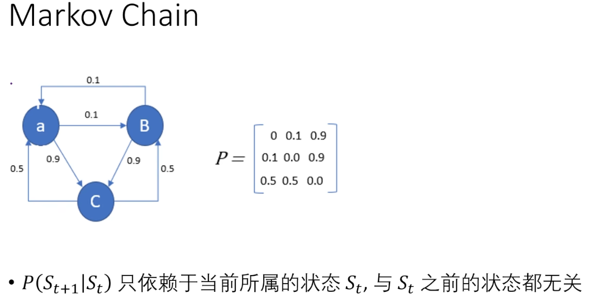

# GAN

## 摘要

生成对抗神经网络

- 同时训练两个模型
  - a generative model G（生成模型G）：用来抓取整个数据的分布
  - a discriminative model D（辨别模型D）：用来估计一个样本是从真正的数据生成出来的（即训练数据）还是通过 G 生成的
- 生成模型G的任务：尽量使辨别模型D犯错
- 任何函数空间的G和D存在一个独一无二的解
  - G能恢复训练数据的真实分布（即能找出训练数据的真实分布），D在所有地方都等于$1/2$（即D没有作用）
- 如果G&D是一个MLP则整个系统可以通过一个误差反传来训练
  - 不需要使用马尔科夫链
  - 或者不需要对一个近似的推理过程展开

#### 马尔科夫链蒙特卡罗（MCMC）

## 导言

作者态度：深度学习不仅仅是深度神经网络，更多的是对整个数据分布的一个特征表示

****

**模型框架**

- **生成模型G**：就是造假，不断提升造假能力
  - 如：MLP
  - 输入：一个随机的噪音
  - 能够把产生随机噪音的分布（通常是一个高斯分布）映射到任何一个我们想去拟合的分布
- **判别模型D**：就是分辨真假，不断提升分辨能力
  - 如：MLP
- **通过反向传递进行训练**
  - GAN 能用反向传播训练的**根本原因**：生成器和判别器都是**可微函数**，所以损失对参数的梯度能算出来。
  - MLP 只是 GAN 的一种常见实现方式（早期 GAN 用 MLP，后来更多用 CNN、ResNet、Transformer 等）。
- **目标**：希望造假者（生成模型G）获胜，即能够生成和真实数据一样的数据

## 相关工作

生成型神经网络方法

- 学习分布函数
  - 方法：一般都是通过构造一个**分布函数**，将函数提供一些参数可供学习，这些参数通过最大化其对数似然函数进行学习
  - 目标：学出其分布函数
  - 劣处：计算复杂

- 近似目标结果
  - 方法：学一个模型近似目标结果即可
  - 优点：计算相对方便
- 通过辨别模型帮助生成模型

## 模型算法

### Adversarial Nets

**生成器 G**

- 对于数据 $x$ 上学习分布$p_g$
- 对于先验输入噪音 $z$ 定一个分布$p_z(z)$
- 生成模型的MLP就是强行将$z$映射成$x$，即$G(z;\theta_g)$，$\theta_g$为可学习参数
- 好处：计算简单
- 坏处：MLP不是真正的知道背后分布逻辑，得到结果后不知道其背后的$z$是什么，所以是随机给$z$然后生成一个近似目标

**辨别器 D**

- 也是一个MLP，$D(x;\theta_d)$
- 作用：将$x$输入，输出一个标量，标量进行判断输入数据是真实采样数据还是生成出来的数据
  - 如：设置真实数据 1，生成器数据 0

**G&D训练**

- G目标：最小化 $log(1-D(G(z)))$ ，即使得辨别器尽量犯错

- **two-player minmax game：价值函数$V(D,G)$**

  

  - 目标

    - D完美情况：第一项为0，第二项为0，$V(D,G)$ 趋向于0，即使V尽量大

    - G完美情况：第二项趋向于无穷小，$V(D,G)$ 趋向于无穷小，即使V尽量小

  - 最终形成一个均衡，DG都无法移动，即 **纳什均衡**

​	

- 前置参数z：均匀分布
- xz间映射：z 经过MLP(G)映射至x
- 绿色曲线：z映射至x值分布曲线
  - 为了能糊弄辨别器，使其峰值尽量与黑色曲线峰值相近
- 黑色曲线：真实x分布曲线
- 蓝色曲线：辨别器曲线，与该时期黑色曲线及绿色曲线相对应
  - 如(b)：黑色集中蓝色曲线偏向于1，绿色集中蓝色曲线偏向于0

### 算法

****

每一个训练循环

- 嵌套一个k步循环

  - 每一步采样m个噪音样本，采样m个真实数据样本，组合形成大小2m的小批量

  - 将2m小批量放入价值函数求梯度，更新辨别器

- k步循环后采样m个噪音样本

- 仅放入价值函数第二项求梯度，更新生成器

****

顺序：先更新辨别器，再更新生成器

超参数k：不能太小，也不能太大，保证辨别器有足够更新，但不要更新太好更

- 新少：导致更新生成器以糊弄辨别器意义不大
- 更新多：导致生成器更新时为对0求导，生成模型更新困难
- k需要使得G&D更新进度差不多，一起进步

**问题**

- 由于两个模型的抖动，所以 GAN 收敛不稳定
- 早期G不行，可能会导致D训练效果好，使得更新生成器时梯度小
  - 建议：更新G变为最大化 $logD(G(z))$ ，又带来数字太大问题

## 理论结果

**目标函数唯一全局最优解**：

- 生成器学到的分布与真实数据分布相同（$p_g=p_{data}$）

### 命题1

- 证明算法有效

G固定时，D最优解计算公式

- $p_{?}(x)$：x放入后在？中的概率（0-1之间）

- 当完全相等情况下：

  - 不管对于什么样的x，最优辨别器输出概率都是 $1/2$

    - G完美情况下，D完美情况为D无法分辨

    - 表示两个分布重合

证明

- 
- 
- 对积分内部求导得出 $y$ 最大值取值为 $a/(a+b)$ ，即D最优解

带回价值函数

#### 定理1

前提：D最优情况下

定理：$C(G)$ 取全局最小值时，当且仅当 $p_g=p_{data}$ ，生成器分布与真实数据分布相同

证明：

- 利用 KL 散度公式及其性质
- 利用 JS 散度公式及其性质

$C(G)$ 最小时，即 KL 为最小值 0，即 $p_g=p_{data}$

****

##### KL散度公式及性质

KL 散度（Kullback–Leibler divergence）是衡量两个概率分布差异的常用工具。

**定义**

对于离散型分布 $P$ 和 $Q$：

$$
D_{\text{KL}}(P \| Q) = \sum_x P(x) \, \log \frac{P(x)}{Q(x)}
$$

对于连续型分布：

$$
D_{\text{KL}}(P \| Q) = \int_{-\infty}^{\infty} p(x) \, \log \frac{p(x)}{q(x)} \, dx
$$

其中：

* $P$ 是“真实分布”或“目标分布”，
* $Q$ 是“近似分布”或“模型分布”。

**性质**

* $D_{\text{KL}}(P \| Q) \geq 0$ （非负性，不等式成立的条件是 $P=Q$ 几乎处处相等）。
* 它**不是对称的**，即

  $$
  D_{\text{KL}}(P \| Q) \neq D_{\text{KL}}(Q \| P)
  $$

****

### 命题2

每一步D达到最优解时，对G的优化是迭代下面一个式子

G最优解时： $p_g=p_{data}$

## 好处&坏处

坏处：

- 训练非常困难，G&G难以到达均衡

好处：

- 生成器没有去试图拟合真正样本的特征，使得其可以去生成比较锐利的边缘（之后的研究发现该说法有问题）
- 无监督学习，不需要使用标号
- 使用一个有监督学习的损失函数做我监督学习，标号来自于数据，来自于是采样还是生成
  - 由于使用有监督学习的损失函数训练更加高效
