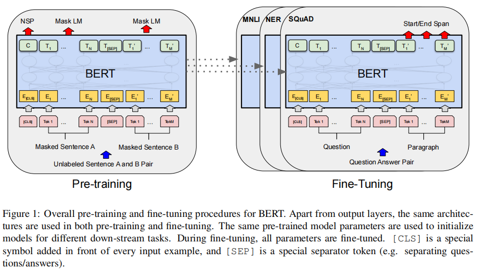
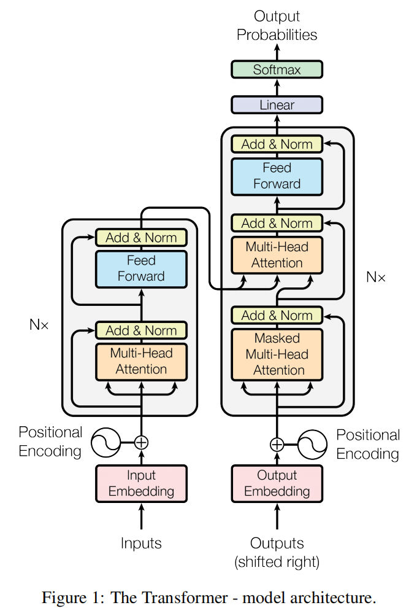
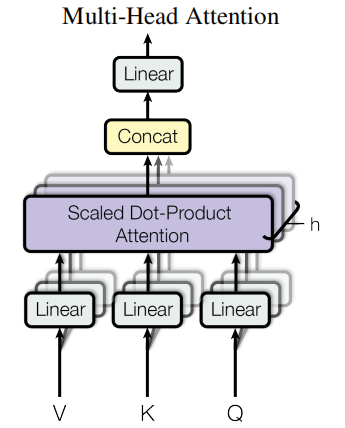
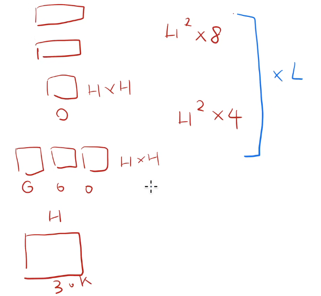
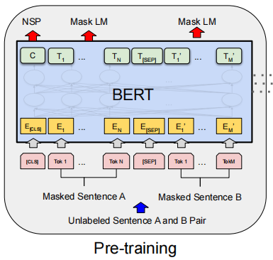
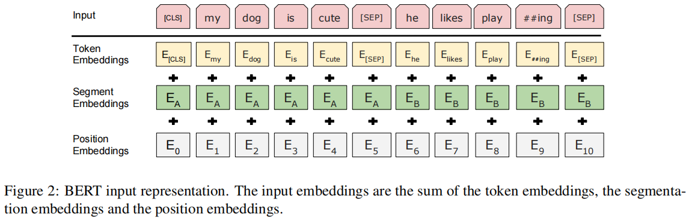
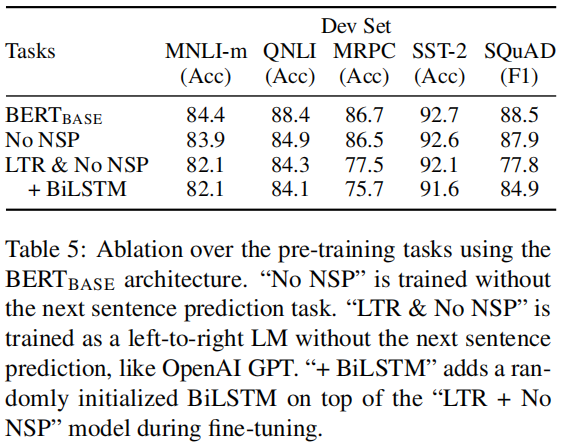

# BERT

**Pre-training of Deep Bidirectional Transformers for Language Understanding**

****

在一个很大的数据集上训练好一个较深的神经网络，然后应用在很多NLP任务中

既简化了NLP任务的训练，又提升了性能

****

Pre-training：（预训练）在实际training之前进行，在较大数据集上进行训练

Deep Bidirectional Transformers：深度双向Transformers

## 摘要

**BERT**：**B**idirectional **E**ncoder **R**epresentations from **T**ransformers.

- transformer双向编码器表示

- 设计目的是去训练深的双向表示，使用**没有标号的数据**，联合**左右的上下文信息**
- 训练好的BERT使用一个额外的输出层即可在其他NLP任务上均得到一个不错的训练效果

好处：概念上简单，实验效果更好

## 导言

Language model **pre-training** has been shown to **be effective for improving** many natural language processing tasks

- sentence-level tasks句子层面任务：用来建模句子间关系
  - 句子情绪识别
  - 两个句子间关系
- token-level tasks词元层面任务：需要一些细腻度的词元层面的输出
  - 判断一个词元是不是实体命名

**使用预训练模型在下游任务做特征表示的两个策略**

- 基于特征（*feature-based*）
  - 如ELMo
  - 对每一个下游任务构造一个与任务相关神经网络（如RNN），预训练好的表示作为一个额外特征输入和你的输入一起进入模型
    - 输入表示强 → 下游训练更容易
- 基于微调（*fine-tuning*）
  - 如GPT
  - 将预训练模型整体迁移到下游任务，只需在输出层添加任务头
    - 预训练好的模型的参数会在下游根据新的数据集进行微调

- 以上两个策略都是在预训练时使用一个相同的目标函数，并且是一个单向的语言模型（这里微调策略中的GPT是单向）
  - 由于是单向：**如果双向考虑，那么应该能够提升任务性能**

**BERT**：用来解除上述语言模型是单向的限制

- 采用masked language model（MLM）
  - 每一次输入随机掩盖一些tokens
  - 目标函数是预测被掩盖的tokens
  - 允许看左右信息

**contribution**

1. 双向信息重要性
2. BERT是第一个基于微调的模型在一系列的任务上都取得非常好的成绩
3. 代码及模型都发布

## Conclusion

使用非监督的预训练模型非常好，这样使得资源不多的任务也能够使用深度神经网络

该论文主要工作是将前人结果拓展至**深的双向的架构**，使得同一个预训练处理的模型能运用在大量不一样的自然语言任务上

- **将预测未来变为完形填空**

## Related Work

非监督的基于特征的相关工作

- ELMo

非监督的基于微调的相关工作

- GPT

有标号的数据上做迁移工作

- NLP上做迁移学习效果不理想
  - 任务差别大
  - 训练数据量远远不够

BERT以及之后相关工作表明：NLP乃至CV在**无标号的数据量大的训练集**训练的模型效果比有标号的数据量小的情况下效果好

## BERT算法

### 步骤

**两个步骤**：pre-training & fine-tuning（预训练及微调）

- **pre-training**：
  - 在没有标号的数据集上训练
- **fine-tuning**：
  - 同样使用一个BERT模型，权重初始化为pre-training中得到的权重，所有权重在fine-tuning中参与训练，使用有标号的数据
  - 每一个下游任务都会如上述创建一个新的BERT模型，但是对于每个下游任务都根据自己的数据单独训练自己的模型

****

#### 有无标号

**无标号数据 (Unlabeled Data)**

- **定义**：只有原始文本，没有额外的“标签”。
- **例子**：
  - 一大堆维基百科文章、小说、新闻语料。
  - 比如句子 *“I like playing football.”*，没有任何“情感标签”或“主题标签”。
- **用途**：
  - 用来做**预训练**（Pre-training），目标是让模型学会语言规律，比如：
    - 语言模型目标（预测下一个词）：GPT
    - 掩码语言模型（预测被遮盖的词）：BERT

**有标号数据 (Labeled Data)**

- **定义**：除了原始文本，还带有任务相关的标签。
- **例子**：
  - 句子分类（Sentiment Analysis） → *“I like playing football.”* → 标签：Positive
  - 命名实体识别（NER） → *“Apple releases new iPhone.”* → 标签：Apple=ORG
  - 机器翻译 → 英文句子 + 中文句子对
- **用途**：
  - 用在 **下游任务训练/微调**（Fine-tuning）。
  - 模型利用预训练好的表示，再根据有标号数据调整参数，学会完成具体任务。

**联系**

- **无标号数据**：量大，用于预训练（让模型有“语言常识”）。
- **有标号数据**：量少，用于下游任务（让模型会“做题”）。

**比喻**：

- 无标号数据 = 大量“阅读” → 学会语言规律（词汇、语法、常识）。
- 有标号数据 = 做带答案的“练习题” → 针对性训练模型去解决具体任务。

**标号（label）的本质**

- 是 **人为定义的任务相关监督信号**。
- 它不一定是自然语言中的一部分，而是对数据的一种“额外解释”。
- 例如：
  - *“I love this movie.”* → 标签：Positive
  - *“Apple launches iPhone.”* → 标签：ORG（Apple 是公司）
- **特点**：**标号通常是离散的、有限的集合**（Positive/Negative，实体类型集合等），和自然文本本身不同。
- 关键区别在于：
  - **无标号数据**：目标来自文本本身（自监督）。
  - **有标号数据**：目标来自任务标签（监督学习）。

****

### Model Architecture

BERT模型：一个多层双向Transformer的编码器，直接基于原始的论文和它的原始代码

****

#### 原始Transformer模型

- **左边为编码器，右边为解码器**

- **嵌入层**：一个矩阵，输入是字典大小30k，输出是隐藏层单元个数H
  - **词表大小 (30k)**：有多少不同的 token。
  - **H**：每个 token 的向量维度（embedding size/hidden size）。
  - 参数量公式：$30k×H$
    - 词表的 embedding 矩阵大小（每个 token 映射成一个 $H$ 维向量）。
- **transformer块**：两个模块，自注意力机制，MLP
  - **多头自注意力机制**：Q K V每个矩阵参数量$H*H$，输出时投影矩阵也为$H*H$
    - A是在合并QKV中消掉了，QKV参数量 $H*H$ 实际上是所有头参数合并，$d_k = d_v = d_q = H / A$
  - **MLP**：两个 $H*H*4$ 的全连接层
    - 两个全连接层：
      - $W_1 \in \mathbb{R}^{H \times 4H}$
      - $W_2 \in \mathbb{R}^{4H \times H}$
  - **参数个数公式**
    - $30k*H+H^2*12*L$

**FFN 的结构回顾**

- 在 BERT / Transformer 的每一层里，FFN（前馈网络）是：

- $$
  \text{FFN}(x) = \max(0, xW_1 + b_1) W_2 + b_2
  $$

- 其中：

  - 输入向量维度 = \$H\$（隐藏层维度）
  - 第一个全连接层：$W\_1 \in \mathbb{R}^{H \times d\_{ff}}$
  - 第二个全连接层：$W\_2 \in \mathbb{R}^{d\_{ff} \times H}$

- 中间维度 $d\_{ff}$ 是一个**超参数**，而 BERT / 原始 Transformer 里选择了：

- $$
  d_{ff} = 4H
  $$

- 为什么是 **4H**

  - **经验 + 表达能力**
    - 在论文 *Attention is All You Need* 里，作者发现如果让 FFN 的中间层 **比输入层大 4 倍**，模型能显著提升表达能力。
    - **直觉**：
      - Attention 负责建模“关系”，
      - FFN 负责对每个位置单独“非线性变换”。
      - 提高 FFN 宽度（4H）相当于给每个位置更强的非线性建模能力。

  - **平衡计算量**

     * 注意力部分每层大约需要 \$4H^2\$ 参数。
     * FFN 部分如果设置为 \$4H\$，参数量 ≈ \$8H^2\$。
     * 合起来每层大约 \$12H^2\$，两者的量级接近，不会出现某一部分过大或过小的不平衡。

  - **实践标准**

     * 原始 Transformer（机器翻译用的）设置 $H=512, d\_{ff}=2048 = 4H$。
     * 后续的 BERT-base (H=768, d\_ff=3072)、BERT-large (H=1024, d\_ff=4096) 都沿用了这个规则。
     * 业界把这个比例当成一个 **经验公式**：

       $$
       d_{ff} \approx 4H
       $$

- 其他变体

  - 并不是所有模型都用 4H：
    - **GPT-3** 系列用了 $d\_{ff} \approx 4H$。
    - **T5** 模型用的是 $d\_{ff} = 4H$ 或更大。
    - 有些轻量模型（比如 DistilBERT）会把 $d\_{ff}$ 设得小一点，降低计算量。

- 总结

  - FFN 的中间层用 $4H$，主要是**经验 + 表达能力 + 计算均衡**的结果。它不是理论推导出的，而是实践里调出来的效果最好。

****

**调整三个参数**

- L：transformer块的个数
- H：隐藏层大小
- A：自注意力机制多头个数

**两个模型参数**

- $BERT_{BASE}$ (L=12, H=768, A=12, Total Parameters=110M)
- $BERT_{LARGE}$ (L=24, H=1024, A=16, Total Parameters=340M)

**输入输出**：一个序列

- 可以是一个句子
  - 一段连续的文字，不一定是真正意义上语义的一段句子
- 也可以是一个句子对

**切词方法**：WordPiece embeddings

- 将词语切成片段

- 30,000 token vocabulary

- 序列第一个词永远是一个特殊token（[CLS]）

  - 作用：BERT希望它最后的输出代表整个序列的信息

- 句子分类时，区分两个句子的方式

  - 法1：在每个句子后放一个特殊token（[SEP]）
  - 法2：学一个嵌入层去判断token属于第一个句子还是第二个句子
  - 如下图

  

**进入BERT的向量表示**

- 词元本身的embedding + 所在句子的embedding + 所在位置的embedding

### Pre-training BERT

pre-train BERT using **two unsupervised tasks**

#### 带掩码的语言模型

**Masked LM**

新改变：

- 如果一个词元由WordPiece生成，则由15%概率随机替换成一个掩码
- 特殊词元则不替换
- 掩码为一个特殊词元（[MASK]）

问题：

- 由于Pre-training有掩码，fine-tuning不用这个函数没有[MASK]，所以预训练与微调看到的结果会有差别
  - 解决方法：对于15%被选中的需要掩码的token
    - **80%**的概率：替换为[MASK]
      - e.g., my dog is hairy *→* my dog is [MASK]
    - **10%**的概率：替换成一个随机词元
      - e.g., my dog is hairy *→* my dog is apple
      - 目的：添加噪音
    - **10%**的概率：什么都不干，仅标记词语说明用其作预测
      - e.g., my dog is hairy *→* my dog is hairy
      - **目的：使真实在做微调时表示偏向于实际观察到的单词。**

#### 预测下一个句子

**Next Sentence Prediction (NSP)**

学习句子层面的信息，用于提升QA和自然语言处理

**设计**：

- 对于输入的句子对A&B

  - **50%概率为正例（IsNext）**：B在原文中真的在A之后

    - Input =  [CLS] the man went to [MASK] store [SEP] he bought a gallon [MASK] milk [SEP]

      Label =  IsNext

  - **50%概率为负例（NotNext）**：B为随机从其他地方选取的句子

    - Input =  [CLS] the man [MASK] to the store [SEP] penguin [MASK] are flight ##less birds [SEP]

      Label =  NotNext

      ##：表示后面的词是跟着前面那个词

#### Pre-training data

- BooksCorpus (800M words)
- English Wikipedia (2,500M words)
  - 选用文本层面的数据集，即EW中一篇一篇的文章，而不是随机打乱的句子

### Fine-tuning BERT

双向编码器self-attention能在两端之间互相看到，而一般transformer编码器一般看不到解码器的东西，所以BERT在该方面效果好

- 缺点：在机器翻译任务效果差

在下游任务中，**只要在输入和输出层面稍微调整**，就能让预训练好的 BERT 适配不同的任务。

- **输入端的适配方式**
  - 句子对任务：输入时把句子 A 和句子 B 拼接（用 [SEP] 分隔），BERT 本身的 segment embedding 就能区分。
  - 单句任务：退化为 “文本 + 空”，也能用。
- **输出端的适配方式**
  - 分类任务：用 [CLS]（特殊 token 的全局表示）。
  - 序列任务：用每个 token 的表示（比如 NER、QA）。
- **计算效率**
  - 预训练需要大规模语料和计算资源（几周）。
  - 但微调相对轻量，只需几个小时甚至更短。

## Experiments

### GLUE

The General Language Understanding Evaluation (GLUE) benchmark

文本分类数据集

在GLUE模型微调过程中，序列第一个特殊词元[CLS]将其最后向量取出，通过计算C和W的函数（$log（softmax（CW^T）$），我们得到标准分类损失函数。

### SQuAD v1.1

斯坦福的Q&A数据集

问你一个问题，需要将答案找出来，答案已经在给出的一段话中，只需要将答案的片段（开始和结尾）找出来

即判断一个词元是答案的开头（向量 $S∈R^H$）还是结尾（向量 $E∈R^H$）

S&E是这个词元是答案开头或者结尾的概率

## Ablation Studies

消融研究：用于分析模型中各个组件的作用

