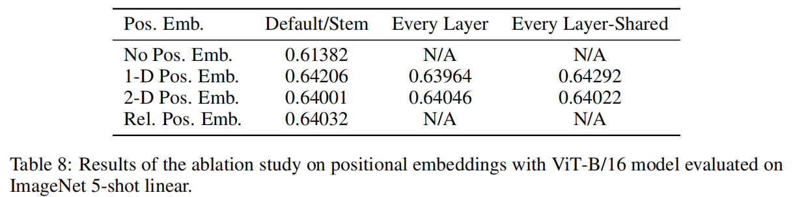

# ViT

AN IMAGE IS WORTH 16X16 WORDS:

TRANSFORMERS FOR IMAGE RECOGNITION AT SCALE

****

将一个图片看作很多个patch组成，每一个patch大小是16*16

transformers运用在图像识别

****

## Abstract

以前CV领域：使用CNN，或者将CNN部分卷积采用自注意力机制，但是仍然保持整体结构不变

本文：采用Vision Transformer 能与顶级CNN取得一样的效果，并且仅需更少的训练资源

## Introduction

Transformer已经成为NLP中必不可少的模块，在大数据集上进行pre-training，然后在小数据集上（特定任务）进行fine-tuning

Transformer：计算高效性，可扩展性

**之前工作**

- 将Transformer运用在CV

  - 利用CNN训练中的降维后的特征图（输入序列维度变低）作为transformer的输入

  - Stand-Alone Attention（孤立注意力）：选取小窗口而不是整个图来进行transformer，使得复杂度在可接受范围内

  - Axial Attention（轴注意力）：将2d的图片转换为两个1d的向量（$N=H*W$ 即 高度*宽度），在H和W上分别做transformer

**ViT想法**

- 直接运用一个标准的Transformer，直接作用于图片，尽量少做修改
- 方法：将一个图片打散为很多patch，每个patch为16*16
- 
  - N为序列长度（224 * 224 --> 14 * 14）
  - 每一个patch作为一个元素，通过 fc layer 得到一个 linear embedding，当作输入传入Transformer
    - 可以将patch（图片块）当作NLP中一个个token
- 采用**有监督训练**
- 将CV当作NLP来做，中间的模型就是用的 Transformer Encoder 

结论

- 中型大小数据集上，如果不加强的约束，同等大小下，ViT比ResNets（残差神经网络：卷积神经网络CNN的一种架构）要弱
  - 因为Transformers缺少一些归纳偏置，即缺少一些先验信息
    - 卷积神经网络归纳偏置：相邻区域相邻特征&平移等变性
- ViT需要更大的数据集去学习更多特征

## Conclution

使用标准Transformers进行CV学习

仅在刚开始抽取图像块以及使用图像的位置编码，使用了图像特有的归纳偏置，除此之外就没有使用图像特有的归纳偏置了

将图像变为一串有序列的图像块

未来工作方向：

- 探索Transformers在CV领域更多应用如分割和检测等
- 探索自监督预训练方式

## Related Work

自注意力在CV运用：

- 像素层面：将每一个像素点当作元素，相互做自注意力（序列长度长，复杂度过高）
- 小窗口层面：对小窗口当作元素（降低序列长度）
- 稀疏点层面：只对一些稀疏的点进行自注意力（全局注意力的近似）
- 使用在不同大小的block上
- 采用轴注意力机制

## Model

模型设计上尽可能按照原始Trnasformer模型

类比BERT加入特殊字符[class]（0 *：0是其位置信息）来进行分类标签，进行分类判断

****

图片输入X：224 * 224 * 3

Patch：每一个patch为16 * 16 * 3

- 整个图片转换为196 * 768（196个大小768的patch）

Linear Projection of Flattened Patches（E）线性投射层（全连接层）：

- 768（patch的维度） * 768（D）

**输入Transformer Encoder：**

- 196 * 768（X点乘E）196个token 维度768
- 额外的cls token：维度768
- 整体序列长度196+1=197   （197 * 768）
- 加入位置编码信息，直接sum加（位置编码是一个表上取的：[x,768]，每一行长768的向量表示一个位置信息，**位置向量表也是可以学习的**）

**Encoder块：**

- Multi-Head：一般为12头，所以KQV大小为197 * 64（768 / 12 = 64）
- MLP：先放大4倍197 * 3072，再缩小回197 * 768

****

Transformer需要1D输入，图片2D

转换后 patch个数（序列长度）：$HW/P^2$ （HW 图片长宽，P patch边长）

patch维度： $P^2*channel$ （ $16*16*3=768$ ）

向量长度 D：需要将patch维度经过全连接层操作后与 D 相同

[class]：可学习的作用于分类的特征（维度 D）

- 后面接一个 MLP 进行分类

位置编码信息：1D的向量

### 消融实验

**选取何种输出进行分类MLP**

- 利用[cls]输入MLP进行分类
- 利用整个输出经过处理（globally average-pooling GAP）后去MLP进行分类

- 结果：没什么区别

****

**位置编码**

- 1D positional embedding
  - 1，2，3...9去编码，维度D
- 2D positional embedding
  - 11，12，13，21，22...33去编码，横纵坐标维度D/2，合并为D
- Relative positional embedding（相对位置编码）
  - 相对距离表示

- 结果：不用位置编码效果相对差，其余没啥区别

****

### Model公式

$z_0$：Transformer输入

- $x_p^n$ ：第n个的patch输入
- $E$：全连接层
- $x_{class}$：[class]标签
- $E_{pos}$：位置编码

Transformer Encoder 块

- $z'_l$：第一层
  - $LN$：Layer Normalization（层归一化）
  - $MSA$：多层注意力层
  - $z_{l-1}$：残差连接
- $z_l$：第二层
  - $LN$：Layer Normalization（层归一化）
  - $MLP$：多层感知机
  - $z'_{l}$：残差连接

$y$：最终输出

- $z_L^0$：L层encoder最终输出的0号位，即[class]对应输出

- $LN$：Layer Normalization（层归一化）

### Inductive bias

归纳偏置

ViT比CNN少很多图像特有的归纳偏置

- CNN的locality（局部性）和translation equivariance（平移等变性）
- ViT：
  - MLP：locality & translation equivariance
  - self-attention：global（全局性）
  - 由于其仅有少量的图像的归纳偏置，所以再少量数据集上效果不如CNN

### Hybrid Architecture

混合架构

1. 先将图片通过CNN进行特征提取，提取出 14*14 的特征图
2. 将特征图通过全连接层再进入 Transformer Encoder

### Fine-tuning

对于预训练后的ViT，在下游任务微调中，如果想处理更大尺寸的图像，会导致输入维度改变，或者导致位置编码出问题（如原本为 3 * 3 ，更改为 5 * 5 等）

位置编码解决方法：2D 插值法

- 采用torch官方自带的interpolate函数
- **2D 插值**：为了让位置编码适应新的尺寸，ViT 会对原始位置编码进行 **2D 插值**。这意味着，原始的二维位置编码矩阵 $P_{H_0, W_0}$ 会通过插值操作生成一个新的矩阵 $P_{H_f, W_f}$，从而匹配微调时的输入图像尺寸。
  - 具体来说，2D 插值会根据目标尺寸的 $H_f$ 和 $W_f$，对原始位置编码进行 **上采样**（resize），以保持空间信息的连续性。
- 仅是一种临时方案，在需要通过插值来扩宽数据范围时，扩的越大，后面效果越差
  - **微调时的局限性**

## Experiment

主要对比ResNet、ViT、混合模型的表征学习能力

在不同大小数据集上进行pre-training

- ViT 在计算代价以及表现结果上 表现非常好

在自监督学习方面

- ViT 表现较好：启发未来研究方向

### Setup

Datasets：

- 预训练
  - ImageNet 1k ckasses
  - JFT
- 下游任务（分类）
  - CIFAR-10/100
  - Oxford-IIIT
  - Oxford Flowers-102

### Model Variants

ViT-L/16 means the “Large” variant with 16*×*16 input patch size

模型运用更小patch，序列长度更长，模型更贵

### 训练结果

- 训练快，效果好

#### 分析

Figure 3：当使用不同大小数据集进行pre-training时，灰色部分为不同BiT（大型ResNet模型）范围，点为不同ViT模型

- 在中小型数据集上，ViT是不如ResNet
  - 原因：ViT没有使用先验知识（归纳偏置），所以需要更多的训练数据
- 大数据集上，ViT超过ResNet
- 结论：小数据集上还是ResNet好，大数据集使用ViT好

同等计算复杂度情况下：一般 ViT 都比 ResNet 好，即训练 ViT 比 ResNet 便宜

小模型上：混合模型精度非常高

### 可视化

第一层（linearly projects E）

- 可以当做基函数，即每一个图像块底层结构

position embedding（位置编码）

- 这里关注位置编码相似性，相似性越高越偏向1，低偏向-1
- 这里对应位置的位置编码相似性高，表示学习到了位置（行、列、距离）
- 1D 位置编码，但是学到了 2D 的位置信息

自注意力能不能注意到距离远的信息

- 横坐标：网络深度
- 点：每一层 self-attention 的头（这里 ViT-L/16 是 16 头，即每一列16个点）
- 纵坐标：平均注意力距离
- 深层网络自注意力的注意力距离已经非常远了，表明可以学习到全局信息，学习到带有语义性的概念

Figure 6：使用网络最后一层的 output token 折射回原来的输入图片

- 结果：模型已经可以注意到主要信息（这里为最后跟分类有关的区域）

### Self-Supervision

Transformer在NLP成功原因：

- Transformer模型本身
- 大规模自监督预训练

本论文参考BERT（masked language modeling）使用 masked patch prediction